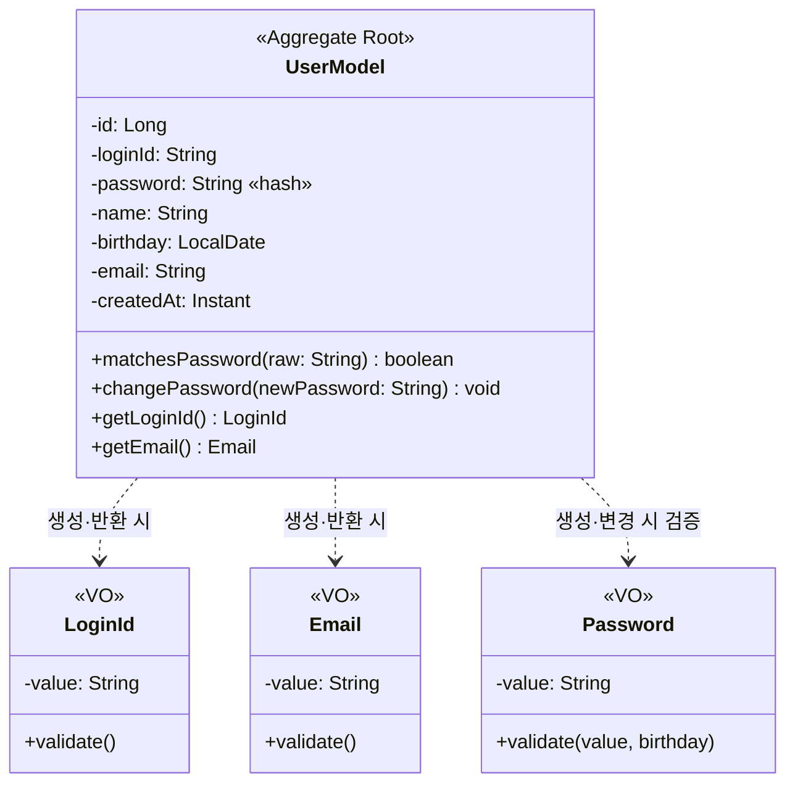
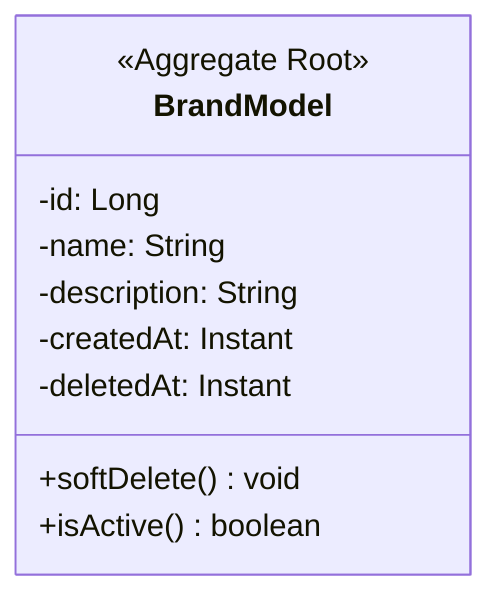
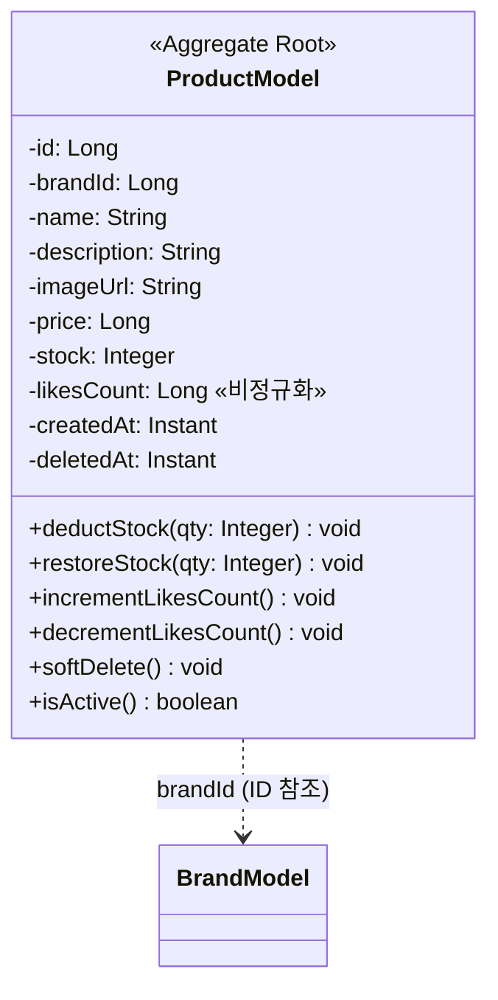
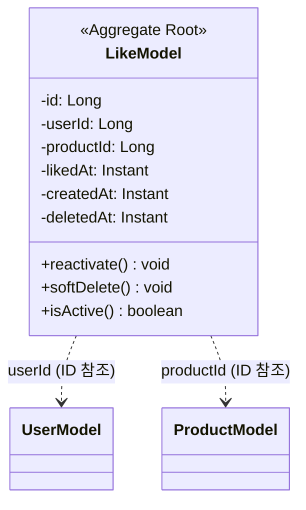
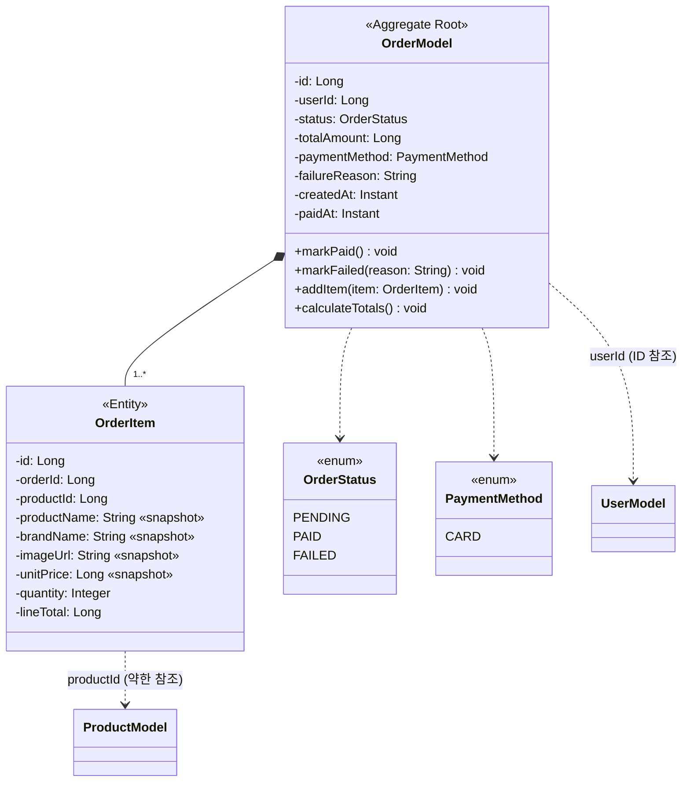
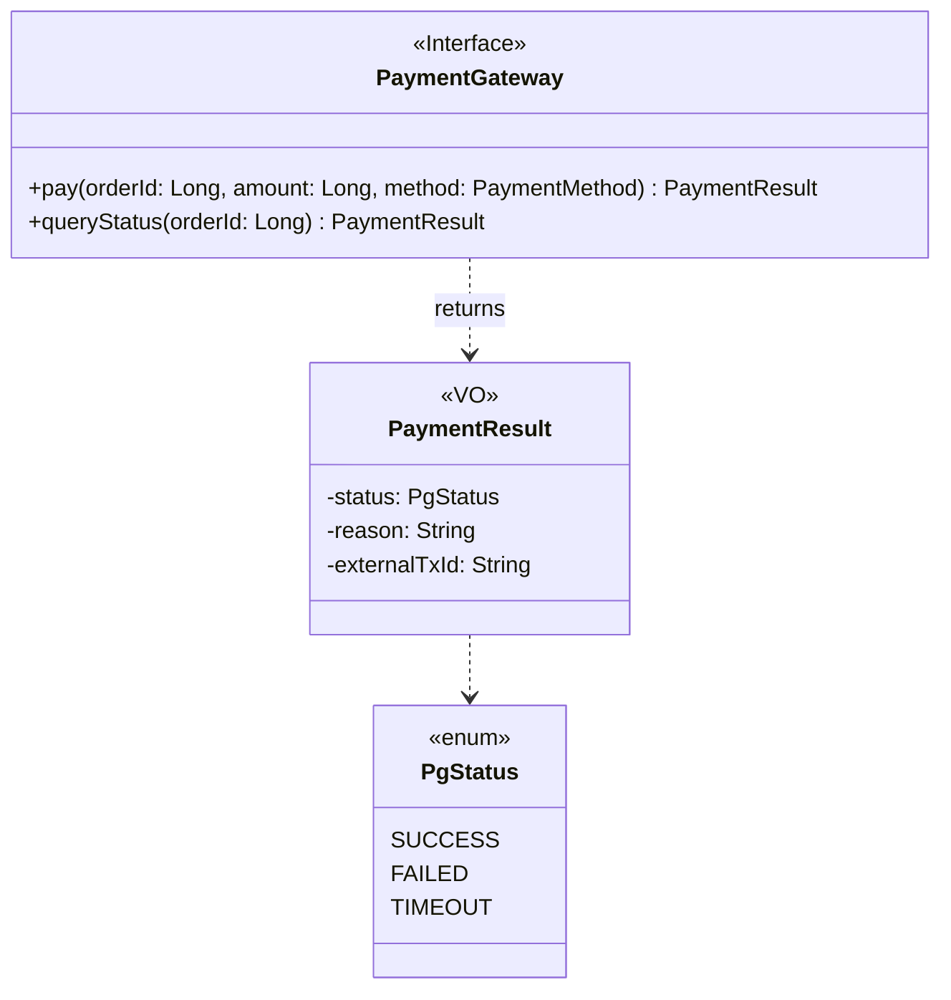
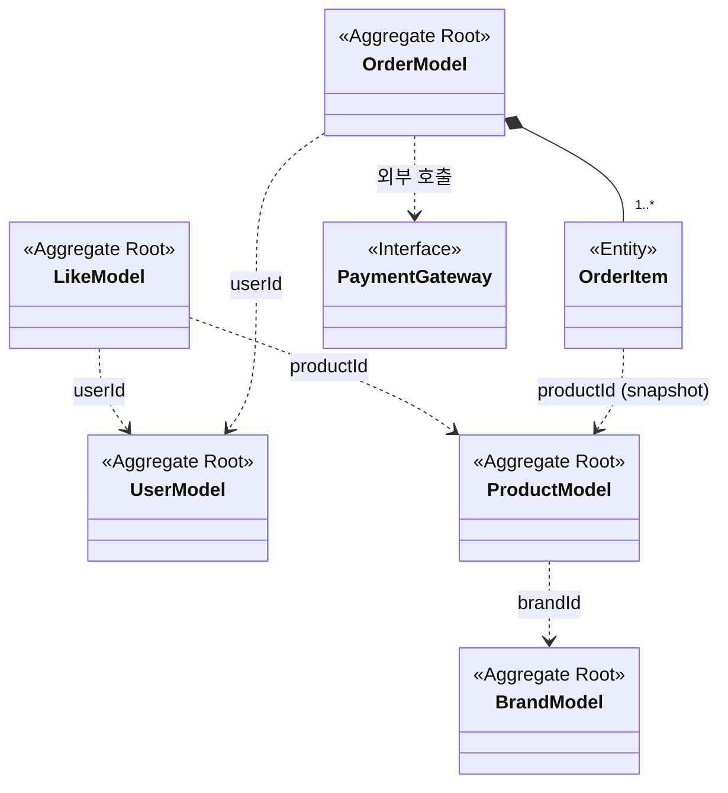

# 03. 클래스 다이어그램

`01-requirements.md` §3 도메인 어휘를 클래스 단위로 시각화한다. Aggregate 단위로 분해하여 각 도메인 객체의 속성·도메인 메서드·관계를 명시하고, §3에서 전체 관계를 한 장의 통합 다이어그램으로 묶는다.

도메인 메서드 시그니처는 `02-sequence-diagrams.md`에서 사용한 호출과 일치한다. Service에서 Repository로 직행하지 않고 항상 Aggregate의 메서드를 거치는 흐름을 전제한다.

## 0. 표기 규칙

### 0.1 도구·문법

- Mermaid `classDiagram` 사용
- Stereotype으로 객체의 역할 구분
  - `<<Aggregate Root>>` — Aggregate의 진입점
  - `<<Entity>>` — Aggregate 내부 자식 엔티티
  - `<<VO>>` — Value Object (식별자 없음, 불변, 검증 책임)
  - `<<Interface>>` — 외부 시스템 추상화
  - `<<enum>>` — 상태/타입 열거형
- 가시성: `-` private, `+` public
- 비정규화·스냅샷 필드는 필드명 뒤 « » 주석

### 0.2 관계 표기

| 표기 | 의미 | 사용 케이스 |
| --- | --- | --- |
| `*--` | Composition | Aggregate 내부 부모-자식 (Order *-- OrderItem) |
| `..>` | Dependency / 단방향 참조 | Aggregate 간 ID 참조, VO 생성·검증 호출 |
| `--` | Association | (사용하지 않음) |

연관 관계 원칙:
- **Aggregate 간은 객체 참조 금지 — ID(Long)로만 참조**. 객체 그래프가 트랜잭션 경계를 넘지 않도록 함.
- **양방향 참조 사용하지 않음**. Like → User/Product, Order → User/Product 모두 단방향 ID 참조.
- 단방향 화살표는 "이쪽이 저쪽을 안다" 방향으로 그린다.

### 0.3 생략 규칙

- 단순 getter/setter는 표기에서 생략. 도메인 메서드(`changePassword`, `deductStock`, `markPaid` 등)만 명시.
- `equals`/`hashCode`는 VO에 모두 정의되어 있으나 다이어그램에서는 생략.
- 감사 컬럼(`createdAt`, `updatedAt`)은 모든 엔티티가 `BaseEntity` 상속 — 다이어그램에서는 의미상 필요한 곳만 명시.

---

## 1. Aggregate 식별

도메인 모델을 6개의 일관성 경계로 분해한다. 각 Aggregate는 단일 Root + (선택) 자식 엔티티 + (선택) VO로 구성된다.

| Aggregate | Root | 자식 엔티티 | VO | 책임 경계 |
| --- | --- | --- | --- | --- |
| **User** | `UserModel` | — | `LoginId`, `Email`, `Password` | 회원 식별·인증·포인트 |
| **Brand** | `BrandModel` | — | — | 상품 그룹 운영 단위 |
| **Product** | `ProductModel` | — | — | 카탈로그·재고·좋아요 카운터 |
| **Like** | `LikeModel` | — | — | User-Product 좋아요 사실 |
| **Order** | `OrderModel` | `OrderItem` | — | 주문 트랜잭션·상태 머신 |
| **(External)** | `PaymentGateway` | — | `PaymentResult` | 외부 결제 시스템 추상화 |

Aggregate 간 참조는 모두 ID(`Long`)로만. 객체 그래프가 트랜잭션·일관성 경계를 넘지 않게 한다.

---

## 2. Aggregate별 클래스 다이어그램

### 2.1 User

**메모**
- VO(`LoginId`, `Email`, `Password`)는 검증 게이트로만 사용. 영속화는 `String` 컬럼 (Hibernate 절충).
- `password` 컬럼은 해시. 해싱 알고리즘은 **bcrypt** (cost factor + salt 내장) — 01 §7.1 비밀번호 정책. 현재 코드는 SHA-256이므로 구현 단계에서 마이그레이션 (§5.1).

### 2.2 Brand

**메모**
- `deletedAt is null` = 활성. 대고객 조회는 활성만 반환 (01 §7.5 비활성 처리·전파).
- Brand의 `softDelete()` 자체는 단일 행만 변경. Product/Like cascade는 Service(`BrandFacade`) 책임 — Aggregate 경계를 넘는 정책이므로.

### 2.3 Product

**메모**
- `brandId`로만 Brand를 참조. `BrandModel` 객체 참조 보유하지 않음.
- `stock`·`likesCount` 모두 자기 자신의 카운터. 음수 방지는 메서드 내부 책임.
- 실제 영속화 시 차감은 원자 UPDATE 쿼리(`WHERE stock >= ?`) — Repository 구현 책임 (04 §4.3). 도메인 메서드 호출 + Repository save 패턴은 비관 락 환경 대비용 모델 표현.

### 2.4 Like

**메모**
- `UNIQUE(userId, productId)` 제약. 재등록은 새 INSERT가 아닌 기존 행 `reactivate()` UPDATE (01 §7.5, UC-05).
- `reactivate()`: `deletedAt = null`, `likedAt = now()`. `createdAt`은 보존.
- `softDelete()`: `deletedAt = now()` 단일 변경. Product의 `likesCount` 차감은 Service가 별도 호출.

### 2.5 Order

**메모**
- `OrderItem`은 Order Aggregate 내부 자식. 외부에서 단독 조작 금지 — 항상 `OrderModel`을 통해 접근·변경.
- `OrderItem`의 상품 정보(`productName`, `brandName`, `imageUrl`, `unitPrice`)는 **주문 시점 스냅샷**. Product/Brand 변경·삭제와 무관하게 보존 (01 §3.2, §7.5).
- `productId`는 표시·추적 목적의 약한 참조. Product가 soft delete되어도 OrderItem은 영향 없음.
- 상태 전이: `PENDING → PAID` (`markPaid`) / `PENDING → FAILED` (`markFailed`). 다른 전이 금지 — 메서드 내부에서 현재 상태 검증.

### 2.6 PaymentGateway (External)

**메모**
- 도메인 인터페이스. 구현체는 `infrastructure.payment` 패키지 (Fake / 실 PG 어댑터).
- `pay()`는 DB 트랜잭션 외부에서 호출 (01 §7.6 주문과 외부 결제의 경계) — 외부 호출이 DB 락을 잡지 않게 함.
- TIMEOUT 응답은 `OrderModel`을 `PENDING` 유지 + 비동기 reconcile 큐 등록 (UC-08c).

---

## 3. 전체 관계 통합 다이어그램

Aggregate 간 의존 방향만 압축. 각 Aggregate 내부 구조는 §2 참조.

**의존 방향 요약**
- `Brand ← Product ← Like` (Brand가 가장 안쪽, 자식이 부모의 ID를 안다)
- `User ← Like`, `User ← Order` (User는 누가 자신을 참조하는지 모름)
- `Order *-- OrderItem` (composition, 같은 Aggregate)
- `OrderItem ..> Product` (스냅샷이지만 productId만 약하게 보유)
- `Order ..> PaymentGateway` (외부 시스템)

사이클 없음. 모든 참조는 단방향 ID.

---

## 4. 도메인 책임 분배

"한 객체에 책임이 몰리지 않았는가" 점검. 각 도메인 메서드가 어디에 있고, 왜 Service가 아닌 Aggregate에 있는지.

| 메서드 | 소속 | Aggregate에 둔 근거 |
| --- | --- | --- |
| `matchesPassword(raw)` | `UserModel` | 비밀번호 해시 비교는 User의 정체성. 해시 알고리즘 변경 시 User만 영향 |
| `changePassword(newPw)` | `UserModel` | 정책 검증(`Password` VO) + 해싱이 모두 User 내부 책임 |
| `softDelete()` | `BrandModel`, `ProductModel`, `LikeModel` | 단일 행의 상태 변경. Aggregate 외 cascade는 Service 책임 |
| `deductStock(qty)` / `restoreStock(qty)` | `ProductModel` | "재고 ≥ 0" 불변식의 소유자 |
| `incrementLikesCount()` / `decrementLikesCount()` | `ProductModel` | `likesCount`는 Product의 자체 카운터. 음수 방지 책임 보유 |
| `reactivate()` | `LikeModel` | `deletedAt = null` + `likedAt = now()` 상태 전이의 사실 |
| `markPaid()` / `markFailed(reason)` | `OrderModel` | 주문 상태 머신은 Order의 핵심. 전이 가능 여부 검증 포함 |
| `calculateTotals()` | `OrderModel` | `lineTotal` 합산 → `totalAmount` 계산은 Order의 책임 |

**Service / Facade가 맡는 것** — 여러 Aggregate를 조정하는 유스케이스 조립만 담당. 예시:
- `OrderFacade.placeOrder()`: `ProductModel.deductStock` × N + `OrderModel` 생성 + `PaymentGateway.pay` 조정
- `BrandFacade.deleteBrand()`: `BrandModel.softDelete` + `ProductModel.softDelete` × N + `LikeModel.softDelete` × M cascade 순서 조정
- `LikeFacade.like()`: `ProductModel.assertActive` + `LikeModel` 신규/reactivate + `ProductModel.incrementLikesCount` 조정

Service는 절대 "재고 음수 방지" 같은 도메인 불변식을 직접 검증하지 않는다 — 모두 Aggregate 메서드 호출로 위임.

---

## 5. 설계 결정 사항

### 5.1 현재 코드와의 정렬 필요 항목

03은 week2 목표 상태를 그린다. 현재 `apps/commerce-api` 코드와 다음 갭이 있으며, 구현 단계에서 해소한다.

| 항목 | 현 코드 | 03 명세 | 처리 방향 |
| --- | --- | --- | --- |
| Password 해시 | SHA-256 (salt 없음) | bcrypt (01 §7.1) | **코드를 bcrypt로 마이그레이션**. cost factor + salt 내장. 기존 SHA-256 해시는 무효화 후 재설정 절차 필요 |
| `UserModel` 필드 | `name`, `birthday` 보유 | 01 §3 도메인 어휘에 미반영 | 01 §3는 컬럼 단위 명시 안 함 (03/04에서만 다룸) — 갭 해소 |
| `ProductModel` | `name, description, price, stock` | `+ brandId, imageUrl, likesCount, deletedAt, BaseEntity 감사컬럼` | 구현 단계 추가 |
| `Brand`, `Like`, `Order`, `OrderItem` | 미존재 | 신규 Aggregate | 구현 단계 추가 |
| `PaymentGateway` 인터페이스 | 미존재 | 신규 (Fake 구현 포함) | 구현 단계 추가 |

### 5.2 VO 분리 기준

| 도메인 값 | VO 여부 | 근거 |
| --- | --- | --- |
| `LoginId` | ✅ VO | 형식 검증(정규식·길이) 책임. 식별자 형식 정책의 소유자 |
| `Email` | ✅ VO | 형식 검증 책임 |
| `Password` | ✅ VO | 정책 검증 + 생일 포함 금지 등 도메인 규칙 보유 |
| `PaymentResult` | ✅ VO | 외부 응답을 도메인 언어로 캡슐화 |
| `price` (Product, OrderItem) | ❌ `Long` primitive | 현 단계에서 통화 단위·할인 규칙 없음. `Money` VO 도입은 통화·환율·할인 도입 시 재검토 |
| `stock` / `likesCount` | ❌ primitive | 음수 방지 불변식은 보유 객체(`Product`) 메서드가 책임. 별도 VO 불필요 |
| `quantity` | ❌ `Integer` | 단순 수량. VO화 효익 없음 |
| `OrderStatus` / `PaymentMethod` / `PgStatus` | enum | 닫힌 집합. VO보다 enum이 적합 |

**원칙** — 검증 책임 또는 형식 규칙이 있는 값만 VO화. 단순 통화·수량은 primitive 유지. VO를 무리하게 도입해 객체 폭증을 피한다.

### 5.3 Aggregate 간 객체 참조 금지

`LikeModel`이 `UserModel` 객체를 보유하지 않고 `userId: Long`만 보유하는 이유:

- 트랜잭션 경계가 명확해진다 — Like 조작 시 User Aggregate를 로드할 필요 없음
- 양방향 참조의 lazy loading / N+1 위험 제거
- 객체 그래프가 트랜잭션 경계를 넘어 직렬화·캐싱·DTO 변환을 오염시키지 않음
- 다른 Aggregate의 내부 변경(예: User 필드 추가)이 Like 코드에 전파되지 않음

조회 성능을 위해 다른 Aggregate 정보가 필요하면 Service/Facade 단계에서 별도 Repository 호출로 조립 (예: 좋아요 목록 조회 시 productIds로 Product를 일괄 IN 조회 — 04 §3 인덱스 전략).

### 5.4 OrderItem 스냅샷 vs Product 참조

`OrderItem`이 `productName`, `brandName`, `imageUrl`, `unitPrice`를 **스냅샷 컬럼으로 보유**하는 이유:

- 주문 시점의 가격·상품명 보존 (상품 가격 변경, 상품 삭제와 무관하게 영수증성 데이터 유지)
- Product/Brand의 soft delete cascade에서 Order/OrderItem 제외 — 과거 주문은 항상 표시 가능 (01 §7.5)
- 조회 시 Product/Brand JOIN 불필요 — 주문 상세 응답 성능

`productId`는 추적·재구매·통계 목적의 약한 참조로 남긴다. Product가 soft delete되면 `productId`는 살아있지만 활성 상품 목록에는 안 나옴.

---

## 6. 참고

- 도메인 어휘: `01-requirements.md` §3
- 도메인 메서드 호출 흐름: `02-sequence-diagrams.md` 전체
- 실제 코드: `apps/commerce-api/src/main/java/com/loopers/domain/`
- ERD (다음 문서): `04-erd.md` — `Like UNIQUE(userId, productId)`, 인덱스, snapshot 컬럼 등 영속화 상세
