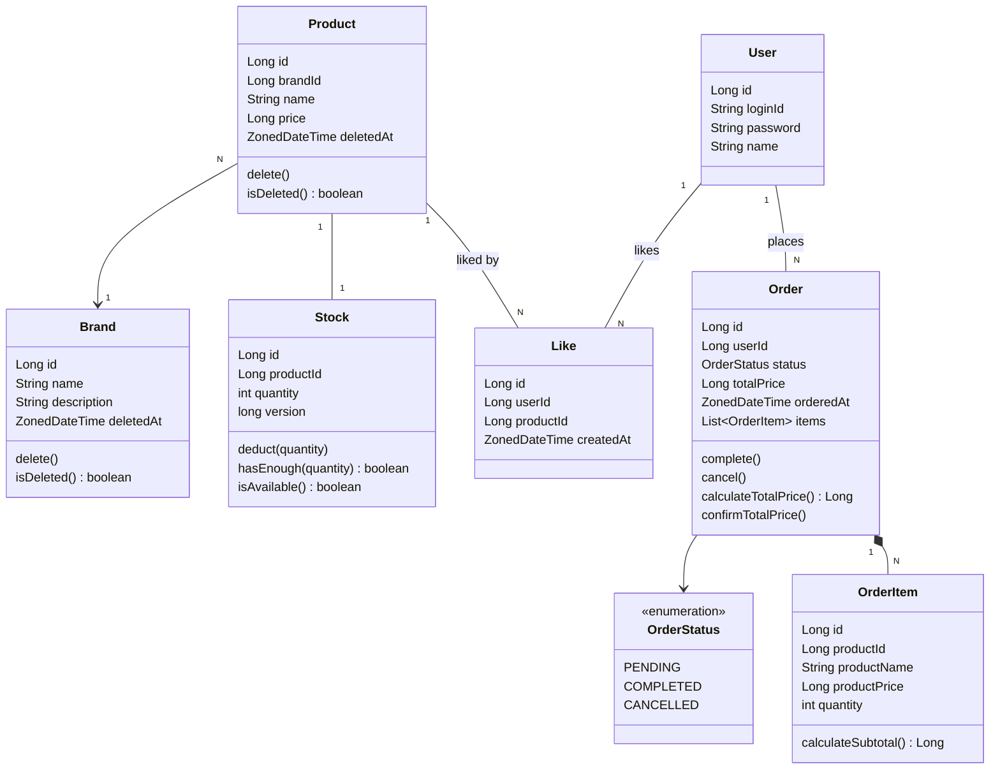

# 클래스 다이어그램

## 도메인 모델

도메인 객체의 책임과 의존 방향, 비즈니스 로직이 Service에 몰리지 않고 적절히 분산되어 있는지 확인한다.

**읽는 포인트**
- `Stock`은 `Product`와 1:1로 분리된 엔티티다. 재고는 주문마다 변경되는 반면 상품 정보(이름, 가격)는 거의 변하지 않아 쓰기 빈도가 다르다. 분리함으로써 동시 주문 시 `stocks` row에만 락이 집중되고 `products` row는 캐싱 가능한 상태를 유지한다.
- `Stock.version`은 낙관적 락(optimistic lock)용 컬럼이다. 동시 주문 충돌 감지에 사용된다.
- `Stock.deduct()`이 재고 부족 예외를 던지는 책임을 가진다. Service가 직접 수량을 비교하지 않는다.
- `Like`는 `userId`, `productId`를 FK 없이 Long 값으로만 보유한다. User/Product 삭제 시 Like가 직접 영향받지 않도록 느슨하게 참조.
- `Brand.delete()`, `Product.delete()`는 `deletedAt`을 채우는 메서드로, BaseEntity에서 상속된다.
- `OrderItem`은 `Order` 없이 존재할 수 없는 구조(Aggregate Root 패턴). `productName`, `productPrice`는 주문 시점 스냅샷이라 이후 상품 변경에 영향받지 않는다.
- 가격 관련 필드(`totalPrice`, `productPrice`)는 `Long`으로 선언한다. `int` 범위(약 21억)를 초과하는 상품이 존재할 수 있기 때문이다.

---

## 레이어별 구조

각 Service가 어떤 Repository에 의존하는지, 의존 방향이 domain → infrastructure로 향하는지 확인한다.

```mermaid
classDiagram
    class UserService {
        +getUser(loginId) User
    }

    class BrandService {
        +createBrand(name, description) Brand
        +getBrand(brandId) Brand
        +getBrands(page, size) List~Brand~
        +updateBrand(brandId, name, description) Brand
        +deleteBrand(brandId)
    }

    class ProductService {
        +createProduct(brandId, ...) Product
        +getProduct(productId) Product
        +getProducts(brandId, sort, page, size) List~Product~
        +updateProduct(id, ...) Product
        +deleteProduct(id)
    }

    class LikeService {
        +like(userId, productId)
        +unlike(userId, productId)
        +getLikedProducts(userId) List~Product~
    }

    class OrderService {
        +createOrder(userId, items) Order
        +getOrders(userId, startAt, endAt) List~Order~
        +getOrder(userId, orderId) Order
    }

    class AdminOrderService {
        +getAllOrders(page, size) List~Order~
        +getOrder(orderId) Order
    }

    class UserRepository {
        <<interface>>
        +findByLoginId(loginId) Optional~User~
    }

    class BrandRepository {
        <<interface>>
        +findById(id) Optional~Brand~
        +findAll(page, size) List~Brand~
        +save(brand) Brand
    }

    class ProductRepository {
        <<interface>>
        +findById(id) Optional~Product~
        +findAll(brandId, sort, page, size) List~Product~
        +findAllByBrandId(brandId) List~Product~
        +save(product) Product
    }

    class StockRepository {
        <<interface>>
        +findByProductId(productId) Optional~Stock~
        +save(stock) Stock
    }

    class LikeRepository {
        <<interface>>
        +existsByUserIdAndProductId(userId, productId) boolean
        +findByUserId(userId) List~Like~
        +findByUserIdAndProductId(userId, productId) Optional~Like~
        +save(like) Like
        +delete(userId, productId)
    }

    class OrderRepository {
        <<interface>>
        +save(order) Order
        +findById(id) Optional~Order~
        +findByUserIdAndOrderedAtBetween(userId, start, end) List~Order~
        +findAll(page, size) List~Order~
    }

    UserService --> UserRepository
    BrandService --> BrandRepository
    BrandService --> ProductRepository
    ProductService --> ProductRepository
    ProductService --> StockRepository
    LikeService --> LikeRepository
    LikeService --> ProductRepository
    OrderService --> OrderRepository
    OrderService --> ProductRepository
    OrderService --> StockRepository
    AdminOrderService --> OrderRepository
```

**읽는 포인트**
- `UserService`는 `loginId → User(userId)` 변환 역할만 한다. Facade에서 호출되어 다른 도메인 Service에 `userId(Long)`를 넘겨준다.
- `BrandService`가 `ProductRepository`에 의존하는 이유: 브랜드 삭제 시 연관 상품도 soft delete 처리해야 하기 때문이다.
- `LikeService`가 `ProductRepository`에 의존하는 이유: 좋아요 등록 전 상품 존재 여부 확인이 필요하기 때문이다.
- `OrderService`와 `AdminOrderService`를 분리했다. 고객 주문 흐름(생성/조회)과 어드민 전체 조회는 접근 주체와 책임이 다르기 때문이다.
- `ProductService`가 `StockRepository`에 의존하는 이유: 상품 등록 시 초기 재고 생성, 상품 삭제 시 재고 정리가 필요하기 때문이다.
- Repository는 모두 interface로 선언하여 domain이 infrastructure 구현체에 직접 의존하지 않는다.
