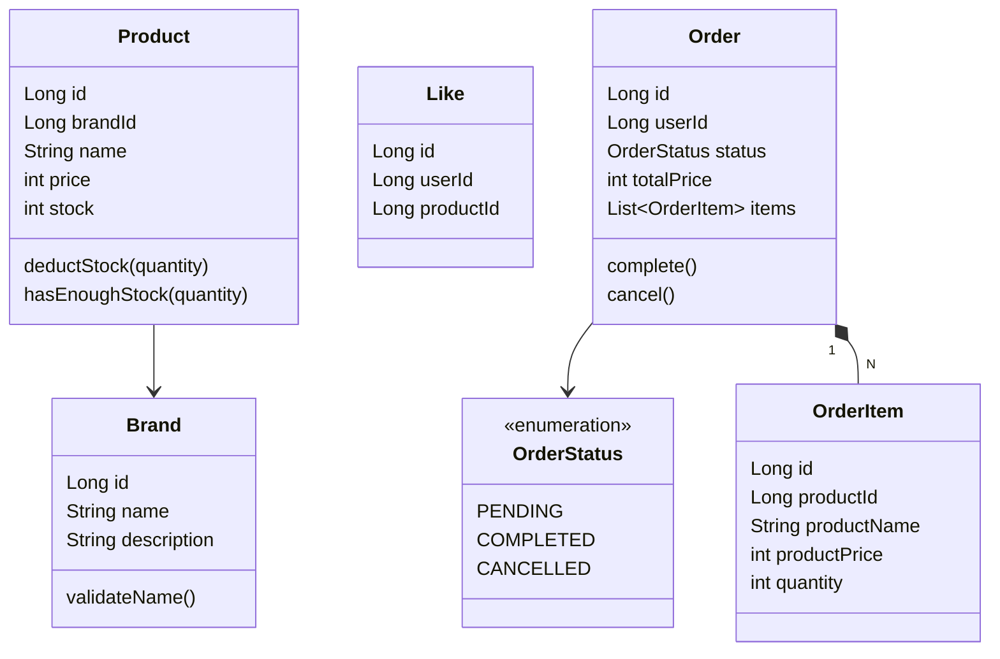
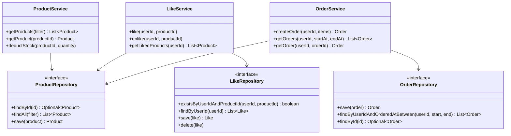

# 클래스 다이어그램

## 도메인 모델



---

## 레이어별 구조



---

## 설계 포인트

**Product.deductStock()**
재고 차감 로직을 Service가 아닌 Product 도메인 객체에 둔다.
재고 부족 시 예외를 던지는 책임도 Product이 갖는다.

```java
public void deductStock(int quantity) {
    if (this.stock < quantity) {
        throw new CoreException(ErrorType.BAD_REQUEST, "재고가 부족합니다.");
    }
    this.stock -= quantity;
}
```

**OrderItem 스냅샷**
OrderItem은 주문 시점의 상품명과 가격을 직접 보유한다.
Product와의 연관은 `productId` 참조로만 유지하고, 상품 정보 변경에 영향받지 않는다.

**Order와 OrderItem 관계**
Order가 OrderItem 목록을 소유한다 (Aggregate Root).
OrderItem은 Order 없이 독립적으로 존재할 수 없다.
