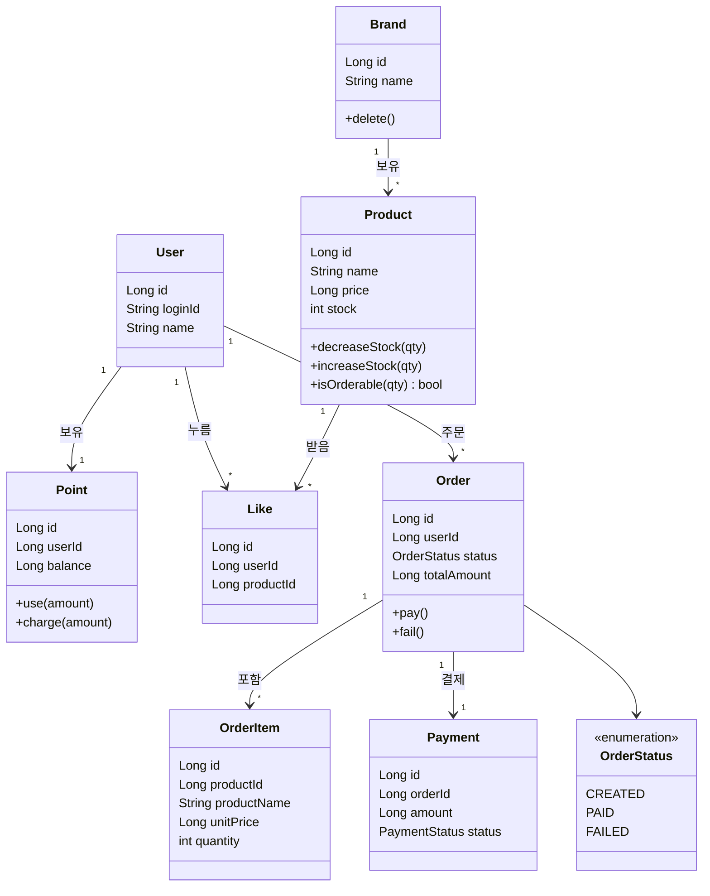

# 03. 클래스 다이어그램 (도메인 객체 설계)

> 클래스 다이어그램은 **시스템을 이루는 객체들이 각각 무엇을 책임지고, 어떻게 연결되는가**를 보여줍니다.
> "어떤 규칙은 어떤 객체가 들고 있는가"를 정하는 것이 핵심입니다.

## 왜 이 다이어그램이 필요한가
- 좋아요 멱등, 재고 차감, 스냅샷 같은 **규칙이 어느 객체의 책임인지** 명확히 하기 위해서입니다.
- 규칙이 특정 한 곳(예: Service)에 전부 몰리지 않도록 **책임 분배**를 검증합니다.

---

## 도메인 객체 한눈에 보기

> 연관 관계는 **단방향을 기본**으로 합니다. 예를 들어 `Product`가 `Like` 목록을 직접 들고 있지 않고,
> `Like`가 어떤 상품·회원인지를 ID로 가리킵니다. (양방향 연관은 최소화)

---

## 객체별 책임

| 객체 | 종류 | 책임 |
|---|---|---|
| `User` | Entity | 회원 식별 |
| `Brand` | Entity | 브랜드 정보. 삭제 시 소속 상품도 함께 삭제 트리거 |
| `Product` | Entity | **재고를 직접 관리**: 충분한지 판단(`isOrderable`)하고 차감/복원 |
| `Like` | Entity | (회원, 상품) 한 쌍을 표현. 같은 쌍은 1건만 존재 |
| `Point` | Entity | 회원 잔액. **차감 시 음수가 되지 않도록 스스로 검증**(`use`) |
| `Order` | Entity | 주문 단위. 상태(`CREATED→PAID/FAILED`) 전이를 책임 |
| `OrderItem` | Entity | 주문에 담긴 상품 1줄. **주문 시점의 이름·단가를 스냅샷으로 보관** |
| `Payment` | Entity | 외부 결제 결과를 기록 |

### 규칙은 객체 안에 둔다 (Service에 몰지 않는다)
- "재고가 충분한가?" → `Product.isOrderable()` 이 판단합니다. Service가 `if (product.getStock() >= qty)` 를 직접 계산하지 않습니다.
- "포인트가 부족하지 않은가?" → `Point.use()` 가 검증하고, 부족하면 예외를 던집니다.
- "이미 좋아요 했는가?" → 존재 여부를 Repository로 확인하고 분기합니다. (멱등)

이렇게 하면 **규칙이 한 객체에 응집**되어, 정책이 바뀌어도 고칠 곳이 한 곳입니다.

---

## Entity vs VO 구분 기준
- **고유 ID가 있고 생명주기를 갖는다** → Entity (위의 모든 객체)
- **값 자체로 의미를 가지며 ID가 없다** → VO (예: 금액, 스냅샷 묶음)
- 주의: VO를 억지로 별도 테이블처럼 다루지 않습니다. (예: 가격을 별도 DB로 빼지 않음)

---

## 이 구조에서 봐야 할 포인트
1. **재고는 `Product`가, 잔액은 `Point`가 스스로 지킨다** - 차감 규칙이 객체 안에 있어 음수 방지가 한 곳에서 보장됩니다.
2. **`OrderItem`이 스냅샷을 들고 있다** - `Product`를 직접 참조하지 않으므로, 나중에 상품 이름/가격이 바뀌어도 주문 내역은 그대로입니다.
3. **`Order`가 상태 전이를 책임진다** - 결제 성공/실패가 상태로만 표현되어 흐름이 명확합니다.

## 리스크와 선택지
- **좋아요 수**를 어디에 둘지: `Product`에 누적 컬럼으로 둘지(빠름, 정합성 관리 필요) vs 매번 `Like`를 집계할지(단순·정확, 느릴 수 있음).
  - 이번엔 단순한 **집계 방식**을 기본으로 하고, 성능 이슈는 "나아가며"에서 다룹니다.
- `Order`가 커지면 결제·배송 등 책임이 몰릴 수 있습니다. 지금은 결제까지만 두고, 확장 시 분리를 검토합니다.
