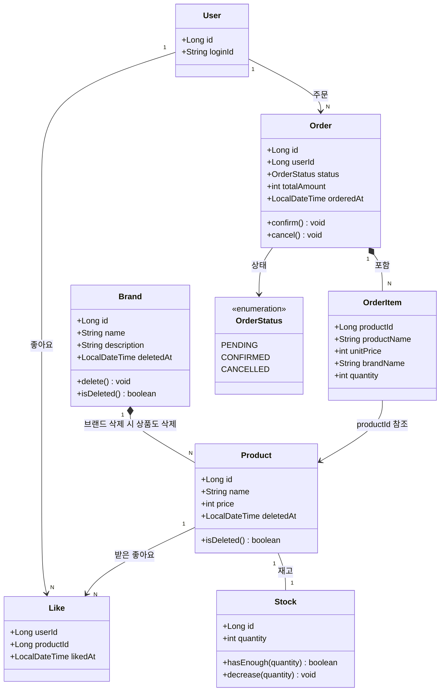
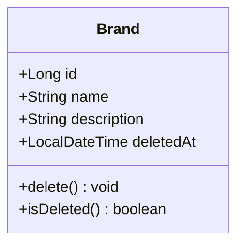
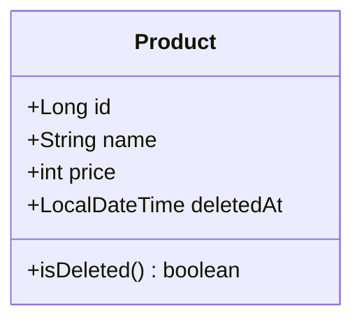
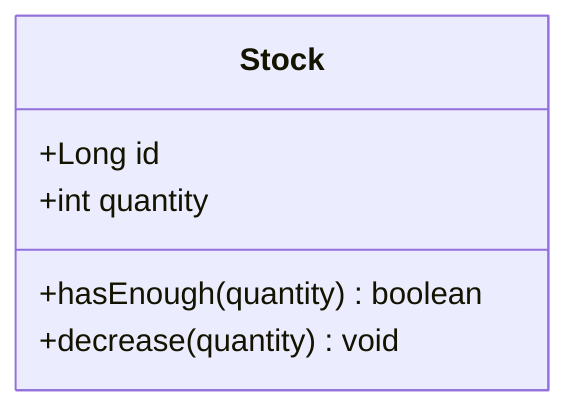
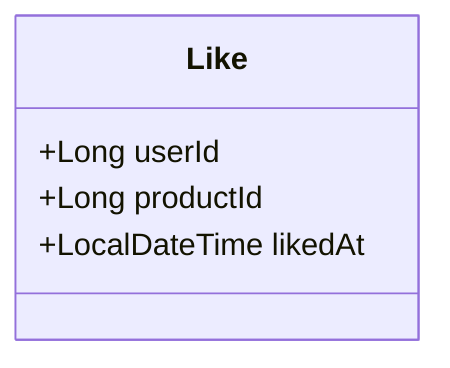
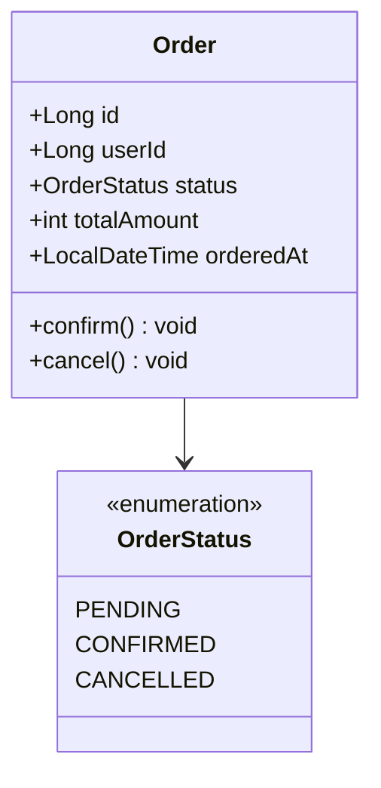
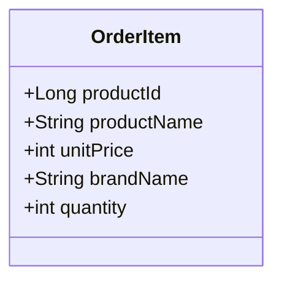

# 03. 클래스 다이어그램

> 모든 필드·메서드를 나열하지 않고, **비즈니스 흐름에서 의미 있는 상태와 행위**만 표현합니다.

---

## 1. 전체 도메인 관계도



---

## 2. 도메인별 설명

### 2-1. Brand (브랜드)



| 필드 / 메서드 | 의미 |
|--------------|------|
| `name` | 브랜드명 (중복 불가) |
| `deletedAt` | 삭제 시각. `null`이면 정상, 값이 있으면 삭제 상태 |
| `delete()` | 삭제 시각을 현재 시각으로 설정 (소프트 딜리트) |
| `isDeleted()` | `deletedAt != null`이면 `true` |

> **설계 이유**: 브랜드를 물리 삭제하면 해당 브랜드를 참조하는 주문 스냅샷의 정합성이 깨진다.  
> 소프트 딜리트로 이력을 보존하면서 고객 노출만 차단한다.

---

### 2-2. Product (상품)



| 필드 / 메서드 | 의미 |
|--------------|------|
| `price` | 현재 판매 단가. 변경되어도 기존 주문 항목(`unitPrice`)에는 영향 없음 |
| `deletedAt` | 소프트 딜리트 (Brand와 동일한 이유) |
| `isDeleted()` | 삭제 여부 확인 |

> **설계 이유**: Product는 카탈로그 정보(명칭·가격·브랜드)만 책임진다.  
> 재고는 라이프사이클과 변경 빈도가 달라 `Stock`으로 분리했다.

---

### 2-3. Stock (재고)



| 필드 / 메서드 | 의미 |
|--------------|------|
| `quantity` | 현재 재고 수량. 0 미만이 될 수 없음 |
| `hasEnough(quantity)` | `quantity >= quantity` 검사. 주문 전 재고 확인에 사용 |
| `decrease(quantity)` | 재고 차감. 0 미만 진입 시 예외 발생 |

> **설계 이유**: 재고 차감(주문마다 발생)과 상품 수정(어드민이 가끔 수행)은  
> 변경 빈도와 목적이 달라 같은 행을 공유하면 락 경합이 생긴다.  
> `Stock`을 분리하면 두 연산이 서로 다른 행을 잠그므로 경합 없이 독립적으로 실행된다.  
> 현재는 Product와 1:1이며, 향후 상품 옵션이 도입되면 Stock이 Option 단위로 이동한다.

---

### 2-4. Like (좋아요)



| 필드 | 의미 |
|------|------|
| `userId` | 좋아요를 누른 사용자 |
| `productId` | 좋아요 대상 상품 |
| `likedAt` | 좋아요 등록 시각 |

> **설계 이유**: Like는 `(userId, productId)` 쌍이 고유하다 (Unique Key).  
> 별도 행위 없이 존재 여부 자체가 좋아요 상태를 나타내므로 상태 필드가 필요 없다.  
> 멱등 처리는 저장 전 존재 여부를 조회하는 것으로 해결한다.

---

### 2-5. Order (주문)



| 필드 / 메서드 | 의미 |
|--------------|------|
| `userId` | 주문한 사용자 식별자 |
| `status` | 주문 상태 (아래 상태 전이 참고) |
| `totalAmount` | 주문 전체 금액 (OrderItem 소계의 합산) |
| `confirm()` | `PENDING → CONFIRMED` 상태 전이 |
| `cancel()` | `PENDING → CANCELLED` 상태 전이 |

**주문 상태 전이**

```
PENDING ──confirm()──▶ CONFIRMED
   │
cancel()
   │
   ▼
CANCELLED
```

> `CONFIRMED` 이후에는 취소 불가 (향후 결제 연동 시 환불 프로세스로 분리)

---

### 2-6. OrderItem (주문 항목)



| 필드 / 메서드 | 의미 |
|--------------|------|
| `productId` | 원본 상품 참조 (이력·연계용) |
| `productName` | 주문 도메인이 인식하는 상품명 |
| `unitPrice` | 주문 시점에 합의된 단가. 상품 도메인의 현재 가격과 무관 |
| `brandName` | 주문 도메인이 인식하는 브랜드명 |
| `quantity` | 주문 수량 |

> **설계 이유 (DDD 관점)**: `unitPrice`, `productName`, `brandName`은 상품 도메인의 값을 복사한 게 아니라,  
> **주문 생성 시점에 주문 도메인이 자체적으로 소유하게 된 값**이다.  
> 주문은 "이 상품을 이 가격에 구매한다"는 계약이며, 계약서에 적힌 가격은 이후 상품 가격 변경과 무관하게 고정된다.  
> 따라서 `snapshot_` 접두사는 오히려 종속 관계를 암시하므로, OrderItem 자신의 언어로 필드를 명명한다.

---

## 3. 핵심 설계 결정 요약

| 결정 | 내용 |
|------|------|
| **소프트 딜리트** | Brand·Product 모두 `deletedAt`으로 관리. 주문 이력과의 참조 정합성 유지 |
| **Product-Stock 분리** | 재고를 `Stock`으로 분리(1:1). Product 수정과 재고 차감이 서로 다른 행을 잠가 락 경합 해소 |
| **좋아요 멱등** | Like 레코드 존재 여부로 상태 판단. 중복 저장 시도 전에 조회로 방어 |
| **OrderItem 자체 소유 필드** | `unitPrice`, `productName`, `brandName`은 주문 생성 시 주문 도메인으로 편입. 상품 도메인 변경과 무관하게 독립 |
| **주문 상태 전이 제어** | Order 내부 메서드(`confirm`, `cancel`)로만 상태 변경. 불법 전이 방어 |

