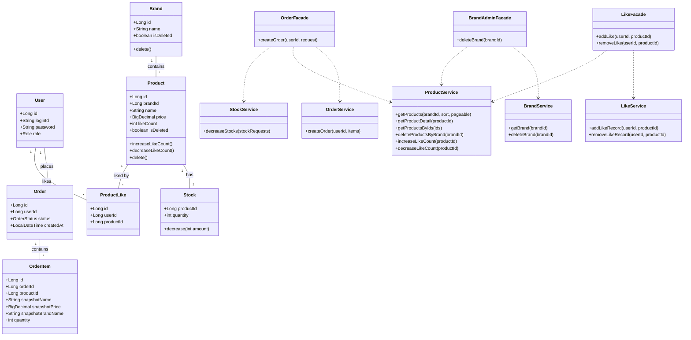

```mermaid
classDiagram
    class User {
        +Long id
        +String loginId
        +String password
        +Role role
    }
    
    class Brand {
        +Long id
        +String name
        +boolean isDeleted
        +delete()
    }
    
    class Product {
        +Long id
        +Long brandId
        +String name
        +BigDecimal price
        +int likeCount
        +boolean isDeleted
        +increaseLikeCount()
        +decreaseLikeCount()
        +delete()
    }
    
    class Stock {
        +Long productId
        +int quantity
        +decrease(int amount)
    }
    
    class ProductLike {
        +Long id
        +Long userId
        +Long productId
    }
    
    class Order {
        +Long id
        +Long userId
        +OrderStatus status
        +LocalDateTime createdAt
    }
    
    class OrderItem {
        +Long id
        +Long orderId
        +Long productId
        +String snapshotName
        +BigDecimal snapshotPrice
        +String snapshotBrandName
        +int quantity
    }

    %% 도메인 간 관계
    Brand "1" -- "*" Product : contains
    Product "1" -- "1" Stock : has
    User "1" -- "*" Order : places
    Order "1" -- "*" OrderItem : contains
    User "1" -- "*" ProductLike : likes
    Product "1" -- "*" ProductLike : liked by

    %% 파사드(Facade) 계층 (복합 트랜잭션 제어)
    class OrderFacade {
        +createOrder(userId, request)
    }
    class BrandAdminFacade {
        +deleteBrand(brandId)
    }
    class LikeFacade {
        +addLike(userId, productId)
        +removeLike(userId, productId)
    }

    %% 서비스(Service) 계층 (단일 도메인 로직 및 조회)
    class OrderService {
        +createOrder(userId, items)
    }
    class ProductService {
        +getProducts(brandId, sort, pageable)
        +getProductDetail(productId)
        +getProductsByIds(ids)
        +deleteProductsByBrand(brandId)
        +increaseLikeCount(productId)
        +decreaseLikeCount(productId)
    }
    class BrandService {
        +getBrand(brandId)
        +deleteBrand(brandId)
    }
    class StockService {
        +decreaseStocks(stockRequests)
    }
    class LikeService {
        +addLikeRecord(userId, productId)
        +removeLikeRecord(userId, productId)
    }

    %% 의존 방향
    OrderFacade ..> OrderService
    OrderFacade ..> ProductService
    OrderFacade ..> StockService
    
    BrandAdminFacade ..> BrandService
    BrandAdminFacade ..> ProductService
    
    LikeFacade ..> LikeService
    LikeFacade ..> ProductService
```