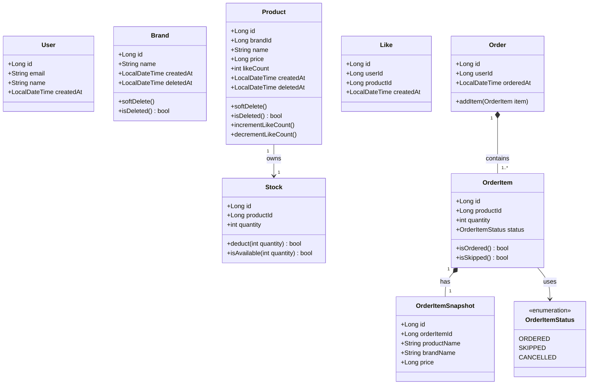

# 03. 클래스 다이어그램

> 도메인 모델의 구조와 책임을 검증하는 다이어그램입니다.
> Aggregate 경계, Entity/Value Object 구분, 도메인 메서드 위치를 확인합니다.

---

## 설계 원칙

- Aggregate 간 참조는 **ID로만** 한다 (직접 객체 참조 금지)
- 하나의 트랜잭션 = 하나의 Aggregate 수정
- 소프트 딜리트(`deletedAt`)는 Brand, Product에만 적용
- 좋아요 취소는 하드 딜리트 (Like 행 삭제)
- `likeCount`는 Product 도메인이 소유하며 LikeService의 요청을 받아 직접 관리

---

## 도메인 클래스 다이어그램

---

## 읽는 포인트

### 1. Product ↔ Stock 분리 이유
`stock`을 Product의 컬럼으로 두면, 관리자가 상품명/가격을 수정하는 동안 주문으로 인한 재고 차감이 동일 row를 잠금(row lock)합니다.
Stock을 별도 Entity로 분리하면 두 작업이 **서로 다른 row를 잠금**하므로 블로킹이 발생하지 않습니다.

### 2. Aggregate 간 참조는 ID만
`OrderItem`은 상품 정보를 `productId`로만 참조합니다.
주문 시점의 실제 상품 정보(이름, 가격, 브랜드명)는 `OrderItemSnapshot`에 별도 저장합니다.
이후 상품이 수정/삭제되어도 주문 내역은 **주문 당시 정보를 그대로 보존**합니다.

### 3. likeCount 위치
`likeCount`는 Product가 소유합니다.
LikeService가 좋아요를 등록/취소할 때 ProductService를 통해 위임하며, Product 도메인 메서드(`incrementLikeCount`, `decrementLikeCount`)가 직접 변경합니다.

### 4. 소프트 딜리트 vs 하드 딜리트
- **Brand, Product**: `deletedAt`으로 소프트 딜리트 — 주문 이력/스냅샷 참조 무결성 유지
- **Like**: 하드 딜리트 — 취소는 영구적이며 이력 보관 불필요
