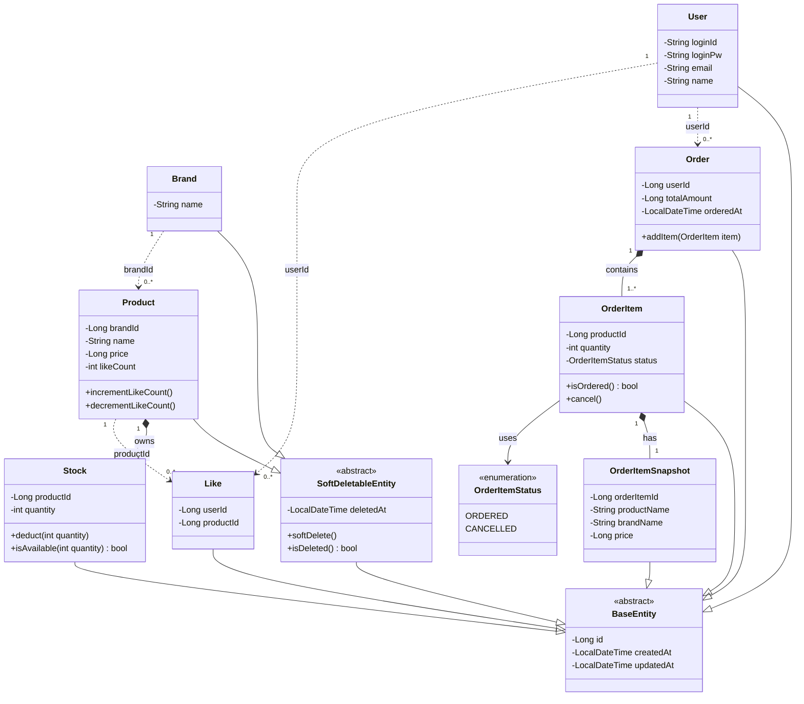
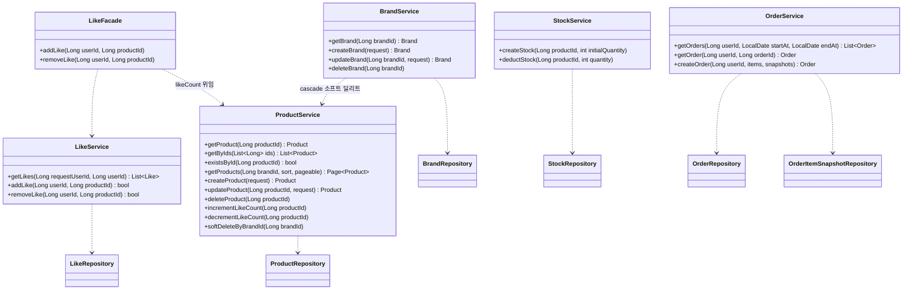

# 03. 클래스 다이어그램

> 도메인 모델의 구조와 책임을 검증하는 다이어그램입니다.
> 클래스, 인터페이스, 기능, 제약조건, 연관관계, 일반화, 의존성을 포함합니다.

---

## 설계 원칙

- Aggregate 간 참조는 **ID로만** 한다 (직접 객체 참조 금지)
- 하나의 트랜잭션 = 하나의 Aggregate 수정
- 소프트 딜리트(`deletedAt`)는 Brand, Product에만 적용
- 좋아요 취소는 하드 딜리트 (Like 행 삭제)
- `likeCount`는 Product 도메인이 소유하며 LikeService의 요청을 받아 직접 관리
- `Stock.deduct()`는 반환값 없이 동작하며, 재고 부족 시 `StockInsufficientException`을 던져 TX 롤백을 트리거한다
- `Stock.isAvailable()`은 조회 전용 (상품 상세의 재고 여부 표시 등). 차감 전 guard 체크 용도로 쓰지 않는다 — 원자적 차감은 `StockRepository.deductStock()`이 전담한다
- 주문은 올-오어-낫싱 정책 — `OrderItemStatus.SKIPPED`는 존재하지 않는다
- 필드는 `-(private)`, 메서드는 `+(public)` — 캡슐화 의도를 가시성으로 표현한다
- `User`는 회원(Member) 전용 도메인 객체다. 어드민은 `X-Loopers-Ldap` 헤더로 식별되는 별도 액터로, `users` 테이블에 존재하지 않으므로 `User`에 `role` 필드를 두지 않는다

---

## 1. 도메인 모델

일반화(상속) 구조, Aggregate 내부/간 연관관계, 제약조건을 표현합니다.

### 제약조건 (Constraints)

| 클래스 | 필드 | 제약조건 | 이유 |
|---|---|---|---|
| User | loginId | UNIQUE | 중복 계정 방지 |
| Like | (userId, productId) | UNIQUE | 좋아요 멱등성 보장 |
| Stock | quantity | >= 0 | 음수 재고 방지 |
| Product | price | > 0 | 유효한 가격만 허용 |
| Product | likeCount | >= 0 | 음수 좋아요 방지 |
| Order | totalAmount | > 0 | 금액 0 이하 주문 불가 |
| OrderItem | quantity | >= 1 | 수량 0 이하 주문 항목 불가 |
| OrderItemSnapshot | (productName, brandName, price) | NOT NULL | 스냅샷은 주문 당시 정보 보존 필수 |

---

## 2. Repository 인터페이스

도메인 레이어가 인프라에 의존하지 않도록 Repository 인터페이스를 도메인 레이어에 정의합니다.  
구현체(`JpaXxxRepository`)는 infrastructure 레이어에 위치합니다.

```mermaid
classDiagram
    class BrandRepository {
        <<interface>>
        +findById(Long id) Brand
        +save(Brand brand) Brand
        +softDeleteById(Long id)
    }

    class ProductRepository {
        <<interface>>
        +findById(Long id) Product
        +findByIds(List~Long~ ids) List~Product~
        +findAll(Long brandId, Sort sort, Pageable pageable) Page~Product~
        +save(Product product) Product
        +softDeleteById(Long id)
        +softDeleteAllByBrandId(Long brandId)
    }

    class StockRepository {
        <<interface>>
        +findByProductId(Long productId) Stock
        +deductStock(Long productId, int quantity) int
        +save(Stock stock) Stock
    }

    class LikeRepository {
        <<interface>>
        +existsByUserIdAndProductId(Long userId, Long productId) bool
        +findAllByUserId(Long userId) List~Like~
        +save(Like like) Like
        +deleteByUserIdAndProductId(Long userId, Long productId)
    }

    class OrderRepository {
        <<interface>>
        +findById(Long id) Order
        +findAllByUserIdAndDateRange(Long userId, LocalDate start, LocalDate end) List~Order~
        +findAll(Pageable pageable) Page~Order~
        +save(Order order) Order
    }

    class OrderItemSnapshotRepository {
        <<interface>>
        +saveAll(List~OrderItemSnapshot~ snapshots) List~OrderItemSnapshot~
    }

    BrandRepository ..> Brand : returns
    ProductRepository ..> Product : returns
    StockRepository ..> Stock : returns
    LikeRepository ..> Like : returns
    OrderRepository ..> Order : returns
    OrderItemSnapshotRepository ..> OrderItemSnapshot : returns
```

---

## 3. 서비스 의존성

서비스 간 의존 방향과 Repository 인터페이스 의존성을 표현합니다.

---

## 읽는 포인트

### 1. 일반화 구조 (SoftDeletableEntity)
`Brand`, `Product`만 `SoftDeletableEntity`를 상속합니다.
나머지는 `BaseEntity`를 상속합니다. `Like`는 하드 딜리트이므로 `deletedAt` 없음.

### 2. Aggregate 간 참조는 점선(`..>`)으로 표현
직접 객체 참조가 아닌 ID 참조임을 시각적으로 구분했습니다.
`Product.brandId`, `Order.userId`, `Like.userId`, `Like.productId`가 그 예입니다.

### 3. Repository는 인터페이스 — 의존 역전
Service는 `BrandRepository` 인터페이스에만 의존합니다.
`JpaBrandRepository` 구현체는 infrastructure 레이어에 위치하며, Service는 구현체를 모릅니다.

### 4. LikeFacade → ProductService 의존
`likeCount` 변경의 책임은 Product 도메인에 있습니다.
LikeService는 좋아요 저장/삭제만 담당하고, LikeFacade가 affected rows 결과를 보고 ProductService에 likeCount 갱신을 위임합니다.
LikeService가 ProductService를 직접 호출하지 않으므로 도메인 서비스 간 결합이 없습니다.

### 5. OrderItem 상태 전환
`CANCELLED` 상태 전환은 `OrderItem.cancel()` 도메인 메서드가 담당합니다.
외부에서 상태 필드를 직접 변경하지 않으며, 비즈니스 의도가 메서드 이름에 드러납니다.
`SKIPPED`는 B2C 올-오어-낫싱 정책 채택으로 제거되었습니다 — 재고 부족 시 주문 전체가 실패하므로 부분 주문 상태가 필요 없습니다.

### 6. StockRepository.deductStock() — 원자적 차감
`UPDATE stocks SET quantity = quantity - ? WHERE quantity >= ?` 쿼리를 실행하고 affected rows를 반환합니다.
0이면 StockService가 `StockInsufficientException`을 던져 TX 롤백을 트리거합니다.
`Stock.isAvailable()`과 분리되어 있으며, 차감 전 사전 체크로 절대 사용하지 않습니다 (TOCTOU 레이스 컨디션).
