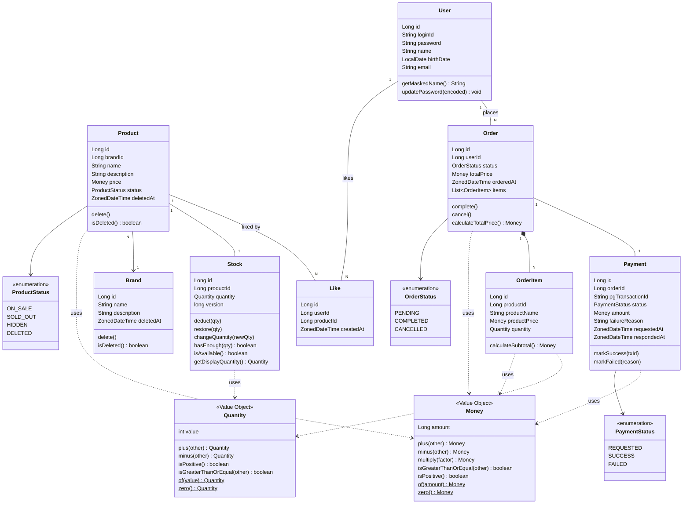
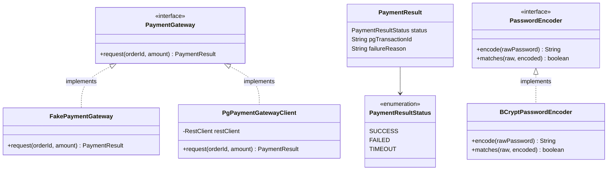
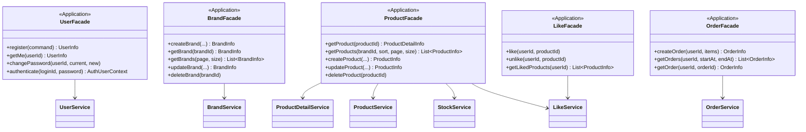

# 클래스 다이어그램

## 1. 도메인 모델

도메인 객체의 책임과 의존 방향, 비즈니스 로직이 Service에 몰리지 않고 적절히 분산되어 있는지 확인한다.

**읽는 포인트**
- `Money`, `Quantity`는 도메인의 핵심 값을 표현하는 **Value Object**다. 불변(immutable)이며, 값 자체로 동일성을 판단한다. 음수 방지·연산 규칙(plus/minus/multiply)·비교 규칙(isGreaterThanOrEqual)을 VO 내부에 캡슐화하여, 원시 타입(`Long`, `int`)이 도메인 곳곳을 떠다니며 같은 규칙이 중복되는 것을 막는다.
- `Money.amount`는 `Long`으로 표현한다. 한국 원화는 소수점이 없고, DB에서도 `bigint`로 저장하기 때문에 `BigDecimal`이 아닌 `Long`을 채택한다.
- `Quantity.value`는 `int`로 표현한다. 재고/수량 단위가 21억을 넘는 경우는 비즈니스적으로 가정하지 않는다.
- `User`는 비밀번호를 평문으로 저장하지 않는다. `updatePassword(encoded)`는 인코딩된 값만 받아 저장하는 도메인 메서드이며, 인코딩 자체는 `PasswordEncoder` 책임이다. `getMaskedName()`은 마지막 글자를 `*`로 치환한 값을 반환한다.
- `Stock`은 `Product`와 1:1로 분리된 별도 엔티티다. 재고는 주문마다 변경되는 반면 상품 정보(이름, 가격)는 거의 변하지 않아 쓰기 빈도가 다르다. 분리함으로써 동시 주문 시 `stocks` row에만 락이 집중되고 `products` row는 캐싱 가능한 상태를 유지한다.
- `Stock.version`은 낙관적 락(optimistic lock)용 컬럼이다. 동시 주문 충돌 감지에 사용된다 (요구사항 P-12).
- `Stock.deduct()`이 재고 부족 예외를 던지고, `Stock.restore()`은 결제 실패 시 보상용으로 호출된다. Service가 수량 비교를 직접 하지 않는다.
- `Like`는 `userId`, `productId`를 FK 없이 Long 값으로만 보유한다. User/Product 삭제 시 Like가 직접 영향받지 않도록 느슨하게 참조.
- `Brand.delete()`는 `deletedAt`을 채우는 메서드로 BaseEntity에서 상속된다. `Product.delete()`는 이를 오버라이드하여 `deletedAt` 채움과 함께 `status = DELETED`로도 변경한다.
- `OrderItem`은 `Order` 없이 존재할 수 없는 구조(Aggregate Root 패턴). `productName`, `productPrice`는 주문 시점 스냅샷이라 이후 상품 변경에 영향받지 않는다. 스냅샷 가격도 `Money` 타입을 그대로 사용한다.
- `Payment`는 주문과 1:1로 분리된 별도 애그리거트다. 결제 시도/결과를 명시적으로 기록하여 추후 PG 대조나 재조회에 활용할 수 있다.

**VO ↔ DB 매핑 (구현 메모)**
- `Money` → `bigint` (단일 컬럼) : JPA `@Embedded` 또는 `AttributeConverter` 활용
- `Quantity` → `int` (단일 컬럼) : 동일

---

## 2. 외부 시스템 추상화

외부 결제 시스템(PG)과 비밀번호 인코딩은 인터페이스로 추상화하여 도메인이 구현 세부사항에 의존하지 않도록 한다.

**읽는 포인트**
- `PaymentGateway`는 외부 PG와의 통신을 추상화한다. 도메인/Service 코드는 인터페이스에만 의존하므로 테스트에서는 `FakePaymentGateway`(고정 응답 반환)로, 운영에서는 `PgPaymentGatewayClient`(실제 HTTP 호출)로 교체된다.
- `PaymentResult`는 외부 응답을 도메인이 이해할 수 있는 결과 객체로 변환한 형태다. HTTP 응답 코드/바디 같은 외부 표현이 도메인까지 흘러들어오지 않도록 경계를 둔다.
- `PasswordEncoder`도 동일하게 인터페이스로 분리하여 알고리즘 교체(BCrypt → Argon2 등) 시 도메인 코드 변경 없이 구현체만 갈아낄 수 있다.

---

## 3. 레이어별 구조

각 계층의 책임과 의존 방향을 확인한다. 의존 방향은 `Application → Domain ← Infrastructure` 로 향한다.

### 3-1. 레이어 개요

| 계층 | 패키지 | 역할 | 대표 클래스 |
|------|--------|------|-------------|
| Interfaces | `interfaces/api/{domain}` | HTTP 요청/응답 매핑 | `XxxController`, `XxxV1Dto` |
| Application | `application/{domain}` | 유스케이스 흐름 조율, DTO 매핑 | `XxxFacade`, `XxxInfo` |
| Domain | `domain/{domain}` | 비즈니스 규칙, 도메인 객체/서비스, Repository 인터페이스 | `XxxModel`(Entity), `XxxService`, `XxxRepository`(I/F) |
| Infrastructure | `infrastructure/{domain}` | 외부 기술 의존 (JPA 등) | `XxxRepositoryImpl`, `XxxJpaRepository` |

### 3-2. Domain Service / Repository 구조

```mermaid
classDiagram
    class UserService {
        <<Domain Service>>
        +register(command) User
        +getUser(loginId) User
        +getUserById(userId) User
        +changePassword(userId, current, new)
        +authenticate(loginId, password) User
    }

    class BrandService {
        <<Domain Service>>
        +createBrand(name, description) Brand
        +getBrand(brandId) Brand
        +getBrands(page, size) List~Brand~
        +updateBrand(brandId, name, description) Brand
        +deleteBrand(brandId)
    }

    class ProductService {
        <<Domain Service>>
        +createProduct(brandId, ...) Product
        +getProduct(productId) Product
        +getProducts(brandId, sort, page, size) List~Product~
        +updateProduct(id, ...) Product
        +deleteProduct(id)
    }

    class StockService {
        <<Domain Service>>
        +createStock(productId, quantity) Stock
        +getStock(productId) Stock
        +getStocksByProductIds(productIds) List~Stock~
        +deduct(productId, qty)
        +restore(productId, qty)
        +changeQuantity(productId, newQty)
    }

    class LikeService {
        <<Domain Service>>
        +like(userId, productId)
        +unlike(userId, productId)
        +getLikedProducts(userId) List~Product~
        +countByProductId(productId) long
    }

    class OrderService {
        <<Domain Service>>
        +createOrder(userId, items) Order
        +getOrders(userId, startAt, endAt) List~Order~
        +getOrder(userId, orderId) Order
    }

    class PaymentService {
        <<Domain Service>>
        +process(orderId, amount) PaymentResult
    }

    class AdminOrderService {
        <<Domain Service>>
        +getAllOrders(page, size) List~Order~
        +getOrder(orderId) Order
    }

    class ProductDetailService {
        <<Domain Service>>
        +assemble(productId) ProductWithBrand
    }

    class ProductWithBrand {
        <<Domain Object>>
        Product product
        Brand brand
    }

    class UserRepository {
        <<interface>>
        +findByLoginId(loginId) Optional~User~
        +findById(userId) Optional~User~
        +existsByLoginId(loginId) boolean
        +save(user) User
    }

    class BrandRepository {
        <<interface>>
        +findById(id) Optional~Brand~
        +findAll(page, size) List~Brand~
        +save(brand) Brand
    }

    class ProductRepository {
        <<interface>>
        +findById(id) Optional~Product~
        +findAll(brandId, sort, page, size) List~Product~
        +findAllByBrandId(brandId) List~Product~
        +save(product) Product
    }

    class StockRepository {
        <<interface>>
        +findByProductId(productId) Optional~Stock~
        +findAllByProductIdIn(productIds) List~Stock~
        +save(stock) Stock
    }

    class LikeRepository {
        <<interface>>
        +existsByUserIdAndProductId(userId, productId) boolean
        +findByUserId(userId) List~Like~
        +countByProductId(productId) long
        +save(like) Like
        +deleteByUserIdAndProductId(userId, productId)
    }

    class OrderRepository {
        <<interface>>
        +save(order) Order
        +findById(id) Optional~Order~
        +findByUserIdAndOrderedAtBetween(userId, start, end) List~Order~
        +findAll(page, size) List~Order~
    }

    class PaymentRepository {
        <<interface>>
        +save(payment) Payment
        +findByOrderId(orderId) Optional~Payment~
    }

    UserService --> UserRepository
    UserService --> PasswordEncoder
    BrandService --> BrandRepository
    BrandService --> ProductRepository
    ProductService --> ProductRepository
    StockService --> StockRepository
    LikeService --> LikeRepository
    LikeService --> ProductRepository
    OrderService --> OrderRepository
    OrderService --> ProductRepository
    OrderService --> StockService
    OrderService --> PaymentService
    PaymentService --> PaymentRepository
    PaymentService --> PaymentGateway
    AdminOrderService --> OrderRepository
    ProductDetailService --> ProductService
    ProductDetailService --> BrandService
    ProductDetailService ..> ProductWithBrand : creates
```

### 3-3. Application Facade 의존 구조

Application Layer의 Facade는 유스케이스 흐름을 조율하고, 여러 Domain Service / Domain Service의 조합 결과를 받아 `XxxInfo` DTO로 어셈블하여 반환한다.

**읽는 포인트**
- **계층 책임 분리**
  - **Application Facade**: 유스케이스 흐름 조율, 여러 Domain Service 호출, Domain Entity → `Info` DTO 매핑. **비즈니스 규칙/계산은 직접 수행하지 않는다.**
  - **Domain Service**: 단일 도메인 내부 로직 또는 여러 도메인 객체 간 협력. 상태를 갖지 않으며 Repository를 통해 도메인 객체를 가져와 협력시킨다.
  - **Repository (interface)**: 도메인이 필요로 하는 영속성 기능을 인터페이스로 정의. 구현은 Infrastructure가 담당하여 DIP를 실현한다.

- **`ProductDetailService` (Domain Service) 도입 배경**
  - 상품 상세 조회는 `Product`와 `Brand` 두 도메인 객체의 협력이 필요하다.
  - 단일 도메인 객체에 두기 애매하고, Application Facade에 둘 경우 도메인 협력 로직이 Application 계층으로 새어나간다.
  - 따라서 두 도메인 객체를 조합한 결과(`ProductWithBrand`)를 반환하는 **Domain Service**로 분리한다.
  - Application Facade(`ProductFacade.getProduct`)는 `ProductDetailService`의 결과에 `Stock`(재고 정보)과 `LikeService.countByProductId`(좋아요 수)를 더해 `ProductDetailInfo`로 어셈블한다.

- **각 Service의 역할 메모**
  - `UserService.authenticate`는 `UserModel`을 반환하고, `UserFacade.authenticate`가 `AuthUserContext(loginId, userId)`로 변환해 `AuthUserArgumentResolver`에 돌려준다. 인증 한 번으로 `userId`까지 확보되므로 다른 Facade에서는 `UserService.getUser()`를 다시 호출하지 않는다.
  - `UserService.getUser(loginId)`는 회원 본인 조회용(인증 시), `getUserById(userId)`는 인증 이후 PK 기준 조회용으로 사용한다.
  - `UserService`가 `PasswordEncoder`에 의존하는 이유: 회원가입 시 비밀번호 인코딩, 비밀번호 변경 시 현재 비밀번호 검증 및 새 비밀번호 인코딩.
  - `BrandService`가 `ProductRepository`에 의존하는 이유: 브랜드 삭제 시 연관 상품도 soft delete 처리해야 하기 때문이다.
  - `LikeService`가 `ProductRepository`에 의존하는 이유: 좋아요 등록 전 상품 존재 여부 확인이 필요하기 때문이다. 멱등 보장은 `LikeService` 내부에서 `existsByUserIdAndProductId` 사전 체크 + UK 위반 예외 캐치로 이중 방어한다.
  - `OrderService`가 `PaymentService`에 의존하는 이유: 주문 생성 트랜잭션 내에서 결제 요청을 동기 호출해야 하기 때문이다. 결제 실패 시 `Stock.restore()`을 통한 보상도 OrderService가 조율한다.
  - `PaymentService`는 `PaymentGateway`(외부 시스템 추상화)에 의존한다. 도메인은 외부 HTTP 호출 세부사항을 모른다.
  - `OrderService`와 `AdminOrderService`를 분리했다. 고객 주문 흐름(생성/조회 + 본인 검증)과 어드민 전체 조회는 접근 주체와 책임이 다르기 때문이다.
  - `ProductService`가 `StockRepository`에 의존하지 않고, 그 책임을 `StockService`로 분리했다. 재고 차감/복구/일괄 조회 같은 동작이 `Stock` 도메인 내부에 응집된다.
  - Repository는 모두 interface로 선언하여 domain이 infrastructure 구현체에 직접 의존하지 않는다.
