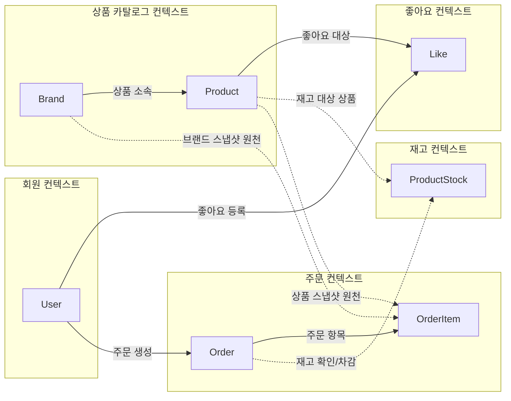
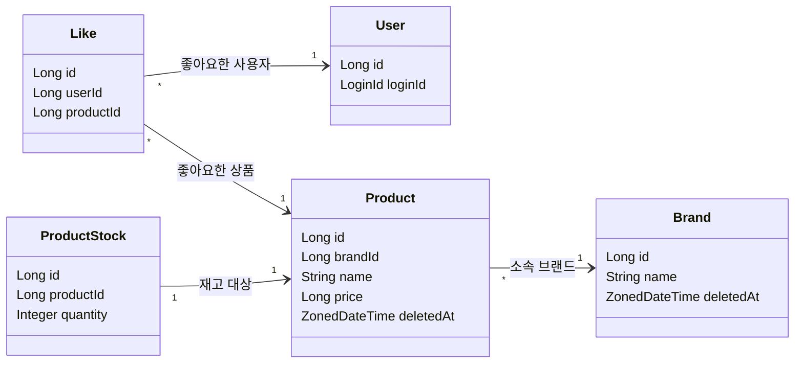
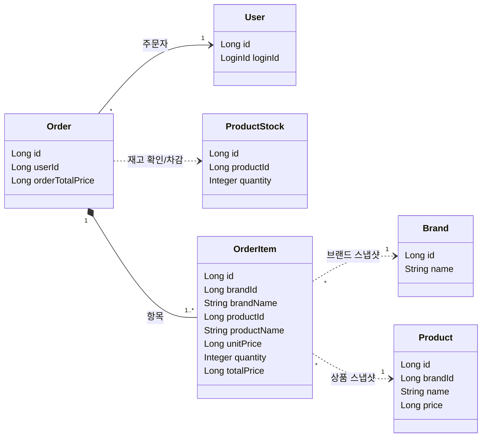

# 감성 이커머스 도메인 객체 설계

> 기준 문서: [01-requirements.md](01-requirements.md), [02-sequence-diagrams.md](02-sequence-diagrams.md)  
> 작성 방식: Mermaid 다이어그램 중심 + 도메인 객체 책임/협업 설명  
> 목적: 구현 클래스명을 세부 확정하기보다, 각 도메인 객체가 어떤 상태와 규칙을 책임지는지 정리한다.

## 1. 설계 방향

이 문서는 요구사항과 시퀀스 흐름을 구현 전 도메인 객체 관계로 정리한 문서다. 목적은 모든 필드와 메서드를 확정하는 것이 아니라, 어떤 도메인이 어떤 상태와 규칙을 소유하고 서로 어떻게 연결되는지 파악하는 데 있다.

- 다이어그램은 핵심 도메인과 관계만 표현한다.
- 필드는 식별자, 관계를 드러내는 값, 핵심 비즈니스 값만 표시한다.
- `User`는 기존 구현된 도메인을 참조한다.
- `Product`는 상품 기본 정보와 가격을 가지고, 현재 재고는 `ProductStock`이 가진다.
- `Brand`, `Product`는 soft delete 대상이고, `Like`는 취소 시 hard delete한다.
- `OrderItem`은 주문 당시의 상품/브랜드 정보를 스냅샷으로 보존한다.
- Controller, Facade, DTO, Repository 구현 세부는 이 문서에서 다루지 않는다.

## 2. 애그리게이트/컨텍스트 관계도

먼저 애그리게이트와 컨텍스트 경계를 한눈에 본다. 상품 기본 정보와 현재 재고는 서로 다른 변경 이유를 가지므로 `Product`와 `ProductStock`을 다른 컨텍스트로 표현한다. 점선은 현재 값을 조회하는 관계가 아니라 주문 당시 값을 보존하기 위한 스냅샷 원천 또는 주문 생성 중 일시적 협력 관계다.

## 3. 도메인 관계 다이어그램

도메인 관계를 한 장에 모두 넣으면 선이 많아져 읽기 어렵다. 그래서 조회/좋아요 중심 관계와 주문 스냅샷 관계를 나누어 표현한다.

### 3.1 상품 탐색과 좋아요 관계

### 3.2 주문과 스냅샷 관계

| 표기 | 의미 |
| --- | --- |
| 실선 | 실제 참조 관계 |
| 마름모 실선 | 생명주기상 포함 관계. 주문이 주문 항목을 소유 |
| 점선 | 주문 시점 값을 복사해 보존하는 스냅샷 원천 또는 일시적 협력 |
| `OrderItem ..> Brand/Product` | 주문 후 브랜드/상품이 수정 또는 삭제되어도 주문 항목 값은 변하지 않음 |

## 4. 도메인 객체 책임

### 4.1 Brand

`Brand`는 브랜드 자체의 유효성과 상태를 책임진다. 브랜드 삭제 시에는 소속 상품도 고객 API에서 함께 제외되어야 한다.

| 항목 | 설계 |
| --- | --- |
| 주요 상태 | `name`, `description`, `deletedAt` |
| 생성 규칙 | `name`은 비어 있을 수 없음 |
| 변경 규칙 | 브랜드명과 설명을 수정할 수 있음 |
| 삭제 규칙 | `delete()`로 soft delete 처리 |
| 맡기지 않을 책임 | 소속 상품 일괄 삭제, 고객 응답 DTO 구성 |

### 4.2 Product

`Product`는 브랜드에 소속된 판매 상품의 기본 정보를 책임진다. 현재 재고 수량과 재고 차감 규칙은 `ProductStock`이 책임진다.

| 항목 | 설계 |
| --- | --- |
| 주요 상태 | `brandId`, `name`, `description`, `price`, `deletedAt` |
| 생성 규칙 | 미삭제 브랜드에만 생성 가능. 브랜드 존재 확인은 서비스에서 수행 |
| 변경 규칙 | 브랜드는 변경하지 않음. 이름, 설명, 가격만 수정 가능 |
| 가격 규칙 | `price >= 0` |
| 삭제 규칙 | `delete()`로 soft delete 처리 |

### 4.3 ProductStock

`ProductStock`은 상품별 현재 재고 수량을 책임진다. 주문 생성 시 비관적 락을 획득하는 대상이다.

| 항목 | 설계 |
| --- | --- |
| 주요 상태 | `productId`, `quantity` |
| 생성 규칙 | 상품 등록 시 상품과 함께 생성 |
| 재고 규칙 | `quantity >= 0` |
| 주문 규칙 | 주문 수량보다 재고가 부족하면 `409 Conflict` 성격의 예외 |
| 재고 차감 | `deduct(quantity)`로 현재 재고를 주문 수량만큼 차감 |
| 동시성 규칙 | 주문 생성 시 `productId` 오름차순으로 `ProductStock` row lock 획득 |

### 4.4 Like

`Like`는 사용자가 특정 상품을 좋아요한 현재 상태를 표현한다. 이력 데이터가 아니므로 취소 시 soft delete하지 않는다.

| 항목 | 설계 |
| --- | --- |
| 주요 상태 | `userId`, `productId` |
| 생성 규칙 | 미삭제 상품에 대해서만 생성 가능. 상품 확인은 서비스에서 수행 |
| 유일성 | `(userId, productId)` 조합은 논리적으로 하나만 존재 |
| 등록 멱등성 | 이미 좋아요가 있으면 새 row를 만들지 않고 성공 처리 |
| 취소 멱등성 | 좋아요가 없어도 성공 처리 |
| 삭제 규칙 | 취소 시 repository에서 hard delete |

### 4.5 Order

`Order`는 한 번의 주문 전체를 표현한다. 주문은 하나 이상의 `OrderItem`을 가지며, 전체 금액은 항목 금액 합계로 계산한다.

| 항목 | 설계 |
| --- | --- |
| 주요 상태 | `userId`, `orderTotalPrice`, `items` |
| 생성 규칙 | 주문 항목은 1개 이상이어야 함 |
| 중복 규칙 | 같은 요청 안의 중복 `productId`는 허용하지 않음 |
| 소유자 규칙 | `isOwnedBy(userId)`로 고객 주문 상세 접근을 검증 |
| 금액 규칙 | `orderTotalPrice`는 모든 `OrderItem.totalPrice`의 합 |
| 실패 규칙 | 하나라도 주문 불가하면 `Order`를 생성하지 않음 |

### 4.6 OrderItem

`OrderItem`은 주문 당시의 상품/브랜드 표시 정보를 스냅샷으로 가진다. 이후 상품명, 브랜드명, 가격이 바뀌거나 삭제되어도 주문 상세는 이 값을 사용한다.

| 항목 | 설계 |
| --- | --- |
| 원본 식별자 | `brandId`, `productId` |
| 스냅샷 표시값 | `brandName`, `productName`, `unitPrice` |
| 수량/금액 | `quantity`, `totalPrice` |
| 생성 규칙 | `quantity >= 1` |
| 금액 규칙 | `totalPrice = unitPrice * quantity` |
| 조회 규칙 | 주문 상세 응답은 현재 상품이 아니라 `OrderItem` 스냅샷 기준 |
