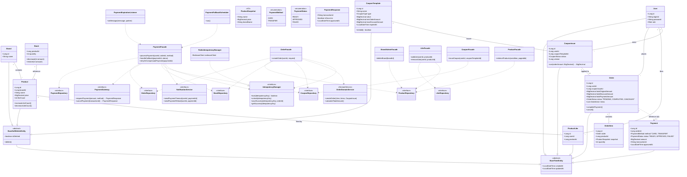

```mermaid
classDiagram
    class BaseTimeEntity {
        <<abstract>>
        +LocalDateTime createdAt
        +LocalDateTime updatedAt
    }

    class BaseSoftDeleteEntity {
        <<abstract>>
        +boolean isDeleted
        +delete()
    }

    BaseSoftDeleteEntity --|> BaseTimeEntity

    class User {
        +Long id
        +String loginId
        +String password
        +Role role
    }
    User --|> BaseTimeEntity
    
    class Brand {
        +Long id
        +String name
    }
    Brand --|> BaseSoftDeleteEntity
    
    class Product {
        +Long id
        +Long brandId
        +String name
        +BigDecimal price
        +int likeCount
        +increaseLikeCount()
        +decreaseLikeCount()
    }
    Product --|> BaseSoftDeleteEntity
    
    class Stock {
        +Long productId
        +int quantity
        +decrease(int amount)
        +restore(int amount)
    }
    Stock "1" -- "1" Product : reference
    
    class ProductLike {
        +Long id
        +Long userId
        +Long productId
    }
    ProductLike --|> BaseTimeEntity

    class CouponTemplate {
        +Long id
        +String name
        +CouponType type
        +BigDecimal value
        +BigDecimal minOrderAmount
        +BigDecimal maxDiscountAmount
        +LocalDateTime expiredAt
        +isValid() boolean
    }
    CouponTemplate --|> BaseSoftDeleteEntity

    class CouponIssue {
        +Long id
        +Long userId
        +Long couponTemplateId
        +CouponStatus status
        +Long version
        +use(orderAmount: BigDecimal): BigDecimal
    }
    CouponIssue --|> BaseTimeEntity
    
    class Order {
        +Long id
        +Long userId
        +Long couponIssueId
        +BigDecimal totalOriginalAmount
        +BigDecimal totalDiscountAmount
        +BigDecimal totalPaymentAmount
        +OrderStatus status "PENDING, COMPLETED, CANCELED"
        +List~OrderItem~ items
        +completePayment()
        +cancel()
    }
    Order --|> BaseTimeEntity
    
    class OrderItem {
        +Long id
        +Order order
        +Long productId
        +ProductSnapshot snapshot
        +int quantity
    }
    
    class ProductSnapshot {
        <<VO>>
        +String name
        +BigDecimal price
        +String brandName
    }

    class Payment {
        +Long id
        +Long orderId
        +PaymentMethod method "CARD, TRANSFER"
        +PaymentStatus status "READY, APPROVED, FAILED"
        +BigDecimal amount
        +String transactionId
        +LocalDateTime approvedAt
    }
    Payment --|> BaseTimeEntity

    class PaymentMethod {
        <<enumeration>>
        CARD
        TRANSFER
    }

    class PaymentStatus {
        <<enumeration>>
        READY
        APPROVED
        FAILED
    }

    class PaymentGateway {
        <<interface>>
        +requestPayment(amount, method): PaymentResponse
        +cancelPayment(transactionId): PaymentResponse
    }

    class PaymentResponse {
        +String transactionId
        +boolean isSuccess
        +LocalDateTime approvedAt
    }

    class NotificationService {
        <<interface>>
        +sendPaymentTimeout(userId, paymentId)
        +sendPaymentRefund(userId, paymentId)
    }

    class PaymentFallbackScheduler {
        +run()
    }

    %% 도메인 간 관계
    Brand "1" -- "*" Product : contains
    User "1" -- "*" Order : places
    Order "1" -- "*" OrderItem : contains
    User "1" -- "*" ProductLike : likes
    Product "1" -- "*" ProductLike : liked by
    User "1" -- "*" CouponIssue : owns
    CouponTemplate "1" -- "*" CouponIssue : issues
    CouponIssue "1" -- "0..1" Order : applied to
    Order "1" ..> "0..1" Payment : reference (id)

    %% 인프라스트럭처 (Repository 및 기타 관리)
    class OrderRepository { <<interface>> }
    class ProductRepository { <<interface>> }
    class StockRepository { <<interface>> }
    class CouponRepository { <<interface>> }
    class LikeRepository { <<interface>> }
    class PaymentRepository { <<interface>> }

    class IdempotencyManager {
        <<interface>>
        +lock(idempotencyKey) boolean
        +unlock(idempotencyKey)
        +saveSuccess(idempotencyKey, orderId)
        +getSuccess(idempotencyKey)
    }
    
    class RedisIdempotencyManager {
        -RedissonClient redissonClient
    }
    RedisIdempotencyManager ..|> IdempotencyManager

    %% 파사드(Facade) 계층 (트랜잭션 및 흐름 제어)
    class OrderFacade {
        +createOrder(userId, request)
    }
    class PaymentFacade {
        +processPayment(userId, orderId, method)
        +handleCallback(paymentId, status)
        +retryOrCompensatePayment(paymentId)
    }
    class PaymentExpirationListener {
        +onMessage(message, pattern)
    }
    class BrandAdminFacade {
        +deleteBrand(brandId)
    }
    class LikeFacade {
        +addLike(userId, productId)
        +removeLike(userId, productId)
    }
    class CouponFacade {
        +issueCoupon(userId, couponTemplateId)
    }
    class ProductFacade {
        +retrieveProducts(condition, pageable)
    }

    %% 도메인 서비스 (Domain Service) - 여러 엔티티의 협력이 필요한 순수 로직
    class OrderDomainService {
        <<DomainService>>
        +createOrder(User, items, CouponIssue)
        +calculateTotalAmount()
    }

    %% Facade 의존성 (Facade -> Repository, Domain Service, PG)
    OrderFacade ..> OrderRepository
    OrderFacade ..> ProductRepository
    OrderFacade ..> StockRepository
    OrderFacade ..> CouponRepository
    OrderFacade ..> OrderDomainService
    OrderFacade ..> IdempotencyManager

    PaymentFacade ..> PaymentRepository
    PaymentFacade ..> OrderRepository
    PaymentFacade ..> PaymentGateway
    PaymentFacade ..> StockRepository
    PaymentFacade ..> CouponRepository
    PaymentFacade ..> NotificationService
    PaymentFacade ..> IdempotencyManager
    
    PaymentExpirationListener ..> PaymentFacade
    PaymentFallbackScheduler ..> PaymentFacade
    
    BrandAdminFacade ..> ProductRepository
    
    LikeFacade ..> LikeRepository
    LikeFacade ..> ProductRepository

    CouponFacade ..> CouponRepository

    ProductFacade ..> ProductRepository
```