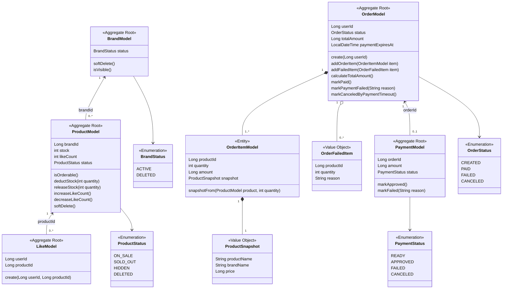
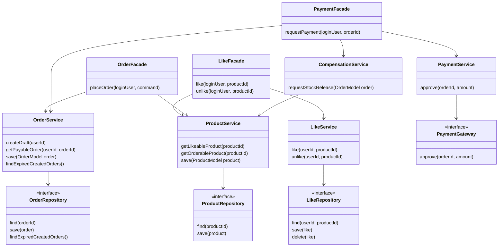

# 03. Class Diagram

## 목적

이 문서는 2주차 설계 대상 도메인의 객체 구조와 책임을 정의한다.
클래스 다이어그램은 구현 클래스를 확정하기 위한 최종 설계가 아니라, DDD 기반으로 어떤 객체가 어떤 책임을 가져야 하는지 합의하기 위한 기준이다.

## 설계 원칙

- 도메인 규칙은 `Model`에 둔다. Facade나 Controller가 상태를 직접 변경하지 않는다.
- Facade는 여러 도메인의 협력을 조율한다.
- Domain Service는 같은 도메인의 Repository 인터페이스를 통해 애그리거트를 조회/저장한다.
- 다른 도메인의 내부 Repository를 직접 참조하지 않는다.
- 연관 객체 전체를 들고 있기보다 ID 참조를 기본으로 한다.
- 주문 이력은 상품 변경의 영향을 받지 않도록 스냅샷을 가진다.
- 클래스 다이어그램은 ERD가 아니므로 모든 컬럼을 나열하지 않는다. 도메인 판단에 필요한 핵심 상태와 행위만 표현한다.

---

## 도메인 모델

## 책임 정의

| 객체 | 책임 |
| --- | --- |
| `BrandModel` | 브랜드의 노출 가능 여부와 소프트 삭제 상태를 관리한다. |
| `ProductModel` | 상품 판매 가능 여부, 재고 차감/해제, 좋아요 수 변경, 소프트 삭제를 관리한다. |
| `LikeModel` | 사용자와 상품의 좋아요 관계를 표현한다. 중복 방지는 Repository 유니크 제약과 함께 보장한다. |
| `OrderModel` | 주문 상태, 주문 항목, 실패 항목, 총 결제 금액을 관리한다. |
| `OrderItemModel` | 주문 당시 상품 정보를 스냅샷으로 보관한다. |
| `OrderFailedItem` | 부분 주문 정책에서 실패한 요청 항목과 실패 사유를 표현한다. |
| `PaymentModel` | 주문 결제 시도와 결제 상태를 표현한다. |

## 애그리거트 경계

### Brand

- `BrandModel`은 독립 애그리거트다.
- `ProductModel`은 `brandId`로 브랜드를 참조한다.
- 브랜드 삭제는 소프트 삭제이며, 사용자 조회에서는 제외된다.

### Product

- `ProductModel`은 상품 애그리거트 루트다.
- 재고 차감과 재고 해제는 `ProductModel`의 행위로 둔다.
- 좋아요 수는 `Product.likeCount`에 캐시하지만, 원본 데이터는 `LikeModel`이다.
- 좋아요 수 변경은 좋아요 생성/삭제 결과에 따라 수행되어야 한다.

### Like

- `LikeModel`은 사용자와 상품의 관계를 표현하는 애그리거트다.
- 같은 `userId`, `productId` 조합은 하나만 존재해야 한다.
- `LikeModel`은 `ProductModel`을 직접 참조하지 않는다.

### Order

- `OrderModel`은 주문 애그리거트 루트다.
- `OrderItemModel`은 `OrderModel`에 포함된다.
- `OrderItemModel`은 `ProductModel`을 직접 참조하지 않고 주문 당시의 상품명, 브랜드명, 가격을 스냅샷으로 가진다.
- `OrderFailedItem`은 재고 부족 등으로 주문 대상에서 제외된 항목을 표현한다.

### Payment

- `PaymentModel`은 주문 결제 시도를 표현하는 애그리거트다.
- 결제 승인/실패 결과는 `PaymentModel`에 기록하고, 주문 상태 변경은 `OrderModel`의 행위로 수행한다.
- 외부 결제 시스템과의 통신은 도메인 모델이 아니라 `PaymentService`와 `PaymentGateway` 경계에서 처리한다.

---

## 유스케이스 조율 구조

## 의존 방향

- `LikeFacade`는 좋아요 생성/삭제 결과에 따라 `ProductModel.likeCount` 변경을 조율한다.
- `OrderFacade`는 상품 조회/재고 차감과 주문 생성의 순서를 조율한다.
- `PaymentFacade`는 결제 결과에 따라 주문 상태 변경과 보상 요청을 조율한다.
- `CompensationService`는 재고 해제를 상품 도메인에 위임한다.
- 도메인 Service는 infrastructure 구현체가 아니라 domain Repository 인터페이스에만 의존한다.

## 설계 리스크

- `Product.likeCount`는 파생 값이므로 `LikeModel`과 정합성이 깨질 수 있다. 좋아요 등록/취소와 카운트 변경은 같은 유스케이스 경계에서 처리해야 한다.
- 부분 주문을 허용하므로 `OrderModel`은 성공 항목과 실패 항목을 명확히 표현해야 한다.
- 결제 실패와 타임아웃 보상 처리는 비동기 재시도가 필요할 수 있다.
- 외부 결제 장애를 별도 대기 상태로 둘지, 실패 상태로 기록할지는 결제 장애 처리 정책을 구체화하면서 결정한다.
