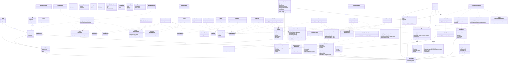

```mermaid
classDiagram
    class BaseTimeEntity {
        <<abstract>>
        +LocalDateTime createdAt
        +LocalDateTime updatedAt
    }

    class BaseSoftDeleteEntity {
        <<abstract>>
        +boolean isDeleted
        +delete()
    }

    BaseSoftDeleteEntity --|> BaseTimeEntity

    class User {
        +Long id
        +String loginId
        +String password
        +Role role
    }
    User --|> BaseTimeEntity
    
    class Brand {
        +Long id
        +String name
    }
    Brand --|> BaseSoftDeleteEntity
    
    class Product {
        +Long id
        +Long brandId
        +String name
        +BigDecimal price
    }
    Product --|> BaseSoftDeleteEntity
    
    class Stock {
        +Long productId
        +int quantity
        +decrease(int amount)
        +restore(int amount)
    }
    Stock "1" -- "1" Product : reference
    
    class ProductLike {
        +Long id
        +Long userId
        +Long productId
    }
    ProductLike --|> BaseTimeEntity

    class CouponTemplate {
        +Long id
        +String name
        +CouponType type
        +BigDecimal value
        +BigDecimal minOrderAmount
        +BigDecimal maxDiscountAmount
        +LocalDateTime expiredAt
        +int totalQuantity
        +int issuedQuantity
        +isValid() boolean
        +increaseIssuedQuantity()
    }
    CouponTemplate --|> BaseSoftDeleteEntity

    class CouponIssue {
        +Long id
        +Long userId
        +Long couponTemplateId
        +CouponStatus status
        +Long version
        +use(orderAmount: BigDecimal): BigDecimal
    }
    CouponIssue --|> BaseTimeEntity
    
    class Order {
        +Long id
        +Long userId
        +Long couponIssueId
        +BigDecimal totalOriginalAmount
        +BigDecimal totalDiscountAmount
        +BigDecimal totalPaymentAmount
        +OrderStatus status "PENDING, COMPLETED, CANCELED"
        +List~OrderItem~ items
        +completePayment()
        +cancel()
    }
    Order --|> BaseTimeEntity
    
    class OrderItem {
        +Long id
        +Order order
        +Long productId
        +ProductSnapshot snapshot
        +int quantity
    }
    
    class ProductSnapshot {
        <<VO>>
        +String name
        +BigDecimal price
        +String brandName
    }

    class Payment {
        +Long id
        +Long orderId
        +PaymentMethod method "CARD, TRANSFER"
        +PaymentStatus status "READY, APPROVED, FAILED, REFUNDED"
        +BigDecimal amount
        +String transactionId
        +LocalDateTime approvedAt
    }
    Payment --|> BaseTimeEntity
    
    class OutboxEvent {
        +Long id
        +String aggregateType
        +Long aggregateId
        +String eventType
        +String payload
        +OutboxStatus status "INIT, PUBLISHED"
        +markAsPublished()
    }
    OutboxEvent --|> BaseTimeEntity

    class ProductMetrics {
        +Long productId
        +LocalDate metricDate
        +int viewCount
        +int likeCount
        +int salesCount
        +BigDecimal orderAmount
        +double dailyRankingScore
        +addView(scoreDelta)
        +addLike(scoreDelta)
        +addSales(amount, orderAmount, scoreDelta)
    }
    ProductMetrics --|> BaseTimeEntity
    
    class EventHandled {
        +String eventId
        +String eventType
        +LocalDateTime handledAt
    }

    class RankingItem {
        <<DTO>>
        +Long productId
        +String productName
        +String brandName
        +BigDecimal price
        +int rank
        +double score
        +RankingPeriod period
        +String startDate
        +String endDate
    }

    class ProductRankingInfo {
        <<DTO>>
        +int rank
        +double score
        +String date
    }

    class RankingPeriod {
        <<enumeration>>
        DAILY
        WEEKLY
        MONTHLY
    }

    class ProductRankMv {
        +RankingPeriod period
        +LocalDate rankStartDate
        +LocalDate rankEndDate
        +Long productId
        +int rank
        +double score
        +Long batchRunId
        +boolean isActive
    }
    ProductRankMv --|> BaseTimeEntity

    class ProductRankBatchRun {
        +Long id
        +RankingPeriod period
        +LocalDate rankStartDate
        +LocalDate rankEndDate
        +BatchRunStatus status
        +markCompleted()
        +markFailed()
    }
    ProductRankBatchRun --|> BaseTimeEntity

    class BatchRunStatus {
        <<enumeration>>
        RUNNING
        COMPLETED
        FAILED
    }

    class OutboxEventLog {
        <<modules/event-contract>>
        +Long id
        +String eventType
        +String status
        +String payload
        +LocalDateTime createdAt
    }

    class ProductRankingEvent {
        <<modules/ranking-contract>>
        +String eventId
        +RankingEventType rankingEventType
        +Long productId
        +BigDecimal price
        +int amount
        +LocalDateTime occurredAt
    }

    class RankingEventType {
        <<modules/ranking-contract>>
        VIEW
        LIKE
        ORDER
        PRODUCT_DELETED
    }

    class RankingKeyPolicy {
        <<modules/ranking-contract>>
        +dateKey(occurredAt): String
        +rankingKey(dateKey): String
        +handledKey(dateKey): String
        +rebuildRankingKey(dateKey): String
        +carryOverDoneKey(dateKey): String
    }

    class PaymentMethod {
        <<enumeration>>
        CARD
        TRANSFER
    }

    class PaymentStatus {
        <<enumeration>>
        READY
        APPROVED
        FAILED
        REFUNDED
    }

    class PaymentGateway {
        <<interface>>
        +requestPayment(amount, method): PaymentResponse
        +cancelPayment(transactionId): PaymentResponse
    }

    class PaymentResponse {
        +String transactionId
        +boolean isSuccess
        +LocalDateTime approvedAt
    }

    class NotificationKafkaConsumer {
        +consumePaymentEvent(ConsumerRecord)
    }
    class ExternalPushService {
        <<interface>>
        +sendPush(userId, message)
    }
    NotificationKafkaConsumer ..> ExternalPushService

    class PaymentFallbackScheduler {
        +run()
    }

    %% 도메인 간 관계
    Brand "1" -- "*" Product : contains
    User "1" -- "*" Order : places
    Order "1" -- "*" OrderItem : contains
    User "1" -- "*" ProductLike : likes
    Product "1" -- "*" ProductLike : liked by
    User "1" -- "*" CouponIssue : owns
    CouponTemplate "1" -- "*" CouponIssue : issues
    CouponIssue "1" -- "0..1" Order : applied to
    Order "1" ..> "0..1" Payment : reference (id)

    %% 인프라스트럭처 (Repository 및 기타 관리)
    class OrderRepository { <<interface>> }
    class ProductRepository { <<interface>> }
    class StockRepository { <<interface>> }
    class CouponRepository { <<interface>> }
    class LikeRepository { <<interface>> }
    class PaymentRepository { <<interface>> }

    class IdempotencyManager {
        <<interface>>
        +lock(idempotencyKey) boolean
        +unlock(idempotencyKey)
        +saveSuccess(idempotencyKey, orderId)
        +getSuccess(idempotencyKey)
    }
    
    class RedisIdempotencyManager {
        -RedissonClient redissonClient
    }
    RedisIdempotencyManager ..|> IdempotencyManager

    %% 파사드(Facade) 계층 (트랜잭션 및 흐름 제어)
    class OrderFacade {
        +createOrder(userId, request)
    }
    class PaymentFacade {
        +processPayment(userId, orderId, method)
        +handleCallback(paymentId, status)
        +retryOrCompensatePayment(paymentId)
    }
    class PaymentRetryWorker {
        +executeRetry(paymentId, retryCount)
    }
    class BrandAdminFacade {
        +deleteBrand(brandId)
    }
    class ProductAdminFacade {
        +deleteProduct(productId)
    }
    class LikeFacade {
        +addLike(userId, productId)
        +removeLike(userId, productId)
    }
    class CouponFacade {
        +requestCouponIssue(userId, couponTemplateId): String
        +getIssueRequestStatus(requestId): CouponRequestStatus
    }
    class CouponKafkaConsumer {
        +consumeCouponIssueEvent(ConsumerRecord)
    }
    class ProductFacade {
        +retrieveProduct(productId)
        +retrieveProducts(condition, pageable)
    }
    class RankingFacade {
        +retrieveRankings(period, startDate, endDate, page, size)
    }

    %% 도메인 서비스 (Domain Service) - 여러 엔티티의 협력이 필요한 순수 로직
    class OrderDomainService {
        <<DomainService>>
        +createOrder(User, items, CouponIssue)
        +calculateTotalAmount()
    }

    %% Facade 의존성 (Facade -> Repository, Domain Service, PG)
    OrderFacade ..> OrderRepository
    OrderFacade ..> ProductRepository
    OrderFacade ..> StockRepository
    OrderFacade ..> CouponRepository
    OrderFacade ..> OrderDomainService
    OrderFacade ..> IdempotencyManager

    PaymentFacade ..> PaymentRepository
    PaymentFacade ..> OrderRepository
    PaymentFacade ..> PaymentGateway
    PaymentFacade ..> StockRepository
    PaymentFacade ..> IdempotencyManager
    
    PaymentRetryWorker ..> PaymentFacade
    PaymentFallbackScheduler ..> PaymentFacade
    
    BrandAdminFacade ..> ProductRepository
    ProductAdminFacade ..> ProductRepository
    ProductAdminFacade ..> OutboxEventRepository
    
    LikeFacade ..> LikeRepository
    LikeFacade ..> ProductRepository

    CouponFacade ..> CouponRepository

    ProductFacade ..> ProductRepository

    %% Kafka 이벤트 퍼블리셔/컨슈머 계층
    class OutboxRelayScheduler {
        +publishPendingEvents()
    }
    class OutboxEventRepository {
        <<interface>>
        +save(outboxEvent)
    }
    class RankingRebuildEventRepository {
        <<interface>>
        +findEventsForRebuild(referenceDate): List~ProductRankingEvent~
    }
    class KafkaEventProducer {
        <<interface>>
        +send(topic, partitionKey, payload)
    }
    class MetricsKafkaConsumer {
        +consumeMetricsEvent(ConsumerRecord)
    }
    class RankingKafkaConsumer {
        +consumeRankingEvent(ConsumerRecord)
    }
    class RankingRebuildJob {
        +rebuild(dateRange)
    }
    class RankingCarryOverJob {
        +carryOver(today)
    }
    class ProductRankingAggregationJob {
        +aggregate(period, startDate, endDate)
    }
    class ProductMetricsItemReader {
        +readChunk(startDate, endDate)
    }
    class ProductRankAggregationProcessor {
        +aggregate(metrics)
        +filterActiveProducts(productIds)
        +top100(items)
    }
    class ProductRankMvWriter {
        +saveSnapshot(batchRunId, rankings)
        +validateSnapshot(batchRunId)
        +activateSnapshot(period, startDate, endDate, batchRunId)
    }
    class MetricsUpdateService {
        <<DomainService>>
        +addMetrics(eventId, payload)
    }
    class RankingScorePolicy {
        <<modules/ranking-contract>>
        +calculate(event): double
        +resolveDateKey(event): String
    }
    class RankingRedisRepository {
        <<interface>>
        +markHandled(dateKey, eventId): boolean
        +increaseScore(dateKey, productId, score)
        +findPage(dateKey, page, size)
        +findTopRankings(dateKey, limit)
        +findRank(dateKey, productId)
        +findScore(dateKey, productId)
        +removeProductFromRecentRankings(productId)
        +markCarryOverDone(dateKey, ttl)
        +isCarryOverDone(dateKey): boolean
        +expire(dateKey, ttl)
    }
    class ProductMetricsRepository {
        <<interface>>
        +findByMetricDateBetween(startDate, endDate)
    }
    class ProductRankMvRepository {
        <<interface>>
        +findActivePage(period, startDate, endDate, page, size)
        +saveAll(batchRunId, rankings)
        +existsInvalidSnapshot(batchRunId): boolean
        +deactivateActiveSnapshot(period, startDate, endDate)
        +activateSnapshot(batchRunId)
    }
    class ProductRankBatchRunRepository {
        <<interface>>
        +create(period, startDate, endDate): Long
        +markCompleted(batchRunId)
        +markFailed(batchRunId)
    }
    
    OutboxRelayScheduler ..> KafkaEventProducer
    MetricsKafkaConsumer ..> MetricsUpdateService
    MetricsKafkaConsumer ..> ProductRankingEvent
    RankingKafkaConsumer ..> ProductRankingEvent
    RankingKafkaConsumer ..> RankingScorePolicy
    RankingKafkaConsumer ..> RankingKeyPolicy
    RankingKafkaConsumer ..> RankingRedisRepository
    RankingRebuildJob ..> RankingRebuildEventRepository
    RankingRebuildJob ..> RankingScorePolicy
    RankingRebuildJob ..> RankingKeyPolicy
    RankingRebuildJob ..> RankingRedisRepository
    RankingCarryOverJob ..> RankingKeyPolicy
    RankingCarryOverJob ..> RankingRedisRepository
    RankingCarryOverJob ..> ProductRepository
    ProductRankingAggregationJob ..> ProductMetricsItemReader
    ProductRankingAggregationJob ..> ProductRankAggregationProcessor
    ProductRankingAggregationJob ..> ProductRankMvWriter
    ProductRankingAggregationJob ..> ProductRankBatchRunRepository
    ProductMetricsItemReader ..> ProductMetricsRepository
    ProductRankAggregationProcessor ..> ProductRepository
    ProductRankAggregationProcessor ..> ProductRankMv
    ProductRankMvWriter ..> ProductRankMvRepository
    ProductRankMv ..> ProductRankBatchRun
    RankingRebuildEventRepository ..> OutboxEventLog
    RankingRebuildEventRepository ..> ProductRankingEvent
    RankingFacade ..> RankingRedisRepository
    RankingFacade ..> RankingKeyPolicy
    RankingFacade ..> ProductRankMvRepository
    RankingFacade ..> ProductRepository
    RankingFacade ..> RankingItem
    ProductFacade ..> RankingRedisRepository
    ProductFacade ..> ProductRankingInfo
```
