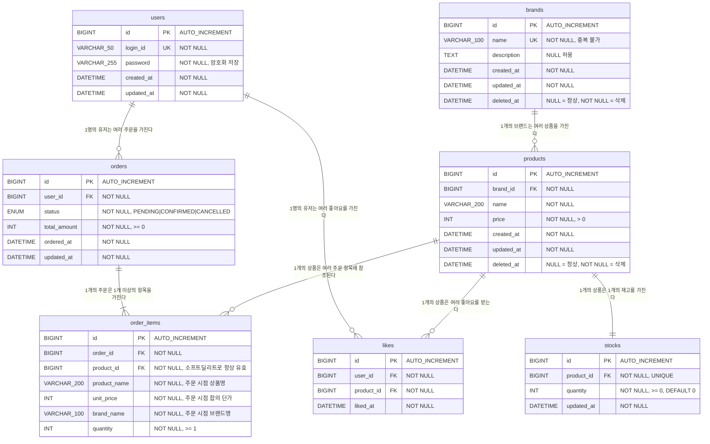

# 04. ERD (Entity Relationship Diagram)

> 요구사항 명세(`01-requirements.md`)의 모든 기능 요구사항을 반영한 전체 테이블 구조입니다.

---

## 1. ERD 다이어그램



---

## 2. 테이블 상세 정의

### 2-1. `users` — 사용자

| 컬럼명 | 타입 | NULL | 제약 | 설명 |
|--------|------|------|------|------|
| `id` | BIGINT | NOT NULL | PK, AUTO_INCREMENT | 사용자 식별자 |
| `login_id` | VARCHAR(50) | NOT NULL | UNIQUE | 로그인 ID (`X-Loopers-LoginId` 헤더 식별값) |
| `password` | VARCHAR(255) | NOT NULL | — | 암호화된 비밀번호 |
| `created_at` | DATETIME | NOT NULL | DEFAULT NOW() | 가입 일시 |
| `updated_at` | DATETIME | NOT NULL | DEFAULT NOW() | 최종 수정 일시 |

> 현재 설계 범위(회원가입·내 정보 조회)는 제외이나, 주문·좋아요가 `user_id`를 참조하므로 테이블은 포함합니다.

---

### 2-2. `brands` — 브랜드

| 컬럼명 | 타입 | NULL | 제약 | 설명 |
|--------|------|------|------|------|
| `id` | BIGINT | NOT NULL | PK, AUTO_INCREMENT | 브랜드 식별자 |
| `name` | VARCHAR(100) | NOT NULL | UNIQUE | 브랜드명. 중복 불가 |
| `description` | TEXT | NULL | — | 브랜드 설명 |
| `created_at` | DATETIME | NOT NULL | DEFAULT NOW() | 등록 일시 |
| `updated_at` | DATETIME | NOT NULL | DEFAULT NOW() | 최종 수정 일시 |
| `deleted_at` | DATETIME | NULL | — | NULL = 정상 운영 / NOT NULL = 삭제됨 |

**소프트 딜리트 동작**
- 브랜드 삭제 시 `deleted_at = NOW()` 로 설정
- 브랜드 삭제 시 소속 상품도 동시에 `deleted_at` 설정 (연쇄 소프트 딜리트)
- `deleted_at IS NOT NULL`인 브랜드는 고객 API 응답에서 제외

---

### 2-3. `products` — 상품

| 컬럼명 | 타입 | NULL | 제약 | 설명 |
|--------|------|------|------|------|
| `id` | BIGINT | NOT NULL | PK, AUTO_INCREMENT | 상품 식별자 |
| `brand_id` | BIGINT | NOT NULL | FK → brands(id) | 소속 브랜드 |
| `name` | VARCHAR(200) | NOT NULL | — | 상품명 |
| `price` | INT | NOT NULL | CHECK (price > 0) | 판매 단가 (원) |
| `created_at` | DATETIME | NOT NULL | DEFAULT NOW() | 등록 일시 |
| `updated_at` | DATETIME | NOT NULL | DEFAULT NOW() | 최종 수정 일시 |
| `deleted_at` | DATETIME | NULL | — | NULL = 정상 / NOT NULL = 삭제됨 |

**주요 제약**
- `brand_id`는 수정 불가 (FR-PA-02)
- `deleted_at IS NOT NULL`인 상품은 고객 API 응답 제외, 주문·좋아요 등록 불가

---

### 2-4. `stocks` — 재고

| 컬럼명 | 타입 | NULL | 제약 | 설명 |
|--------|------|------|------|------|
| `id` | BIGINT | NOT NULL | PK, AUTO_INCREMENT | 재고 식별자 |
| `product_id` | BIGINT | NOT NULL | FK → products(id), UNIQUE | 상품당 1개의 재고 (1:1) |
| `quantity` | INT | NOT NULL | CHECK (quantity >= 0), DEFAULT 0 | 현재 재고 수량 |
| `updated_at` | DATETIME | NOT NULL | DEFAULT NOW() | 최종 변경 일시 |

**설계 이유**
- 재고 차감은 주문마다 발생하고, 상품 정보 수정은 어드민이 가끔 수행한다.
- `products`와 `stocks`를 분리하면 두 연산이 서로 다른 행을 잠가 락 경합이 없어진다.
- `product_id`에 UNIQUE 제약으로 상품당 정확히 1개의 재고 행을 보장한다.
- 향후 상품 옵션이 도입되면 `stocks.product_id` → `stocks.option_id`로 자연스럽게 확장된다.

---

### 2-5. `likes` — 좋아요

| 컬럼명 | 타입 | NULL | 제약 | 설명 |
|--------|------|------|------|------|
| `id` | BIGINT | NOT NULL | PK, AUTO_INCREMENT | 좋아요 식별자 |
| `user_id` | BIGINT | NOT NULL | FK → users(id) | 좋아요를 누른 사용자 |
| `product_id` | BIGINT | NOT NULL | FK → products(id) | 좋아요 대상 상품 |
| `liked_at` | DATETIME | NOT NULL | DEFAULT NOW() | 좋아요 등록 일시 |

**제약 및 멱등 처리**
- `UNIQUE (user_id, product_id)` — 같은 사용자·상품 조합의 중복 행 방지
- 좋아요 등록 시 이미 행이 존재하면 INSERT 없이 정상 응답 반환 (멱등)
- 좋아요 취소 시 행이 없으면 DELETE 없이 정상 응답 반환 (멱등)

---

### 2-6. `orders` — 주문

| 컬럼명 | 타입 | NULL | 제약 | 설명 |
|--------|------|------|------|------|
| `id` | BIGINT | NOT NULL | PK, AUTO_INCREMENT | 주문 식별자 |
| `user_id` | BIGINT | NOT NULL | FK → users(id) | 주문한 사용자 |
| `status` | ENUM | NOT NULL | PENDING \| CONFIRMED \| CANCELLED | 주문 상태 |
| `total_amount` | INT | NOT NULL | CHECK (total_amount >= 0) | 주문 총금액 (원) |
| `ordered_at` | DATETIME | NOT NULL | DEFAULT NOW() | 주문 요청 일시 |
| `updated_at` | DATETIME | NOT NULL | DEFAULT NOW() | 상태 변경 등 최종 수정 일시 |

**주문 상태 전이**

```
PENDING → CONFIRMED   (주문 확정)
PENDING → CANCELLED   (주문 취소)
```
- `CONFIRMED` 이후 상태 변경 불가 (향후 결제·환불 프로세스 별도 설계)
- 주문 목록 조회 시 `ordered_at` 기준으로 `startAt`, `endAt` 범위 필터 적용

---

### 2-7. `order_items` — 주문 항목

| 컬럼명 | 타입 | NULL | 제약 | 설명 |
|--------|------|------|------|------|
| `id` | BIGINT | NOT NULL | PK, AUTO_INCREMENT | 주문 항목 식별자 |
| `order_id` | BIGINT | NOT NULL | FK → orders(id) | 소속 주문 |
| `product_id` | BIGINT | NOT NULL | FK → products(id) | 원본 상품 참조 (이력용) |
| `product_name` | VARCHAR(200) | NOT NULL | — | 주문 도메인이 인식하는 상품명 |
| `unit_price` | INT | NOT NULL | CHECK (> 0) | 주문 시점에 합의된 단가 (원) |
| `brand_name` | VARCHAR(100) | NOT NULL | — | 주문 도메인이 인식하는 브랜드명 |
| `quantity` | INT | NOT NULL | CHECK (quantity >= 1) | 주문 수량 |

**설계 이유 (DDD 관점)**
- `product_name`, `unit_price`, `brand_name`은 상품 도메인의 값을 "복사"한 것이 아니라, 주문 생성 시점에 **주문 도메인이 자체적으로 소유하게 된 값**
- 주문은 구매자-판매자 간 계약이며, 계약 시점의 단가(`unit_price`)는 이후 `products.price` 변경과 무관하게 고정됨
- `product_id`는 원본 상품 식별을 위한 참조값으로만 사용 (소프트 딜리트이므로 항상 유효)

---

## 3. 테이블 관계 요약

```
users
 ├── orders  (1:N)  — 유저의 주문 이력
 └── likes   (1:N)  — 유저의 좋아요 이력

brands
 └── products (1:N) — 브랜드 삭제 시 소속 상품 연쇄 소프트 딜리트

products
 ├── stocks   (1:1) — 상품의 재고 (락 경합 분리)
 ├── likes    (1:N) — 상품이 받은 좋아요
 └── order_items (1:N) — 상품의 주문 이력 참조

orders
 └── order_items (1:N, 최소 1개) — 주문 구성 항목
```

---

## 4. 설계 결정 요약

| 결정 | 내용 | 근거 |
|------|------|------|
| **소프트 딜리트** | `brands`, `products`에 `deleted_at` 컬럼 사용 | 주문 이력의 FK 정합성 유지, 이력 보존 |
| **Product-Stock 분리** | `stocks` 테이블을 `products`와 1:1로 분리 | 재고 차감·상품 수정이 서로 다른 행을 잠가 락 경합 해소. 향후 옵션 도입 시 확장 용이 |
| **OrderItem 자체 소유 필드** | `product_name`, `unit_price`, `brand_name`을 주문 도메인 소유 컬럼으로 관리 | 주문은 계약이며, 계약 시점의 단가는 상품 도메인 변경과 무관하게 고정 |
| **주문 상태 ENUM** | `OrderStatus`를 ENUM으로 정의 | 허용 값을 명시적으로 제한, 잘못된 상태 값 DB 레벨에서 차단 |
