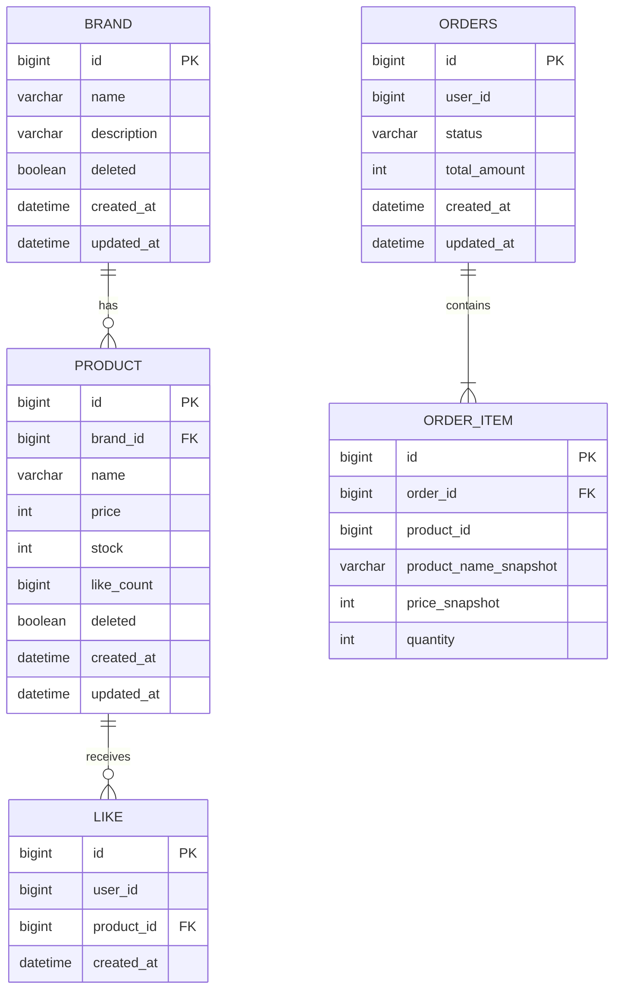

# 04. ERD 및 리스크

> 영속성 구조, 관계의 주인, 정규화 여부를 검증하기 위한 테이블 설계 (Mermaid)

---

## 왜 이 다이어그램이 필요한가
주문은 상품 정보를 스냅샷으로 보관해야 하고, 좋아요는 (사용자, 상품) 단위로 중복이 없어야 한다. FK가 어느 테이블에 위치하는지, 어떤 컬럼에 유니크 제약이 필요한지, 정규화/비정규화 결정이 타당한지 검증한다.

---

## 이 구조에서 특히 봐야 할 포인트

- **포인트 1 (관계의 주인 — FK 위치)**: `PRODUCT.brand_id`, `LIKE.product_id`, `ORDER_ITEM.order_id`는 모두 1:N 관계의 N쪽 테이블에 FK를 둔다. 정석적인 1:N FK 배치다.

- **포인트 2 (멱등성 보장 — 유니크 제약)**: `LIKE` 테이블에 **`(user_id, product_id)` 복합 유니크 제약**을 둔다. 애플리케이션의 `existsBy` 체크와 동시 요청이 경합해도 DB 레벨에서 중복 좋아요가 막힌다. 멱등성의 최종 방어선.

- **포인트 3 (의도적 비정규화 — 스냅샷)**: `ORDER_ITEM`은 `product_id`를 가지면서도 FK 제약을 걸지 않고 `product_name_snapshot`, `price_snapshot`을 별도 보관한다. 정규화 관점에서는 중복이지만, 주문 시점 정보 보존이라는 요구사항 때문에 의도적으로 비정규화한다. 상품이 삭제(soft delete)되어도 과거 주문 내역이 깨지지 않는다.

- **포인트 4 (집계 비정규화 — like_count)**: `PRODUCT.like_count`는 `LIKE` 행을 세면 도출 가능한 파생 데이터지만, `likes_desc` 정렬 성능을 위해 비정규화 컬럼으로 둔다. 정합성 유지 책임은 좋아요 등록/취소 트랜잭션에 있다.

> 정규화 주석: `LIKE.user_id`와 `ORDERS.user_id`는 USER 테이블 참조이나, 회원 도메인이 설계 범위에서 제외되어 FK 없이 식별자만 보관한다. 회원 도메인 합류 시 FK 제약 추가를 검토한다.

---

# 리스크 및 대안

## 리스크 1: 재고 차감과 외부 결제 사이의 정합성 공백

- **현재 설계의 문제점**: 재고 차감(트랜잭션 1)을 먼저 커밋하고 외부 PG를 호출한다. PG 호출 직후 애플리케이션이 다운되면, 재고는 차감됐는데 주문이 `PENDING`에 멈춰 재고가 영원히 묶일 수 있다.
- **대안**: (a) 재고 차감과 PG 호출을 한 트랜잭션에 묶기, (b) PENDING 주문을 일정 시간 후 자동 복구하는 배치/스케줄러 도입.
- **현재 방법을 선택한 이유**: (a)는 외부 호출을 DB 트랜잭션에 넣어 커넥션 장기 점유·전체 처리량 저하를 유발하므로 부적합. 트랜잭션을 분리하고, 잔여 리스크는 (b) 보상 배치로 흡수하는 것이 트레이드오프상 유리하다. 이번 범위에서는 동기 보상(실패 시 즉시 복구)까지 구현하고, 비정상 종료 대비 배치는 확장 항목으로 남긴다.

## 리스크 2: 좋아요 수 비정규화 컬럼의 정합성 드리프트

- **현재 설계의 문제점**: `PRODUCT.like_count`는 `LIKE` 행 수와 항상 일치해야 하나, 동시성·예외 상황에서 실제 행 수와 어긋날 수 있다.
- **대안**: (a) 정렬 시마다 `COUNT(*)` 실시간 집계(컬럼 제거), (b) 주기적 재집계 배치로 보정.
- **현재 방법을 선택한 이유**: (a)는 데이터가 커질수록 `likes_desc` 정렬 비용이 급증해 비현실적. 비정규화 컬럼 + (b) 재집계 배치로 정확도와 성능을 함께 확보하는 것이 트레이드오프상 낫다. 단건 증감은 좋아요 트랜잭션 내에서 함께 처리해 드리프트 발생 빈도를 최소화한다.

## 리스크 3: 동시 주문 시 재고 초과 판매

- **현재 설계의 문제점**: 여러 사용자가 같은 상품을 동시에 주문하면 재고 확인과 차감 사이에 경합이 발생해 재고가 음수가 되거나 초과 판매될 수 있다.
- **대안**: (a) 비관적 락(SELECT ... FOR UPDATE), (b) 낙관적 락(version 컬럼), (c) `UPDATE ... SET stock = stock - n WHERE stock >= n` 조건부 차감.
- **현재 방법을 선택한 이유**: (c) 조건부 차감은 별도 락 없이 한 문장으로 원자성을 보장하고, 영향 행 수가 0이면 재고 부족으로 판단할 수 있어 구현이 단순하고 성능이 좋다. 고경합 인기 상품에 한해 (a)/(b)를 선택 적용하는 것을 확장 항목으로 둔다.

## 리스크 4: 사용자 식별이 헤더에만 의존

- **현재 설계의 문제점**: 인증/인가가 범위 밖이라 `X-Loopers-LoginId` 헤더 값만으로 사용자를 식별한다. 헤더 위조 시 타 유저의 주문/좋아요에 접근할 여지가 있다.
- **대안**: (a) 본격 인증(JWT/세션) 도입, (b) 최소한의 본인 리소스 검증(요청 헤더의 사용자와 리소스 소유자 일치 확인)만 적용.
- **현재 방법을 선택한 이유**: 인증은 명시적으로 범위 밖이므로 (a)는 과하다. 대신 (b)를 적용해 "타 유저 정보 직접 접근 불가" 요구사항을 충족한다. 즉 인증은 생략하되 인가(소유권 검증)는 최소 수준으로 유지하는 절충이다.
