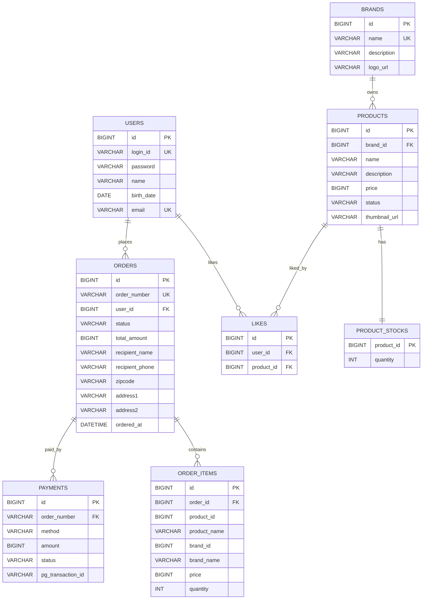

# ERD

이 문서는 도메인 모델이 영속성 구조로 어떻게 저장되는지 확인하려고 작성한다. DDD 모델과 DB 테이블은 완전히 같은 개념은 아니므로, ERD는 저장 구조와 제약을 표현하는 용도로만 사용한다.

- 모든 테이블의 기본 키는 `BIGINT IDENTITY`이며, `BaseEntity`(`created_at`, `updated_at`, `deleted_at`)를 공유한다. 공통 컬럼은 다이어그램에서 생략한다.
- 금액 컬럼은 KRW 원 단위 정수(`BIGINT`)로 저장한다.

## 전체 ERD

이 다이어그램은 사용자, 브랜드, 상품, 좋아요, 주문이 저장소 관점에서 어떻게 연결되는지 한 번에 보여준다.

## 관계 해석

- `USERS`는 일반 회원만 저장한다. 관리자 권한은 LDAP 등 별도 인증 시스템과 Security 권한으로 판단하므로 `users` 테이블에 role 컬럼을 두지 않는다.
- `BRANDS`와 `PRODUCTS`는 DB에서는 FK로 연결되지만, 도메인에서는 서로 다른 Aggregate로 본다.
- `PRODUCT_STOCKS`는 상품 재고를 저장한다. `product_id`는 `products.id`를 참조하면서 동시에 기본 키로 사용한다.
- 도메인상으로 `ProductStock`은 Product Aggregate 안의 구성요소지만, 재고 변경 빈도와 동시성 특성을 고려해 별도 테이블로 분리한다.
- `LIKES`는 사용자와 상품 사이의 선호 관계를 저장한다. 같은 사용자와 상품 조합은 한 row로 관리하며, `UNIQUE(user_id, product_id)` 제약을 둔다. 취소는 `deleted_at`을 채워 비활성화하고, 재등록은 같은 row의 `deleted_at`을 비워 복구한다.
- `ORDERS`는 주문의 상태와 주문자, 주문 총액을 저장한다. `total_amount`는 주문 생성 시 `order_items`의 합으로 산정해 함께 저장한다. 주문 생성 시 초기 상태는 `PENDING`이다.
- `ORDER_ITEMS`는 주문 당시 상품 정보를 스냅샷으로 저장한다. `product_id`, `brand_id`는 추적용 식별자이며, `product_name`, `brand_name`, `price`는 주문 당시 값을 별도로 보관한다. 브랜드명을 함께 보관하는 이유는 브랜드가 변경/삭제된 이후에도 주문 이력에서 당시 브랜드를 식별할 수 있어야 하기 때문이다.
- `USERS.email`은 `login_id`와 별개로 중복 가입을 막기 위해 `UNIQUE` 제약을 둔다.
- `BRANDS.name`은 중복될 수 없어 `UNIQUE` 제약을 둔다. `logo_url`은 브랜드 로고 이미지 경로를 저장한다.
- `PRODUCTS.status`는 관리자 의도(`ON_SALE`/`SUSPENDED`)만 저장한다. 품절은 컬럼이 아니라 `product_stocks.quantity = 0`으로 판단한다. `thumbnail_url`은 대표 이미지 1장이다(다중 갤러리는 현재 범위 밖).
- `ORDERS.order_number`는 사람이 식별하는 주문번호로, `yyyyMMdd + 일별 시퀀스`(예: `20260528-000123`) 형식이다. 주문 생성 시 1회 생성하고 `UNIQUE` 제약을 둔다. PK(`id`)와 별개의 식별자다.
- `ORDERS`는 배송지·수령인 정보(`recipient_name`, `recipient_phone`, `zipcode`, `address1`, `address2`)를 주문 시점 스냅샷으로 저장한다. 결제수단은 Order가 아니라 `PAYMENTS`가 소유한다(결제 시점에 정해지는 값). 배송 상태·송장번호 같은 배송 라이프사이클이 생기면 별도 테이블로 분리를 검토한다.
- `PAYMENTS`는 결제 시도를 저장하며 `order_number`로 `ORDERS`를 참조한다(별도 Aggregate, 의존 단방향). `method`(`CARD`/`CASH`), `amount`(주문 `total_amount` 스냅샷), `status`(`REQUESTED`→`PAID`/`FAILED`)를 가진다. 주문당 결제 row가 여러 개일 수 있어 `ORDERS 1:N PAYMENTS`로 본다(현재 스코프는 실패=종료라 사실상 1건).

## 설계 리스크

- 브랜드 삭제 시 하위 상품도 같은 트랜잭션에서 soft delete되어야 하므로, 상품 수가 많아질 경우 삭제 트랜잭션이 커질 수 있다.
- 재고 차감은 `product_stocks`를 중심으로 일어나므로 동시성 제어 전략이 필요하다. 1차로는 Pessimistic Lock(`SELECT ... FOR UPDATE`)을 적용한다.
- 한 주문에 여러 상품이 포함될 때 동시 주문에서 deadlock이 발생할 수 있으므로, 재고 락은 `product_id` 오름차순으로 획득한다.
- `likes.user_id`, `likes.product_id` 조합은 중복되지 않아야 하며 `UNIQUE` 제약으로 보장한다. 활성/취소 여부는 `deleted_at`으로만 판별한다.
- 활성 좋아요만 조회하는 조건이 일관되게 적용되어야 한다.
- 좋아요 수 정렬(`likes_desc`)은 현재 `likes`를 매번 집계(GROUP BY)해 처리한다. 트래픽이 늘면 집계 컬럼이나 캐시 도입을 측정 후 별도로 검토한다.
- 주문 이력은 상품이 삭제되거나 변경되어도 유지되어야 하므로, 주문 상품은 현재 상품을 직접 참조하지 않고 스냅샷으로 저장한다.
- 주문번호의 일별 시퀀스는 동시 주문에서 채번 충돌이 날 수 있으므로 원자적 채번(채번 테이블 또는 시퀀스)으로 보장한다.
- 결제 콜백(webhook)은 중복 수신될 수 있으므로 멱등 처리한다(이미 `PAID`/`FAILED`로 확정된 결제·주문은 재반영하지 않음).
- 결제 결과는 Payment가 `Order`에 반영한다(승인 → `PAID`, 실패 → 재고 복구 + `FAILED`). 미결제 `PENDING` 주문은 재고를 점유하므로 만료 배치로 정리한다.
