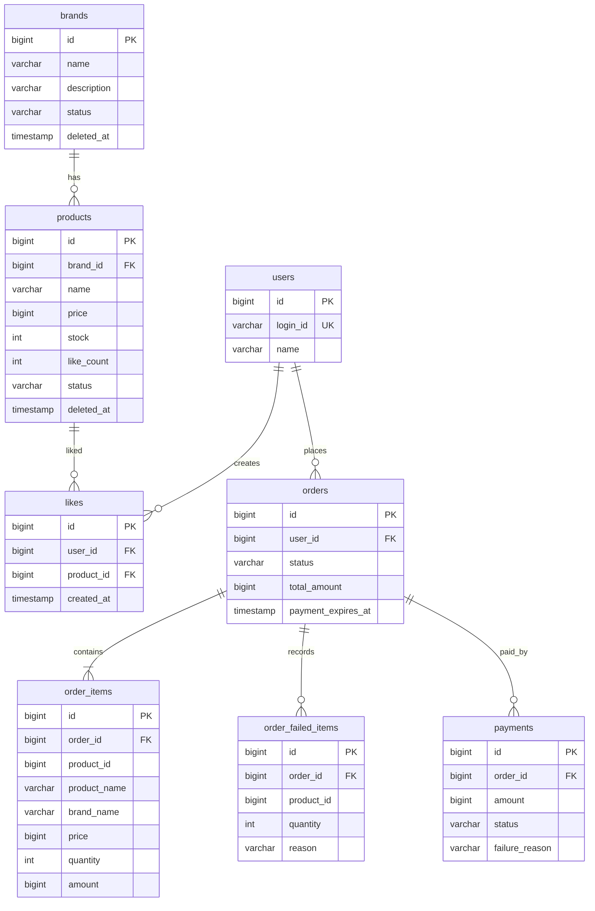

# 04. ERD

## 목적

이 문서는 2주차 설계 대상 도메인의 테이블 구조와 관계를 정리한다.
`03-class-diagram.md`가 도메인 객체의 책임을 다룬다면, 이 문서는 영속성 구조, FK, 유니크 제약, 조회/정렬을 위한 인덱스 기준을 다룬다.

## 공통 컬럼

프로젝트의 `BaseEntity` 기준으로 주요 엔티티 테이블은 다음 공통 컬럼을 가진다.

| 컬럼 | 설명 |
| --- | --- |
| `id` | PK |
| `created_at` | 생성 시각 |
| `updated_at` | 수정 시각 |
| `deleted_at` | 소프트 삭제 시각 |

ERD 본문에서는 공통 컬럼을 반복해서 모두 표시하지 않고, 도메인 관계 판단에 필요한 컬럼 중심으로 표현한다.

---

## ERD

## 테이블 설명

### users

- 1주차 회원 도메인에서 생성되는 사용자 테이블이다.
- 2주차에서는 직접 설계 대상은 아니지만, 좋아요와 주문의 주체로 참조한다.
- `login_id`는 요청 헤더의 `X-Loopers-LoginId`와 매핑되는 식별 값이다.

### brands

- 브랜드 정보를 저장한다.
- 어드민 브랜드 등록/수정/삭제의 대상 테이블이다.
- 삭제는 물리 삭제가 아니라 `deleted_at` 또는 `status = DELETED`로 처리한다.
- 사용자 조회에서는 삭제된 브랜드를 제외한다.
- 브랜드 정보가 수정되어도 기존 주문 항목에 저장된 브랜드명 스냅샷은 변경하지 않는다.

### products

- 상품 정보를 저장한다.
- 어드민 상품 등록/수정/삭제, 판매 상태 변경, 재고 변경의 대상 테이블이다.
- `brand_id`로 브랜드를 참조한다.
- `stock`은 주문 가능 수량이다.
- `like_count`는 `likes` 테이블을 원본으로 하는 파생 값이며, 상품 목록의 `likes_desc` 정렬에 사용한다.
- 삭제는 물리 삭제가 아니라 `deleted_at` 또는 `status = DELETED`로 처리한다.
- 상품 정보가 수정되어도 기존 주문 항목의 상품명, 브랜드명, 가격 스냅샷은 변경하지 않는다.

### likes

- 사용자가 상품에 남긴 좋아요 관계를 저장한다.
- 같은 사용자와 상품 조합은 하나만 존재해야 한다.
- 좋아요 취소 시 물리 삭제를 기본으로 본다. 좋아요 이력까지 보존해야 한다면 `deleted_at` 기반 소프트 삭제로 확장할 수 있다.

### orders

- 주문의 헤더 정보를 저장한다.
- `status`는 `CREATED`, `PAID`, `FAILED`, `CANCELED`를 가진다.
- `payment_expires_at`은 주문 생성 후 결제 완료 제한 시간을 표현한다.
- `total_amount`는 정상 주문 대상으로 확정된 `order_items` 기준 금액이다.

### order_items

- 정상 주문 대상으로 확정된 주문 항목을 저장한다.
- 상품명, 브랜드명, 가격은 주문 당시 값을 스냅샷으로 저장한다.
- `product_id`는 원 상품 식별을 위한 참조 값이지만, 주문 이력 정합성은 스냅샷 컬럼을 기준으로 보장한다.
- 상품이 이후 수정되거나 삭제되어도 기존 주문 항목의 스냅샷은 변경하지 않는다.

### order_failed_items

- 부분 주문 정책에 따라 주문 요청에서 제외된 항목을 저장한다.
- 재고 부족, 판매 불가, 상품 없음 등 실패 사유를 `reason`에 기록한다.
- 사용자 응답에서 성공 항목과 실패 항목을 구분하기 위한 근거 데이터다.

### payments

- 주문에 대한 결제 시도와 결과를 저장한다.
- 주문 생성과 결제 승인은 별도 단계이므로 `orders`와 분리한다.
- 한 주문에 여러 결제 시도를 허용할 수 있도록 `orders 1:N payments`로 둔다.
- 현재 결제 결과는 `APPROVED`, `FAILED`, `CANCELED` 등을 기준으로 표현한다.

---

## 주요 제약

| 테이블 | 제약 | 설명 |
| --- | --- | --- |
| `users` | `UK(login_id)` | 로그인 ID는 사용자 식별자이므로 유일해야 한다. |
| `products` | `FK(brand_id) -> brands(id)` | 상품은 반드시 하나의 브랜드에 속한다. |
| `products` | `CHECK(stock >= 0)` | 재고는 음수가 될 수 없다. |
| `products` | `CHECK(price >= 0)` | 상품 가격은 음수가 될 수 없다. |
| `likes` | `FK(user_id) -> users(id)` | 좋아요는 사용자 기준으로 생성된다. |
| `likes` | `FK(product_id) -> products(id)` | 좋아요는 상품 기준으로 생성된다. |
| `likes` | `UK(user_id, product_id)` | 같은 사용자는 같은 상품에 좋아요를 하나만 가질 수 있다. |
| `orders` | `FK(user_id) -> users(id)` | 주문은 사용자 기준으로 생성된다. |
| `order_items` | `FK(order_id) -> orders(id)` | 주문 항목은 주문에 속한다. |
| `order_failed_items` | `FK(order_id) -> orders(id)` | 실패 항목은 주문 요청 결과에 속한다. |
| `payments` | `FK(order_id) -> orders(id)` | 결제 시도는 주문에 속한다. |

## 인덱스 후보

| 테이블 | 인덱스 | 목적 |
| --- | --- | --- |
| `brands` | `(status, deleted_at)` | 사용자 브랜드 조회에서 삭제/비노출 브랜드 제외 |
| `products` | `(brand_id, status, deleted_at)` | 브랜드별 상품 목록 조회와 삭제/비노출 상품 제외 |
| `products` | `(created_at)` | `latest` 정렬 |
| `products` | `(price)` | `price_asc` 정렬 |
| `products` | `(like_count)` | `likes_desc` 정렬 |
| `likes` | `(user_id, created_at)` | 사용자가 좋아요한 상품 목록 조회 |
| `orders` | `(user_id, created_at)` | 사용자 주문 목록 조회 |
| `orders` | `(status, payment_expires_at)` | 결제 기한 만료 주문 조회 |
| `payments` | `(order_id, created_at)` | 주문별 결제 시도 이력 조회 |

## 설계 메모

- `Product.likeCount`는 조회 최적화를 위한 파생 값이다. 정합성 기준은 `likes` 테이블이다.
- `order_items.product_id`는 FK로 강제하지 않는 선택지도 가능하다. 주문 이력은 스냅샷으로 보존되므로 상품이 삭제되어도 주문 항목이 깨지지 않아야 한다.
- `order_failed_items`는 요구사항상 사용자에게 실패 항목을 알려야 하므로 별도 테이블로 둔다. 단순 응답 전용으로만 처리할 경우 영속화하지 않는 선택지도 가능하다.
- `payments`는 1:N 구조로 두어 결제 재시도와 실패 이력을 보존할 수 있게 한다.
- 소프트 삭제된 브랜드/상품은 사용자 조회에서 항상 제외되어야 한다.
- 관리자 상품 변경은 기존 `brands`, `products` 테이블을 사용한다. 별도 관리자 변경 이력 테이블은 이번 설계 범위에 포함하지 않는다.
- 관리자 재고 변경과 사용자 주문 생성의 동시성 제어는 구현 단계에서 낙관적 락 또는 조건부 업데이트 방식으로 구체화한다.
