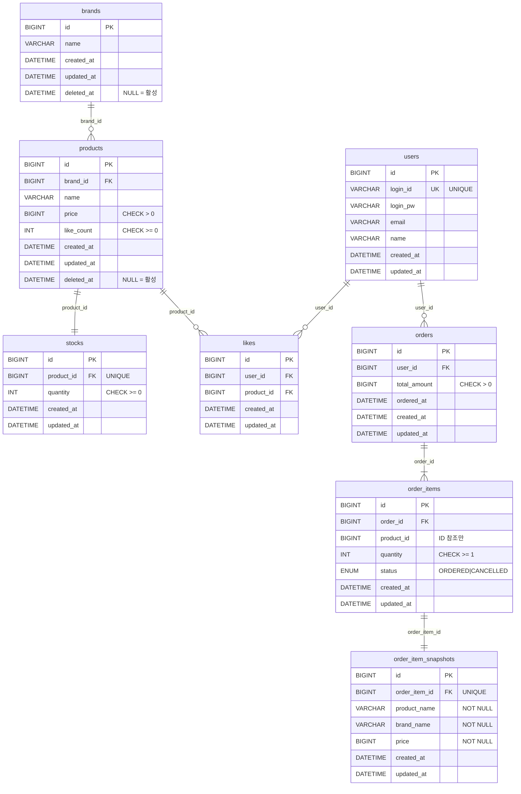

# 04. ERD (Entity Relationship Diagram)

> 도메인 모델이 실제 DB 테이블로 어떻게 매핑되는지 검증하는 다이어그램입니다.
> 관계의 주인(FK 위치), 제약조건, 소프트 딜리트 적용 범위를 확인합니다.

---

## ERD

---

## 제약조건 요약

| 테이블 | 컬럼 / 조합 | 제약조건 | 이유 |
|---|---|---|---|
| users | login_id | UNIQUE | 중복 계정 방지 |
| likes | (user_id, product_id) | UNIQUE | 좋아요 멱등성 보장 |
| stocks | product_id | UNIQUE | Product 1개 ↔ Stock 1개 1:1 보장 |
| stocks | quantity | CHECK >= 0 | 음수 재고 방지 |
| products | price | CHECK > 0 | 유효한 가격만 허용 |
| products | like_count | CHECK >= 0 | 음수 좋아요 방지 |
| orders | total_amount | CHECK > 0 | 금액 0 이하 주문 불가 |
| order_items | quantity | CHECK >= 1 | 수량 0 이하 주문 항목 불가 |
| order_item_snapshots | product_name, brand_name, price | NOT NULL | 스냅샷은 주문 당시 정보 보존 필수 |

---

## 읽는 포인트

### 1. `stocks.product_id`는 UNIQUE
Product 1개 ↔ Stock 1개 1:1 관계.  
`UNIQUE(product_id)` 제약이 DB 레벨에서 Stock 중복 생성을 차단한다.

### 2. `likes`에 복합 UNIQUE
`UNIQUE(user_id, product_id)` — 좋아요 멱등성 보장.  
동시 요청이 들어와도 DB가 중복을 막아준다.

### 3. `order_items.product_id`는 FK가 아닌 단순 ID 참조
주문 확정 후 상품이 삭제돼도 주문 이력은 살아있어야 한다.  
실제 상품 정보는 `order_item_snapshots`에 스냅샷으로 고정된다.  
FK를 걸면 `products` 소프트 딜리트 시 참조 무결성 오류가 발생할 수 있으므로 의도적으로 FK를 생략한다.

### 4. 소프트 딜리트는 `brands`, `products`만 `deleted_at` 보유
`likes`는 하드 딜리트(행 삭제), `order_items`는 `CANCELLED` 상태 전환으로 처리한다.
