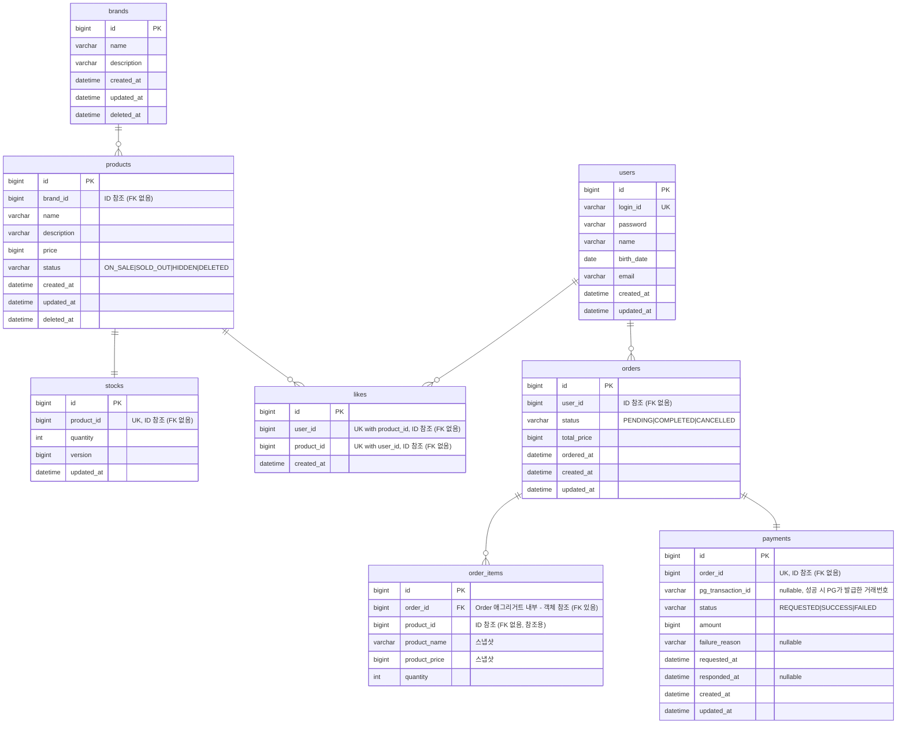

# ERD

## 전체 ERD

영속성 구조, 테이블 간 관계, soft delete 컬럼 위치, 스냅샷 컬럼 위치, UK 제약을 확인한다.

**읽는 포인트**
- **FK 제약은 같은 애그리거트 내부에서만 사용한다.** `order_items.order_id`만 FK가 걸려 있고(OrderItem이 Order 애그리거트의 일부, JPA `@ManyToOne` cascade), 나머지(`products.brand_id`, `stocks.product_id`, `orders.user_id`, `likes.user_id/product_id`, `order_items.product_id`, `payments.order_id`)는 모두 **Long ID 참조**다. 락 경쟁 회피, 추후 샤딩 대비, 마이그레이션 유연성을 위해 DB 레벨 FK 대신 애플리케이션 레벨에서 정합성을 보장한다.
- `stocks`는 `products`와 1:1로 분리된 테이블이다. 주문마다 갱신되는 `quantity`를 `products`에서 분리해 락 경쟁 범위를 최소화한다. `products` row는 캐싱 가능한 상태를 유지한다.
- `stocks.version`은 낙관적 락(`@Version`)용 컬럼이다. 동시 주문이 같은 재고를 차감할 때 충돌을 감지한다.
- `stocks.product_id`는 UK 제약으로 1:1 관계를 DB 레벨에서 보장한다 (FK는 없음).
- `brands`, `products` 모두 `deleted_at` 컬럼 보유. 브랜드 삭제 시 연관 상품의 `deleted_at`도 함께 채운다. 조회 시 `deleted_at IS NULL` 조건 필수.
- `order_items.product_id`는 ID 참조. 상품이 삭제되어도 주문 내역은 `product_name`, `product_price` 스냅샷으로 독립 보존된다.
- `likes`는 `(user_id, product_id)` 복합 UK 제약으로 DB 레벨에서 중복 좋아요 방지. 좋아요 등록 시 애플리케이션 사전 체크 + DB UK가 이중 방어선이며, UK 위반 예외는 멱등 응답으로 변환한다.
- `payments`는 `order_id`에 UK 제약을 두어 1주문 1결제 관계를 보장한다 (FK는 없음). 결제 시도/결과를 모두 기록하여 PG 대조와 감사 추적에 사용한다.
- 가격 관련 컬럼(`price`, `total_price`, `product_price`, `amount`)은 `bigint`로 선언한다. `int` 범위(약 21억)를 초과하는 경우를 대비한다.

---

## 인덱스

성능에 영향을 주는 주요 인덱스를 명시한다. 컬럼 순서는 카디널리티가 높은 쪽이 앞에 온다.

| 테이블 | 인덱스 | 용도 |
|---|---|---|
| `users` | `UNIQUE (login_id)` | 로그인, 회원가입 중복 체크 |
| `brands` | `(deleted_at)` | 브랜드 목록 조회 (삭제 제외) |
| `products` | `(brand_id, deleted_at)` | 상품 목록 브랜드 필터 |
| `products` | `(deleted_at, created_at DESC)` | 최신순 정렬 |
| `products` | `(deleted_at, price)` | 가격 오름차순 정렬 |
| `stocks` | `UNIQUE (product_id)` | 상품-재고 1:1 보장, 재고 조회 |
| `likes` | `UNIQUE (user_id, product_id)` | 중복 좋아요 방지, 내 좋아요 목록 |
| `likes` | `(product_id)` | 좋아요 수 COUNT 집계 |
| `orders` | `(user_id, ordered_at DESC)` | 사용자 주문 목록 날짜 범위 조회 |
| `orders` | `(ordered_at DESC)` | 어드민 전체 주문 목록 |
| `order_items` | `(order_id)` | 주문 항목 조회 (FK 자동 생성) |
| `payments` | `UNIQUE (order_id)` | 1주문 1결제 |
| `payments` | `(status, requested_at)` | 결제 실패 모니터링/배치 처리 |

---

## 테이블별 설계 설명

### users
- `login_id`: 영문 + 숫자 5~20자. UK 제약으로 중복 가입 방지.
- `password`: 인코딩된 값만 저장. 평문 노출 금지.
- `name`: 한글 2~10자. 응답 시 마지막 글자를 `*`로 마스킹.
- `birth_date`: yyyy-MM-dd. API는 yyyyMMdd 문자열로 받아 파싱.
- `email`: 이메일 형식 검증만 수행. UK 제약 없음 (정책상 중복 허용).

### brands
- `deleted_at`: soft delete 컬럼. null이면 활성, 값이 있으면 삭제 처리.
- `description`: 필수, 공백 불가.

### products
- `brand_id`: 브랜드 FK. 상품 수정 시 변경 불가 (수정 요청 DTO에 필드 자체가 없음).
- `status`: 상품 상태. `ON_SALE`(판매중) / `SOLD_OUT`(품절) / `HIDDEN`(숨김) / `DELETED`(삭제). 기본값 `ON_SALE`.
- `deleted_at`: 브랜드 삭제 시 연관 상품에도 함께 채워진다. 삭제 시 `status = DELETED`로 함께 변경.
- `price`: `bigint`. 0 이상.

### stocks
- `product_id`: UK 제약으로 `products`와 1:1 관계 보장. FK로 참조 무결성도 보장.
- `quantity`: 주문 시 차감되는 재고 수량. 사용자에게는 10개 이하일 때만 수량 노출 ("3개 남음"), 10개 초과 시 재고 유무(`inStock`)만 노출.
- `version`: 낙관적 락용. JPA `@Version`과 연동.

### likes
- `(user_id, product_id)` 복합 UK 제약으로 중복 좋아요 방지. 좋아요 등록 시 멱등성의 최후 방어선.
- `user_id`, `product_id`는 FK 제약 없이 Long 값으로만 보유. User/Product 삭제와 무관하게 독립적으로 존재.
- 좋아요 수는 별도 컬럼 없이 COUNT 집계로 처리. 성능 이슈 발생 시 `products.like_count` 캐시 컬럼 도입 검토.

### orders
- `status`: `PENDING` → `COMPLETED` / `CANCELLED` 상태 전이.
- `total_price`: 주문 시점 총 금액. 이후 상품 가격 변동과 무관하게 보존.
- `ordered_at`: 비즈니스 주문 시각. `created_at`은 DB insert 시각으로, 배치/재처리 등으로 레코드 생성 시점이 달라질 수 있어 구분한다.

### order_items
- `product_name`, `product_price`: 주문 당시 상품 정보 스냅샷. `product_id`가 가리키는 상품이 변경/삭제되어도 주문 내역은 영향받지 않는다.
- `product_id`: FK 제약 없이 참조용으로만 보유.
- 할인 금액, 쿠폰 등의 컬럼은 현재 요구사항에 없어 포함하지 않는다. 도입 시점에 별도 테이블 또는 컬럼 추가로 확장.

### payments
- `order_id`: UK + FK. 1주문 1결제 관계를 보장.
- `status`: `REQUESTED`(PG 호출 직전) → `SUCCESS` / `FAILED`. 결제 시도 기록 자체가 의미 있으므로 결제 시작 시점에도 row를 생성한다.
- `pg_transaction_id`: PG가 발급한 거래번호. 성공 시에만 값이 채워짐. PG 측 대조 조회에 사용.
- `failure_reason`: 실패 시에만 채워짐. 타임아웃, 한도 초과 등 사유 기록.
- `requested_at`, `responded_at`: 외부 호출 지연 측정 및 모니터링에 사용.

---

## 설계 고민

### 좋아요 수 정렬 (`likes_desc`)
- 현재: `likes` 테이블 COUNT JOIN으로 집계 → 항상 정확하지만 상품 수가 많아지면 느려질 수 있음.
- 추후: `products.like_count` 캐시 컬럼 도입 → 빠르지만 좋아요 등록/취소 시 동기화 필요, 동시성 문제 고려 필요.

### FK 제약 정책 (애그리거트 내부에만 FK)

대규모 트래픽 서비스에서는 보통 다음 이유로 DB FK 제약을 제거한다.

- INSERT/UPDATE 시 부모 row의 존재 확인을 위한 lock 발생 → 동시성 저하.
- 마이그레이션·배치 작업 시 제약을 풀고 다시 거는 부담.
- 추후 샤딩 도입 시 다른 샤드의 row를 참조하는 FK는 불가능.

대신 정합성은 **애플리케이션 레벨**에서 보장한다 (예: 상품 등록 시 `brandService.getBrand()`로 존재 확인 → 없으면 404).

본 설계에서는 **같은 애그리거트 내부에만 FK를 사용**한다.

| 관계 | FK 여부 | 이유 |
|---|---|---|
| `order_items.order_id` → `orders.id` | ✅ 있음 | OrderItem은 Order 애그리거트 내부. JPA `@ManyToOne` + cascade로 묶임 |
| `products.brand_id` → `brands.id` | ❌ 없음 | 다른 애그리거트. Long ID로 참조 |
| `stocks.product_id` → `products.id` | ❌ 없음 | 다른 애그리거트. UK 제약은 1:1 보장용 |
| `orders.user_id` → `users.id` | ❌ 없음 | 다른 애그리거트 |
| `likes.user_id`, `likes.product_id` | ❌ 없음 | 다른 애그리거트. UK는 중복 좋아요 방지용 |
| `order_items.product_id` | ❌ 없음 | 다른 애그리거트. 스냅샷 보존으로 독립 |
| `payments.order_id` | ❌ 없음 | 다른 애그리거트. UK는 1주문 1결제 보장용 |

### `order_items.product_id`를 FK로 걸지 않은 이유
- FK를 걸면 상품 hard delete 시 주문 내역도 영향받음.
- soft delete를 쓰더라도, FK 없이 참조용 Long ID만 두면 상품 데이터와 무관하게 주문 내역이 독립 보존된다. 스냅샷 컬럼(`product_name`, `product_price`)이 표시용 데이터의 무결성을 책임진다.

### 결제 정보를 별도 테이블로 분리한 이유
- 대안 A: `orders` 테이블에 `pg_transaction_id`, `paid_at`, `failure_reason` 컬럼 추가.
- 대안 B: `payments` 별도 테이블 (현재 결정).
- 선택 이유: 결제 시도 자체를 기록(`REQUESTED` 상태)해두면 외부 호출 실패/타임아웃 같은 모호한 상태를 추적할 수 있다. 추후 결제 수단(카드/페이/포인트)이 늘어날 때 컬럼 폭증 없이 확장 가능.

### `stocks.version` 낙관 락 vs 비관 락
- 낙관 락(현재 결정): 충돌 시 예외 → 재시도. 동시 주문 빈도가 낮을 때 효율적.
- 비관 락(`SELECT ... FOR UPDATE`): 락 잡고 시작. 충돌 빈도가 높을 때 유리하지만 처리량 제한.
- 트래픽 패턴 측정 후 전환 검토.

### `payments.order_id` UK 제약과 결제 재시도
- 현재 1주문 1결제 제약. 결제 실패 시 주문 자체를 `CANCELLED`로 처리하고 종료.
- 추후 "결제 재시도" 기능 도입 시 UK 제약을 해제하고 `status`로 최신 결제 시도 식별 필요.
