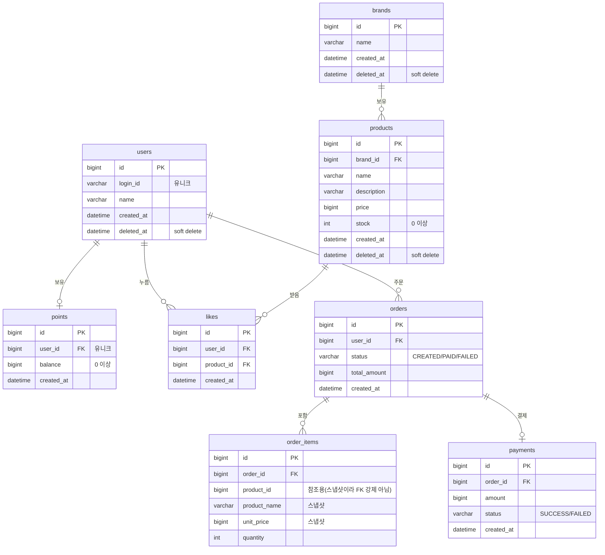

# 04. ERD (테이블 구조 및 관계)

> ERD는 데이터를 **어떤 테이블에 어떻게 저장하고, 테이블끼리 어떻게 연결되는지**를 보여줍니다.

## 왜 이 다이어그램이 필요한가
- 좋아요 중복 방지, 주문 스냅샷, soft delete 같은 **정합성 규칙이 테이블 구조로 보장되는지** 확인합니다.
- API·도메인·DB가 같은 구조를 공유하도록 맞춥니다.

---

## 전체 ERD



---

## 설계 원칙

| 항목 | 적용 |
|---|---|
| **1:N 관계** | 외래키(FK)로 표현 - `brands → products`, `orders → order_items` 등 |
| **N:M 관계** | 조인 테이블로 표현 - `likes`가 `users`와 `products`를 연결 |
| **enum** | `status`는 코드에선 enum, DB에선 `VARCHAR`로 저장 (`CREATED`, `PAID`...) |
| **soft delete** | 실제 삭제 대신 `deleted_at`에 시각 기록. 조회 시 `deleted_at IS NULL`만 노출 |
| **상태 관리** | `orders.status` 컬럼으로 상태 전이를 명시 (코드 하드코딩 금지) |

---

## 정합성을 위한 핵심 제약

### 1. 좋아요 중복 방지 - 유니크 제약
```sql
UNIQUE (user_id, product_id)  -- likes 테이블
```
같은 회원이 같은 상품에 좋아요를 두 번 저장하는 것을 **DB 차원에서 차단**합니다.
애플리케이션의 "존재 여부 확인"과 더불어 **이중 안전장치**가 됩니다.

### 2. 주문 스냅샷 - `order_items`는 상품을 따라가지 않는다
- `order_items`는 주문 당시의 `product_name`, `unit_price`를 **직접 컬럼에 복사**해 보관합니다.
- 따라서 `products`가 수정·삭제(soft delete)되어도 **과거 주문 내역은 그대로** 유지됩니다.
- `product_id`는 추적용으로만 두고, **FK 제약을 강하게 걸지 않습니다** (브랜드 삭제 시 상품이 사라져도 주문이 깨지지 않도록).

### 3. 음수 방지
- `products.stock >= 0`, `points.balance >= 0` - 재고/잔액은 음수가 될 수 없습니다. (애플리케이션 검증 + 컬럼 의미로 보장)

### 4. 브랜드 삭제의 연쇄
- 브랜드를 soft delete하면, 소속 `products`도 함께 soft delete됩니다.
- 물리 삭제가 아니므로 과거 주문(스냅샷)은 영향받지 않습니다.

---

## 이 구조에서 봐야 할 포인트
1. **`likes`의 유니크 제약**이 멱등성의 마지막 방어선입니다. 코드 버그가 있어도 DB가 중복을 막습니다.
2. **`order_items`의 스냅샷 컬럼**이 주문과 상품을 분리합니다 - 상품이 바뀌어도 영수증은 불변.
3. 모든 마스터 테이블에 **`deleted_at`** 이 있어, 삭제가 곧 데이터 소실로 이어지지 않습니다.

## 리스크와 선택지
- **좋아요 수 정렬(`likes_desc`)**: 매번 `likes`를 COUNT하면 데이터가 많아질수록 느려집니다.
  - 선택지 A: 매번 집계 (단순·정확)
  - 선택지 B: `products`에 좋아요 수 컬럼을 누적 (빠름, 정합성 관리 필요)
  - 성능 최적화는 "나아가며"에서 별도로 다룹니다.
- **과도한 정규화 주의**: 조회마다 JOIN이 너무 많아지지 않도록, 스냅샷처럼 의도적으로 값을 복제하는 부분을 둡니다.
