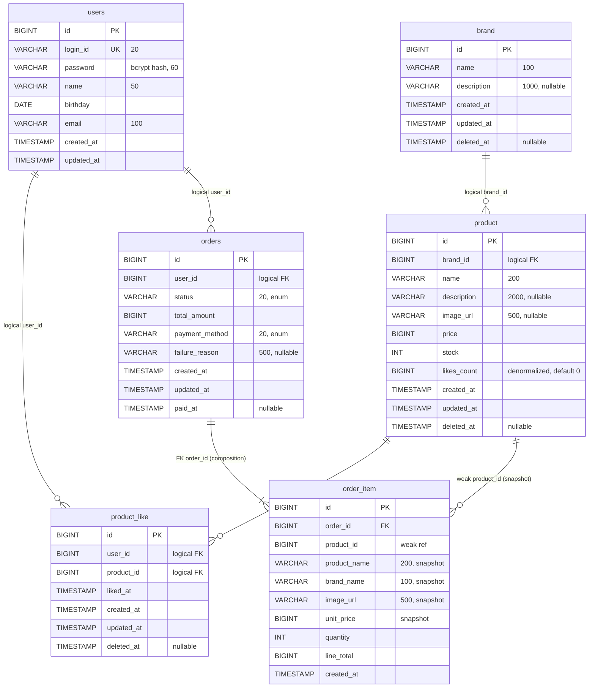

# 04. ERD

`03-class-diagram.md`의 6개 Aggregate를 물리 테이블로 매핑한다. 컬럼·인덱스·제약은 `01-requirements.md` §3 도메인 어휘 / §7 비즈니스 규칙·정책과 `02-sequence-diagrams.md`의 조회 패턴을 근거로 결정한다.

## 0. 표기 규칙

### 0.1 도구·문법

- Mermaid `erDiagram`으로 전체도 작성. 각 테이블 상세는 §2 컬럼 표로 보강.
- 식별자: `id BIGINT AUTO_INCREMENT PK` 전체 테이블 공통.
- 시간: 모든 timestamp는 UTC, `TIMESTAMP(6)` 마이크로초 정밀도. `created_at`/`updated_at`은 `BaseEntity` 상속 (코드 현황 유지).
- 상태값: 단순 닫힌 집합은 **VARCHAR(20) + 애플리케이션 enum 매핑**. 코드 테이블 별도 도입하지 않음 — 값 변경 빈도·비즈니스 속성 없음.
- soft delete: `deleted_at TIMESTAMP(6) NULL`. `deleted_at IS NULL`이 활성 행.

### 0.2 외래키 정책 — Aggregate 경계 반영

03 "Aggregate 간 객체 참조 금지, ID로만 참조" 원칙을 DB 레벨에 반영한다.

| 관계 | DB FK 여부 | 근거 |
| --- | --- | --- |
| `orders.id ← order_item.order_id` | **DB FK O** | 같은 Aggregate. composition. order 삭제 시 item 동반 |
| `brand.id ← product.brand_id` | DB FK X (논리 참조) | Brand soft delete cascade가 애플리케이션 트랜잭션에서 정렬 — DB FK가 있으면 cascade 정책과 충돌 |
| `users.id ← product_like.user_id` | DB FK X | Aggregate 간 ID 참조 |
| `product.id ← product_like.product_id` | DB FK X | 동상 |
| `users.id ← orders.user_id` | DB FK X | 동상 |
| `product.id ← order_item.product_id` | DB FK X | 스냅샷 컬럼 보유의 약한 참조 — Product soft delete가 OrderItem을 끊지 않아야 함 |

논리 참조라도 인덱스는 정확히 부여한다(§3). FK가 없을 뿐 join 성능은 동일.

### 0.3 네이밍 컨벤션 (코드 현황 반영)

코드의 기존 테이블명을 그대로 유지하되, SQL 예약어는 회피한다.

| 03 Aggregate | 테이블명 | 비고 |
| --- | --- | --- |
| User | `users` | 코드 기존 (`user`는 일부 DBMS 예약어) |
| Brand | `brand` | 코드 컨벤션(단수) 따름 |
| Product | `product` | 코드 기존 |
| Like | `product_like` | `like` SQL 예약어 회피 |
| Order | `orders` | `order` SQL 예약어 회피 |
| OrderItem | `order_item` | snake_case |

복수/단수 혼용은 마이그레이션 사안으로 분리 (§6.1 정렬 항목 참조).

---

## 1. 전체 ERD



---

## 2. 테이블별 상세

### 2.1 `users`

| 컬럼 | 타입 | NULL | 기본값 | 비고 |
| --- | --- | --- | --- | --- |
| id | BIGINT | NOT NULL | AUTO_INCREMENT | PK |
| login_id | VARCHAR(20) | NOT NULL | — | UNIQUE. `LoginId` VO 형식 검증 |
| password | VARCHAR(60) | NOT NULL | — | bcrypt 해시 (cost factor + salt 내장) |
| name | VARCHAR(50) | NOT NULL | — | |
| birthday | DATE | NOT NULL | — | Password 정책에서 생일 포함 차단용 |
| email | VARCHAR(100) | NOT NULL | — | |
| created_at | TIMESTAMP(6) | NOT NULL | NOW() | |
| updated_at | TIMESTAMP(6) | NOT NULL | NOW() | |

**제약·인덱스**
- PRIMARY KEY (id)
- UNIQUE KEY uk_users_login_id (login_id)

**메모**
- soft delete 정책 없음 (요구사항 미정의). 향후 회원 탈퇴 추가 시 `deleted_at` 컬럼 추가.
- 비밀번호 검증·해싱은 `UserModel.matchesPassword/changePassword` 책임. DB는 hash 결과 저장만.

### 2.2 `brand`

| 컬럼 | 타입 | NULL | 기본값 | 비고 |
| --- | --- | --- | --- | --- |
| id | BIGINT | NOT NULL | AUTO_INCREMENT | PK |
| name | VARCHAR(100) | NOT NULL | — | |
| description | VARCHAR(1000) | NULL | NULL | |
| created_at | TIMESTAMP(6) | NOT NULL | NOW() | |
| updated_at | TIMESTAMP(6) | NOT NULL | NOW() | |
| deleted_at | TIMESTAMP(6) | NULL | NULL | soft delete |

**제약·인덱스**
- PRIMARY KEY (id)
- (이름 검색 UC 없음. 인덱스 추가 보류)

**메모**
- 대고객 조회: `WHERE id = ? AND deleted_at IS NULL`
- 어드민은 `deleted_at` 무관 전체 조회 가능

### 2.3 `product`

| 컬럼 | 타입 | NULL | 기본값 | 비고 |
| --- | --- | --- | --- | --- |
| id | BIGINT | NOT NULL | AUTO_INCREMENT | PK |
| brand_id | BIGINT | NOT NULL | — | 논리 FK |
| name | VARCHAR(200) | NOT NULL | — | |
| description | VARCHAR(2000) | NULL | NULL | |
| image_url | VARCHAR(500) | NULL | NULL | |
| price | BIGINT | NOT NULL | — | 0 이상. 단위: 원 (정수) |
| stock | INT | NOT NULL | 0 | 0 이상. 원자 UPDATE로 차감 |
| likes_count | BIGINT | NOT NULL | 0 | 비정규화 카운터. ±1 원자 UPDATE |
| created_at | TIMESTAMP(6) | NOT NULL | NOW() | |
| updated_at | TIMESTAMP(6) | NOT NULL | NOW() | |
| deleted_at | TIMESTAMP(6) | NULL | NULL | soft delete |

**제약·인덱스**
- PRIMARY KEY (id)
- KEY idx_product_brand_active (brand_id, deleted_at) — 브랜드별 활성 상품 조회 (UC-02·UC-04)
- KEY idx_product_likes_desc (deleted_at, likes_count DESC, id DESC) — `likes_desc` 정렬 (01 §7.3 좋아요 수 표시, UC-03)
- KEY idx_product_created_desc (deleted_at, created_at DESC, id DESC) — `latest` 정렬
- KEY idx_product_price_asc (deleted_at, price, id DESC) — `price_asc` 정렬

**메모**
- 정렬 인덱스의 첫 컬럼이 `deleted_at`인 이유: 모든 대고객 정렬 조회가 `deleted_at IS NULL` 필터를 동반함. 필터-정렬 복합 효율.
- `likes_count` 매 요청 COUNT 금지(01 §7.3) — 비정규화 카운터로 응답 성능 확보. 정합성은 주기적 reconcile.
- 재고 원자 UPDATE: `UPDATE product SET stock = stock - ? WHERE id = ? AND stock >= ? AND deleted_at IS NULL`. 영향 행 0이면 `INSUFFICIENT_STOCK`.

### 2.4 `product_like`

| 컬럼 | 타입 | NULL | 기본값 | 비고 |
| --- | --- | --- | --- | --- |
| id | BIGINT | NOT NULL | AUTO_INCREMENT | PK |
| user_id | BIGINT | NOT NULL | — | 논리 FK |
| product_id | BIGINT | NOT NULL | — | 논리 FK |
| liked_at | TIMESTAMP(6) | NOT NULL | NOW() | reactivate 시 갱신 |
| created_at | TIMESTAMP(6) | NOT NULL | NOW() | 최초 좋아요 시점, reactivate에서도 보존 |
| updated_at | TIMESTAMP(6) | NOT NULL | NOW() | |
| deleted_at | TIMESTAMP(6) | NULL | NULL | soft delete + reactivate |

**제약·인덱스**
- PRIMARY KEY (id)
- UNIQUE KEY uk_product_like (user_id, product_id) — 1 user × 1 product = 1 row 보장
- KEY idx_like_user_active_liked (user_id, deleted_at, liked_at DESC, id DESC) — "내 좋아요 목록" 조회 (UC-06)
- KEY idx_like_product (product_id, deleted_at) — 상품별 좋아요 활성 행 조회 / count 보정용

**메모**
- 재등록은 새 INSERT가 아닌 기존 행 UPDATE (01 §7.5, UC-05). `deleted_at = NULL`, `liked_at = NOW()`, `created_at` 보존.
- 부분 인덱스(`WHERE deleted_at IS NULL`) 사용 안 함 — MariaDB 미지원. UNIQUE를 `(user_id, product_id, deleted_at)`로 늘리는 대신 reactivate 패턴으로 회피.
- `idx_like_user_active_liked`의 `deleted_at`을 두 번째 컬럼에 둔 이유: 같은 user 행 안에서 `deleted_at IS NULL` 행만 빠르게 골라내고 `liked_at DESC` 정렬을 인덱스에서 처리.

### 2.5 `orders`

| 컬럼 | 타입 | NULL | 기본값 | 비고 |
| --- | --- | --- | --- | --- |
| id | BIGINT | NOT NULL | AUTO_INCREMENT | PK |
| user_id | BIGINT | NOT NULL | — | 논리 FK |
| status | VARCHAR(20) | NOT NULL | 'PENDING' | enum: PENDING/PAID/FAILED |
| total_amount | BIGINT | NOT NULL | — | items lineTotal 합. PG에 결제 요청하는 금액과 동일 |
| payment_method | VARCHAR(20) | NOT NULL | — | enum: CARD (향후 확장 가능) |
| failure_reason | VARCHAR(500) | NULL | NULL | status=FAILED 시 |
| created_at | TIMESTAMP(6) | NOT NULL | NOW() | |
| updated_at | TIMESTAMP(6) | NOT NULL | NOW() | |
| paid_at | TIMESTAMP(6) | NULL | NULL | status=PAID 전이 시점 |

**제약·인덱스**
- PRIMARY KEY (id)
- KEY idx_orders_user_created (user_id, created_at DESC, id DESC) — "내 주문 목록" (UC-09)
- KEY idx_orders_status_created (status, created_at DESC, id DESC) — 어드민 상태 필터 검색 (UC-12)
- KEY idx_orders_created (created_at DESC, id DESC) — 어드민 전체 최신순

**메모**
- soft delete 컬럼 없음 — 주문은 영구 보존(01 §7.5). Brand/Product soft delete cascade 대상 아님.
- 상태 전이는 `OrderModel.markPaid()` / `markFailed(reason)` 에서만. CHECK 제약 미사용 (애플리케이션 책임).
- 어드민 검색 필터(상태, 기간, 사용자) 조합은 `idx_orders_status_created` + `user_id` 보강. 복합 필터가 다양해지면 (status, user_id, created_at) 추가 인덱스 고려.

### 2.6 `order_item`

| 컬럼 | 타입 | NULL | 기본값 | 비고 |
| --- | --- | --- | --- | --- |
| id | BIGINT | NOT NULL | AUTO_INCREMENT | PK |
| order_id | BIGINT | NOT NULL | — | DB FK → orders.id |
| product_id | BIGINT | NOT NULL | — | 약한 참조 (스냅샷 보유) |
| product_name | VARCHAR(200) | NOT NULL | — | 주문 시점 스냅샷 |
| brand_name | VARCHAR(100) | NOT NULL | — | 주문 시점 스냅샷 |
| image_url | VARCHAR(500) | NULL | NULL | 주문 시점 스냅샷 |
| unit_price | BIGINT | NOT NULL | — | 주문 시점 단가 |
| quantity | INT | NOT NULL | — | 1 이상 |
| line_total | BIGINT | NOT NULL | — | unit_price × quantity |
| created_at | TIMESTAMP(6) | NOT NULL | NOW() | |

**제약·인덱스**
- PRIMARY KEY (id)
- FOREIGN KEY (order_id) REFERENCES orders(id) ON DELETE RESTRICT
- KEY idx_order_item_order (order_id) — order 상세 조회 join
- KEY idx_order_item_product (product_id) — 상품별 판매 통계 (어드민·운영)

**메모**
- `order_id` FK가 유일한 DB FK. 같은 Aggregate라 무결성 보장 필요.
- ON DELETE RESTRICT: orders 삭제 자체가 정책상 없으므로 안전망 역할.
- 스냅샷 컬럼은 product/brand 변경·삭제에 영향받지 않음 (01 §3.2 관계, §7.5).

---

## 3. 인덱스 전략 — 조회 패턴 매핑

02 시퀀스의 모든 조회를 인덱스로 매핑한다.

| 조회 패턴 | 출처 UC | 사용 인덱스 |
| --- | --- | --- |
| 활성 브랜드 단건 조회 | UC-02 | brand PK |
| 브랜드 필터 + 정렬 페이지 상품 목록 | UC-03 | idx_product_brand_active + 정렬용 인덱스 |
| `likes_desc` 정렬 페이지 | UC-03 | idx_product_likes_desc |
| `latest` 정렬 페이지 | UC-03 | idx_product_created_desc |
| `price_asc` 정렬 페이지 | UC-03 | idx_product_price_asc |
| 상품 단건 + 활성 검증 | UC-04 | product PK |
| `likedByMe` 일괄 조회 (N+1 회피) | UC-03 | uk_product_like — `(user_id, product_id) IN (...)` |
| 좋아요 등록·취소 시 단건 조회 | UC-05, UC-05b | uk_product_like |
| 내 좋아요 목록 (`liked_at DESC` 페이지) | UC-06 | idx_like_user_active_liked |
| 내 주문 단건 조회 | UC-09 | orders PK + idx_order_item_order |
| 어드민 주문 검색 (status 필터) | UC-12 | idx_orders_status_created |

**정렬 안정성 (01 §7.2 목록 조회 정책)** — 모든 정렬 인덱스 마지막 컬럼은 `id DESC`. 동률 발생 시 page 경계의 일관성 확보.

**N+1 회피** — `likedByMe`는 페이지 productId 집합을 단일 IN 쿼리 1회로 조회. `uk_product_like`가 효과적으로 커버.

**카운터 우회** — `likes_desc` 정렬은 매 요청 `COUNT(product_like)` 실행 금지. `product.likes_count` 컬럼 + `idx_product_likes_desc`로 처리.

---

## 4. 제약·정합성

### 4.1 소프트 삭제 cascade 순서

01 §7.5의 비활성 전파는 **DB 트리거가 아닌 애플리케이션 트랜잭션**에서 정렬한다. DB FK가 없어 cascade가 자동으로 일어나지 않음.

```
Brand.softDelete()
  → Product.softDelete() WHERE brand_id = ?           -- 다중 행
    → product_like.softDelete() WHERE product_id IN (...) -- 다중 행
```

각 단계는 같은 트랜잭션 내에서 처리. `likes_count` 동기화는 cascade에서 제외 — Product 자체가 삭제되어 카운터 의미 없음.

`orders` / `order_item`은 cascade 대상 아님(01 §7.5). 스냅샷 보존.

### 4.2 비정규화 카운터 정합성

`product.likes_count` 정합성:
- 동기 유지: 좋아요 변화 케이스에만 `± 1` 원자 UPDATE를 동일 트랜잭션에서 (01 §7.3 좋아요 수 표시, UC-05).
- 보정: 주기적 reconcile 배치(옵션) — `COUNT(product_like WHERE deleted_at IS NULL AND product_id = ?)`와 비교. drift 발견 시 보정.
- 음수 방지: `GREATEST(likes_count - 1, 0)` UPDATE 식.

### 4.3 원자 UPDATE 패턴 (동시성)

비관 락·분산락 미사용. 핵심 쿼리는 모두 조건부 UPDATE.

```sql
-- 재고 차감
UPDATE product
SET stock = stock - :qty
WHERE id = :productId AND deleted_at IS NULL AND stock >= :qty;

-- likes_count 증감
UPDATE product
SET likes_count = likes_count + 1
WHERE id = :productId;

UPDATE product
SET likes_count = GREATEST(likes_count - 1, 0)
WHERE id = :productId;
```

영향 행 0 → 충돌. 트랜잭션 최대 3회 재시도 → 그래도 실패 시 `409 CONFLICT`.

### 4.4 UNIQUE 충돌 회피 (product_like)

soft delete + reactivate 패턴이 `uk_product_like (user_id, product_id)`와 충돌하지 않는 이유:
- 같은 (user_id, product_id) 행은 항상 **단일 행**으로 유지
- 좋아요 취소 = `deleted_at` 채움. 같은 row 그대로
- 재등록 = `deleted_at = NULL`, `liked_at = NOW()`. INSERT 안 함

MariaDB 부분 인덱스(`WHERE deleted_at IS NULL`) 미지원 회피책. 03 §2.4 메모 참조.

---

## 5. 상태 전이

### 5.1 `orders.status` 상태 머신

```
       ┌────────────┐
       │            │
       ▼            │
   [PENDING] ──── markFailed(reason) ──> [FAILED]
       │
       └─── markPaid() ──> [PAID]
```

| 전이 | 트리거 | 사이드 이펙트 |
| --- | --- | --- |
| (생성) → PENDING | OrderFacade.placeOrder | order INSERT, order_item × N INSERT, product.stock 차감 |
| PENDING → PAID | OrderFacade (PG SUCCESS) → OrderModel.markPaid | paid_at = NOW(), audit 로그 |
| PENDING → FAILED | OrderFacade (PG FAILED) → OrderModel.markFailed | failure_reason 저장, **product.stock 원복** |
| PENDING (PG TIMEOUT) | reconcile job (UC-08c) | PG queryStatus 재호출 결과로 PAID/FAILED 확정 |

다른 전이(예: PAID → FAILED, FAILED → PAID)는 도메인 메서드에서 거부. CHECK 제약 미부여 — 애플리케이션 책임으로 일관 유지.

### 5.2 `product_like` deleted_at 상태 전이

엄밀히 상태 컬럼은 없지만 `deleted_at` 값으로 활성/비활성 두 상태:

```
[active: deleted_at IS NULL]  ──── softDelete() ────>  [inactive: deleted_at = NOW()]
       ▲                                                       │
       └────────────── reactivate() ──────────────────────────┘
```

같은 row를 왕복. INSERT는 최초 1회만.

---

## 6. 마이그레이션 메모

### 6.1 03 → 04 정렬 항목

| 항목 | 처리 |
| --- | --- |
| 테이블명 단·복수 혼용 (users/orders 복수, brand/product 단수) | 코드 기존 유지. 통일은 별도 마이그레이션 사안 |
| `password` 컬럼 길이 | 현재 코드 base64 SHA-256 결과(44자) → bcrypt(60자)로 마이그레이션 시 컬럼 확장 필요. **VARCHAR(60)으로 ALTER 선행** |
| `product` 신규 컬럼 | brand_id, image_url, likes_count, deleted_at 모두 ADD COLUMN |
| `brand`, `product_like`, `orders`, `order_item` | CREATE TABLE 신규 |
| `BaseEntity`의 created_at/updated_at | 코드 기존 패턴 활용. 04 컬럼 정의는 이를 전제 |

### 6.2 인덱스 생성 순서

대용량 데이터 가정 시 운영 권장 순서:
1. 신규 테이블 (brand, product_like, orders, order_item) CREATE — 인덱스 포함
2. product ADD COLUMN (brand_id, image_url, likes_count, deleted_at) — DEFAULT 명시
3. product 인덱스 추가 (`CREATE INDEX ... ALGORITHM=INPLACE` 권장, MariaDB)
4. users password 컬럼 ALTER (VARCHAR(60))
5. bcrypt 마이그레이션 (기존 사용자 비번 무효화 + 재설정 안내)

### 6.3 다음 문서 연결

- 도메인 매핑 검증: `03-class-diagram.md` §2 / §4 도메인 책임 분배
- 조회 흐름 일치: `02-sequence-diagrams.md` UC-01~12
- 요구사항 근거: `01-requirements.md` §3 도메인 어휘 / §7 비즈니스 규칙·정책
