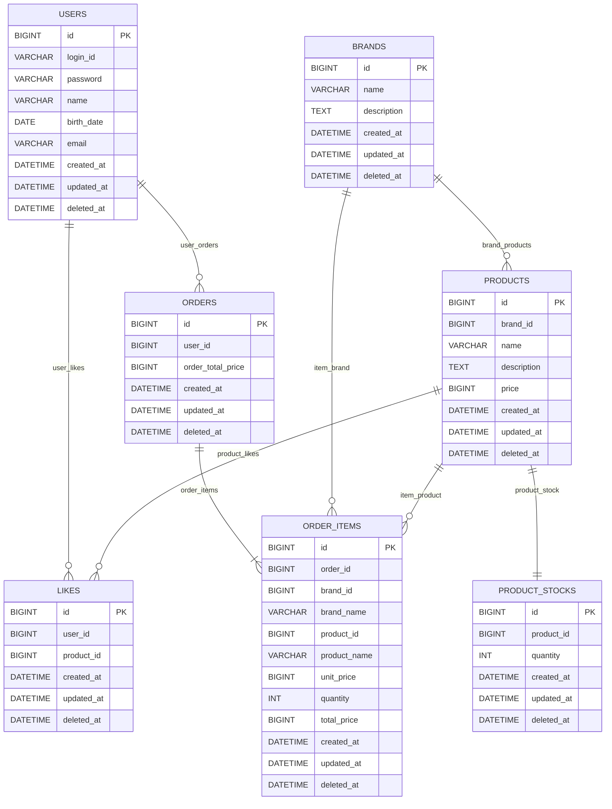

# 04. ERD

> 기준 문서: [01-requirements.md](01-requirements.md), [02-sequence-diagrams.md](02-sequence-diagrams.md), [03-class-diagram.md](03-class-diagram.md)  
> 목적: 감성 이커머스의 전체 테이블 구조와 핵심 관계를 한눈에 확인한다.

## 1. ERD 설계 기준

| 설계 결정 | ERD 반영 |
| --- | --- |
| 사용자는 기존 도메인을 사용한다 | `users`는 주문/좋아요의 참조 대상만 표현한다 |
| 브랜드와 상품은 soft delete 한다 | `brands.deleted_at`, `products.deleted_at`으로 삭제 상태를 표현한다 |
| 상품 기본 정보와 재고를 분리한다 | `products`와 `product_stocks`를 1:1로 분리한다 |
| 주문은 당시 상품 정보를 보존한다 | `order_items`에 브랜드/상품 ID와 이름, 가격 스냅샷을 함께 저장한다 |
| 좋아요는 현재 상태 토글이다 | `likes`는 취소 시 hard delete 하고, `(user_id, product_id)` unique로 중복을 막는다 |
| 주문 재고 차감은 동시성 안전해야 한다 | `product_stocks` row를 `product_id` 오름차순으로 비관적 락 조회한다 |
| 물리 FK는 명시하지 않는다 | 관계선과 `*_id` 컬럼은 논리 참조를 의미하며, DB `FOREIGN KEY` 제약을 뜻하지 않는다 |

## 2. 회원과 어드민 설계

이번 범위에서 고객과 어드민은 같은 성격의 계정으로 보지 않는다.

| 주체 | 설계 방향 | 이유 |
| --- | --- | --- |
| 고객 | `users` 테이블로 관리 | 주문, 좋아요처럼 고객이 직접 소유하는 데이터가 있다 |
| 어드민 | 별도 테이블 없이 운영 인증 주체로 취급 | 브랜드/상품/주문을 관리하는 행위자지만, 이번 범위에서 어드민 가입/권한/이력 관리가 없다 |

어드민 API는 `/api-admin/v1` prefix와 어드민 인증 헤더로 접근을 제한한다. 즉, ERD에는 `admins`를 추가하지 않고, 어드민은 시스템 밖의 운영 인증 주체로 표현한다.

추후 어드민별 작업 이력, 권한 그룹, 계정 비활성화가 필요해지면 `admin_users`, `admin_roles`, `admin_audit_logs`를 별도 운영 도메인으로 추가하는 편이 좋다. 고객 `users`에 `role`만 추가해 어드민을 섞는 방식은 고객 계정과 운영자 계정의 생명주기와 보안 정책이 달라질 가능성이 커서 이번 설계에서는 제외한다.

## 3. 전체 ERD

> Mermaid `erDiagram`은 관계 라벨에 한글을 넣으면 파싱 오류가 발생할 수 있어, 다이어그램 안에서는 ASCII 라벨을 사용한다. 한글 비즈니스 관계명은 아래 관계 요약 표에서 확인한다.
> 관계선은 논리 참조 관계를 보여주기 위한 표현이며, 물리 DB `FOREIGN KEY` 제약을 의미하지 않는다.

> `created_at`, `updated_at`, `deleted_at`은 현재 프로젝트의 `BaseEntity` 공통 컬럼이다. 다만 비즈니스 삭제 정책으로 `deleted_at`을 사용하는 도메인은 브랜드와 상품이다. 좋아요는 취소 시 row를 hard delete 하므로 `deleted_at`을 좋아요 상태 판단에 사용하지 않는다.

## 4. 관계 요약

| 관계 | 설명 |
| --- | --- |
| `users` 1 : N `likes` | 한 사용자는 여러 상품에 좋아요를 누를 수 있다 |
| `users` 1 : N `orders` | 한 사용자는 여러 주문을 생성할 수 있다 |
| `brands` 1 : N `products` | 한 브랜드는 여러 상품을 가질 수 있다 |
| `products` 1 : 1 `product_stocks` | 한 상품은 하나의 현재 재고 row를 가진다 |
| `products` 1 : N `likes` | 한 상품은 여러 사용자에게 좋아요를 받을 수 있다 |
| `orders` 1 : N `order_items` | 한 주문은 하나 이상의 주문 항목을 가진다 |
| `brands/products` 1 : N `order_items` | 주문 항목은 원본 브랜드/상품 ID와 주문 당시 스냅샷 값을 함께 보존한다 |

## 5. 테이블별 핵심 제약

| 테이블 | 논리 참조와 제약 |
| --- | --- |
| `users` | `login_id` unique. 기존 사용자 도메인 테이블이며 신규 설계 범위에서는 참조만 한다 |
| `brands` | `name`은 비어 있을 수 없다. 삭제는 `deleted_at`으로 soft delete 한다 |
| `products` | `brand_id`는 `brands.id`를 논리적으로 가리킨다. `price >= 0`. 삭제는 `deleted_at`으로 soft delete 한다 |
| `product_stocks` | `product_id`는 `products.id`를 논리적으로 가리키며 unique다. `quantity >= 0` |
| `likes` | `user_id`, `product_id`는 논리 참조다. `(user_id, product_id)` unique. 좋아요 취소 시 row를 hard delete 한다 |
| `orders` | `user_id`는 `users.id`를 논리적으로 가리킨다. `order_total_price = sum(order_items.total_price)` |
| `order_items` | `order_id`는 `orders.id`를 논리적으로 가리킨다. `brand_id`, `product_id`는 주문 당시 원본 식별자다. `quantity >= 1`, `unit_price >= 0`, `total_price = unit_price * quantity` |

## 6. 삭제와 보존 정책

| 도메인 | 정책 |
| --- | --- |
| 브랜드 | soft delete. 브랜드 삭제 시 소속 상품도 같은 트랜잭션에서 soft delete 한다 |
| 상품 | soft delete. 고객 상품 목록/상세와 신규 주문 대상에서 제외한다 |
| 재고 | 상품과 1:1로 유지한다. 별도 삭제 API는 두지 않고 상품 상태를 기준으로 노출 여부를 판단한다 |
| 좋아요 | hard delete. 이력이 아니라 현재 좋아요 상태만 관리한다 |
| 주문 | 삭제하지 않는다. 주문 당시 스냅샷을 기준으로 계속 조회할 수 있어야 한다 |
| 주문 항목 | 삭제하지 않는다. 상품/브랜드가 이후 수정 또는 삭제되어도 주문 당시 값을 유지한다 |

## 7. 향후 인덱스 고려 사항

현재는 트래픽이 많지 않은 초기 단계로 보고, 성능 최적화 목적의 별도 인덱스는 이번 ERD에서 확정하지 않는다. 다만 데이터가 늘거나 특정 조회가 느려지면 아래 인덱스를 우선 검토할 수 있다.

| 상황 | 향후 고려할 수 있는 인덱스 |
| --- | --- |
| 브랜드별 상품 목록 | `products(brand_id, deleted_at, created_at)` |
| 최신 상품 목록 | `products(deleted_at, created_at)` |
| 내가 좋아요한 상품 목록 | `likes(user_id, created_at)` |
| 내 주문 목록 | `orders(user_id, created_at)` |
| 주문 상세 항목 조회 | `order_items(order_id)` |

> `product_stocks(product_id)` unique와 `likes(user_id, product_id)` unique는 조회 성능 목적의 인덱스가 아니라 데이터 무결성 제약이다. 주문 생성 시 여러 상품의 재고를 차감할 때는 `product_stocks.product_id` 오름차순으로 row lock을 획득한다.
