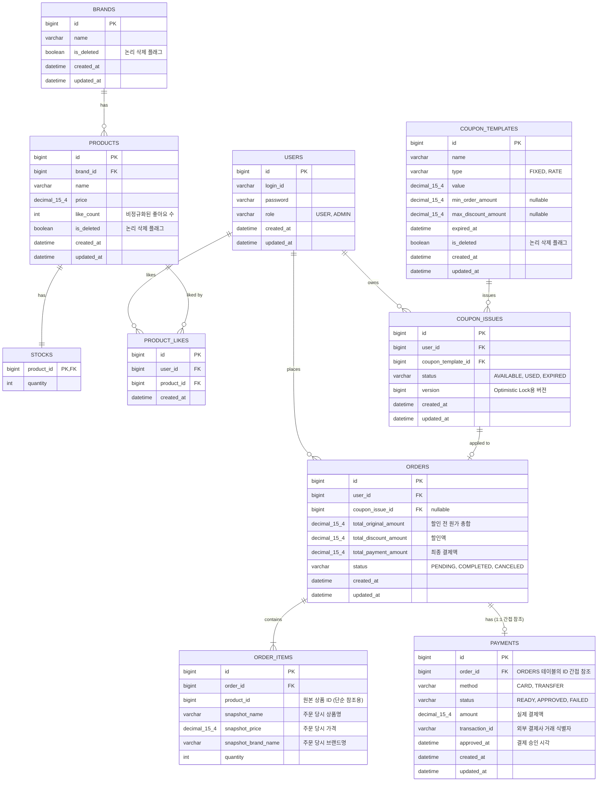

```mermaid
erDiagram
    USERS {
        bigint id PK
        varchar login_id
        varchar password
        varchar role "USER, ADMIN"
        datetime created_at
        datetime updated_at
    }

    BRANDS {
        bigint id PK
        varchar name
        boolean is_deleted "논리 삭제 플래그"
        datetime created_at
        datetime updated_at
    }

    PRODUCTS {
        bigint id PK
        bigint brand_id FK
        varchar name
        decimal_15_4 price
        int like_count "비정규화된 좋아요 수"
        boolean is_deleted "논리 삭제 플래그"
        datetime created_at
        datetime updated_at
    }

    STOCKS {
        bigint product_id PK, FK
        int quantity
    }

    PRODUCT_LIKES {
        bigint id PK
        bigint user_id FK
        bigint product_id FK
        datetime created_at
        %% Unique Index: (user_id, product_id)
    }

    COUPON_TEMPLATES {
        bigint id PK
        varchar name
        varchar type "FIXED, RATE"
        decimal_15_4 value
        decimal_15_4 min_order_amount "nullable"
        decimal_15_4 max_discount_amount "nullable"
        datetime expired_at
        boolean is_deleted "논리 삭제 플래그"
        datetime created_at
        datetime updated_at
    }

    COUPON_ISSUES {
        bigint id PK
        bigint user_id FK
        bigint coupon_template_id FK
        varchar status "AVAILABLE, USED, EXPIRED"
        bigint version "Optimistic Lock용 버전"
        datetime created_at
        datetime updated_at
        %% Unique Index: (user_id, coupon_template_id)
    }

    ORDERS {
        bigint id PK
        bigint user_id FK
        bigint coupon_issue_id FK "nullable"
        decimal_15_4 total_original_amount "할인 전 원가 총합"
        decimal_15_4 total_discount_amount "할인액"
        decimal_15_4 total_payment_amount "최종 결제액"
        varchar status "PENDING, COMPLETED, CANCELED"
        datetime created_at
        datetime updated_at
    }

    PAYMENTS {
        bigint id PK
        bigint order_id FK "ORDERS 테이블의 ID 간접 참조"
        varchar method "CARD, TRANSFER"
        varchar status "READY, APPROVED, FAILED"
        decimal_15_4 amount "실제 결제액"
        varchar transaction_id "외부 결제사 거래 식별자"
        datetime approved_at "결제 승인 시각"
        datetime created_at
        datetime updated_at
    }

    ORDER_ITEMS {
        bigint id PK
        bigint order_id FK
        bigint product_id "원본 상품 ID (단순 참조용)"
        varchar snapshot_name "주문 당시 상품명"
        decimal_15_4 snapshot_price "주문 당시 가격"
        varchar snapshot_brand_name "주문 당시 브랜드명"
        int quantity
    }

    %% Relationships
    BRANDS ||--o{ PRODUCTS : "has"
    PRODUCTS ||--|| STOCKS : "has"
    USERS ||--o{ ORDERS : "places"
    ORDERS ||--|{ ORDER_ITEMS : "contains"
    USERS ||--o{ PRODUCT_LIKES : "likes"
    PRODUCTS ||--o{ PRODUCT_LIKES : "liked by"
    USERS ||--o{ COUPON_ISSUES : "owns"
    COUPON_TEMPLATES ||--o{ COUPON_ISSUES : "issues"
    COUPON_ISSUES ||--o| ORDERS : "applied to"
    ORDERS ||--o| PAYMENTS : "has (1:1 간접 참조)"
```