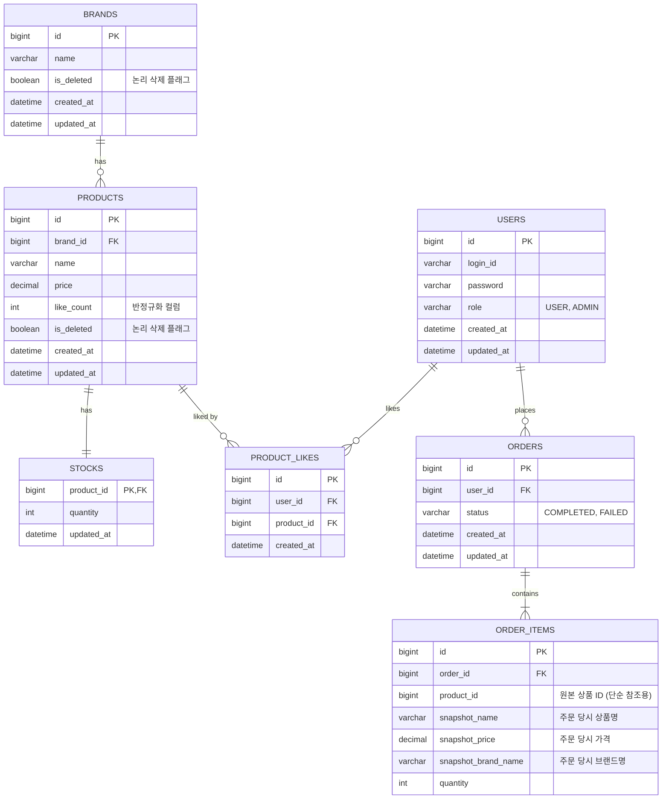

```mermaid
erDiagram
    USERS {
        bigint id PK
        varchar login_id
        varchar password
        varchar role "USER, ADMIN"
        datetime created_at
        datetime updated_at
    }

    BRANDS {
        bigint id PK
        varchar name
        boolean is_deleted "논리 삭제 플래그"
        datetime created_at
        datetime updated_at
    }

    PRODUCTS {
        bigint id PK
        bigint brand_id FK
        varchar name
        decimal price
        int like_count "반정규화 컬럼"
        boolean is_deleted "논리 삭제 플래그"
        datetime created_at
        datetime updated_at
    }

    STOCKS {
        bigint product_id PK, FK
        int quantity
        datetime updated_at
    }

    PRODUCT_LIKES {
        bigint id PK
        bigint user_id FK
        bigint product_id FK
        datetime created_at
        %% Unique Index: (user_id, product_id)
    }

    ORDERS {
        bigint id PK
        bigint user_id FK
        varchar status "COMPLETED, FAILED"
        datetime created_at
        datetime updated_at
    }

    ORDER_ITEMS {
        bigint id PK
        bigint order_id FK
        bigint product_id "원본 상품 ID (단순 참조용)"
        varchar snapshot_name "주문 당시 상품명"
        decimal snapshot_price "주문 당시 가격"
        varchar snapshot_brand_name "주문 당시 브랜드명"
        int quantity
    }

    %% Relationships
    BRANDS ||--o{ PRODUCTS : "has"
    PRODUCTS ||--|| STOCKS : "has"
    USERS ||--o{ ORDERS : "places"
    ORDERS ||--|{ ORDER_ITEMS : "contains"
    USERS ||--o{ PRODUCT_LIKES : "likes"
    PRODUCTS ||--o{ PRODUCT_LIKES : "liked by"
```