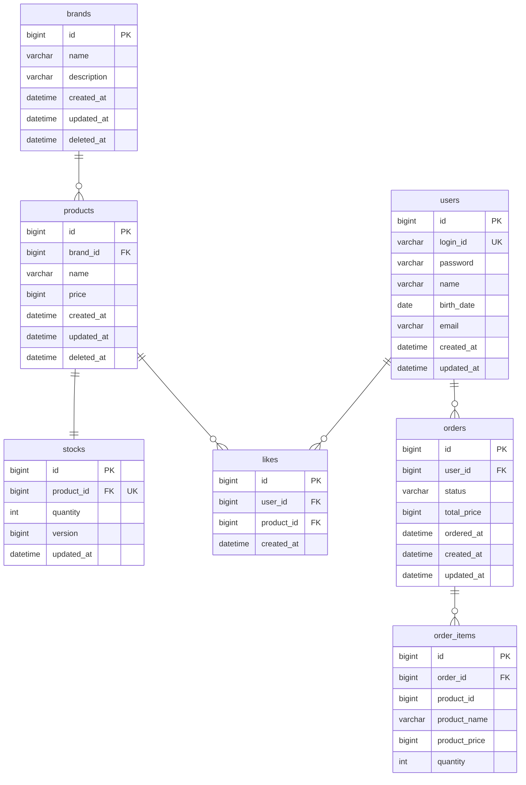

# ERD

## 전체 ERD

영속성 구조, 테이블 간 관계, soft delete 컬럼 위치, 스냅샷 컬럼 위치, UK 제약을 확인한다.

**읽는 포인트**
- `stocks`는 `products`와 1:1로 분리된 테이블이다. 주문마다 갱신되는 `quantity`를 `products`에서 분리해 락 경쟁 범위를 최소화한다. `products` row는 캐싱 가능한 상태를 유지한다.
- `stocks.version`은 낙관적 락용 컬럼이다. 동시 주문이 같은 재고를 차감할 때 충돌을 감지한다. (JPA `@Version` 활용)
- `stocks.product_id`는 UK 제약으로 1:1 관계를 DB 레벨에서 보장한다.
- `brands`, `products` 모두 `deleted_at` 컬럼 보유. 브랜드 삭제 시 연관 상품의 `deleted_at`도 함께 채운다. 조회 시 `deleted_at IS NULL` 조건 필수.
- `order_items.product_id`는 FK 제약 없음. 상품이 삭제되어도 주문 내역은 `product_name`, `product_price` 스냅샷으로 독립 보존된다.
- `likes`는 `(user_id, product_id)` 복합 UK 제약으로 DB 레벨에서 중복 좋아요 방지.
- 가격 관련 컬럼(`price`, `total_price`, `product_price`)은 `bigint`로 선언한다. `int` 범위(약 21억)를 초과하는 경우를 대비한다.

---

## 테이블별 설계 설명

### brands
- `deleted_at`: soft delete 컬럼. null이면 활성, 값이 있으면 삭제 처리.

### products
- `brand_id`: 브랜드 FK. 상품 수정 시 변경 불가.
- `deleted_at`: 브랜드 삭제 시 연관 상품에도 함께 채워진다.

### stocks
- `product_id`: UK 제약으로 products와 1:1 관계를 보장한다.
- `quantity`: 주문 시 차감되는 재고 수량. 어드민에게만 수량 노출, 사용자에게는 `quantity > 0` 여부만 노출.
- `version`: 낙관적 락용 컬럼. JPA `@Version`과 연동하여 동시 주문 시 충돌을 감지한다.

### likes
- `(user_id, product_id)` 복합 UK 제약으로 중복 좋아요 방지.
- 좋아요 수는 별도 컬럼 없이 COUNT 집계로 처리. 성능 이슈 발생 시 `products.like_count` 캐시 컬럼 도입 검토.

### orders
- `status`: `PENDING` → `COMPLETED` / `CANCELLED` 상태 전이.
- `total_price`: 주문 시점 총 금액. 이후 상품 가격 변동과 무관하게 보존.
- `ordered_at`: 비즈니스 주문 시각. `created_at`은 DB insert 시각으로, 배치/재처리 등으로 레코드 생성 시점이 달라질 수 있어 구분한다.

### order_items
- `product_name`, `product_price`: 주문 당시 상품 정보 스냅샷. `product_id`가 가리키는 상품이 변경/삭제되어도 주문 내역은 영향받지 않는다.
- `product_id`: FK 제약 없이 참조용으로만 보유.

---

## 설계 고민

**좋아요 수 정렬 (`likes_desc`)**
- 현재: `likes` 테이블 COUNT JOIN으로 집계 → 항상 정확하지만 상품 수가 많아지면 느려질 수 있음
- 추후: `products.like_count` 캐시 컬럼 도입 → 빠르지만 좋아요 등록/취소 시 동기화 필요, 동시성 문제 고려 필요

**`order_items.product_id` FK 제약**
- FK 제약을 걸면 상품 물리 삭제 시 주문 내역도 영향받음
- soft delete 방식을 쓰더라도 FK 제약 없이 참조용으로만 두는 것이 안전
