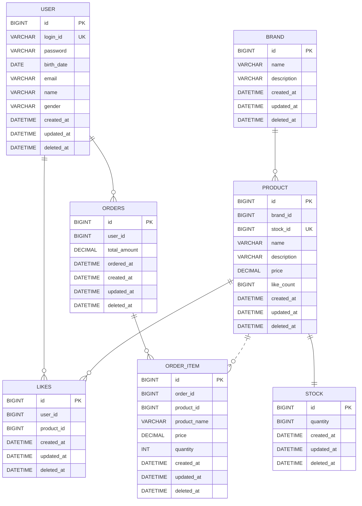

# ERD

```mermaid
erDiagram
    USER    ||--o{ LIKES      : ""
    USER    ||--o{ ORDERS     : ""
    BRAND   ||--o{ PRODUCT    : ""
    PRODUCT ||--|| STOCK      : ""
    PRODUCT ||--o{ LIKES      : ""
    ORDERS  ||--o{ ORDER_ITEM : ""
    PRODUCT ||..o{ ORDER_ITEM : ""

    USER {
        BIGINT   id          PK
        VARCHAR  login_id    UK
        VARCHAR  password
        DATE     birth_date
        VARCHAR  email
        VARCHAR  name
        VARCHAR  gender
        DATETIME created_at
        DATETIME updated_at
        DATETIME deleted_at
    }

    BRAND {
        BIGINT   id          PK
        VARCHAR  name
        VARCHAR  description
        DATETIME created_at
        DATETIME updated_at
        DATETIME deleted_at
    }

    PRODUCT {
        BIGINT   id          PK
        BIGINT   brand_id
        BIGINT   stock_id    UK
        VARCHAR  name
        VARCHAR  description
        DECIMAL  price
        BIGINT   like_count
        DATETIME created_at
        DATETIME updated_at
        DATETIME deleted_at
    }

    STOCK {
        BIGINT   id          PK
        BIGINT   quantity
        DATETIME created_at
        DATETIME updated_at
        DATETIME deleted_at
    }

    LIKES {
        BIGINT   id          PK
        BIGINT   user_id
        BIGINT   product_id
        DATETIME created_at
        DATETIME updated_at
        DATETIME deleted_at
    }

    ORDERS {
        BIGINT   id           PK
        BIGINT   user_id
        DECIMAL  total_amount
        DATETIME ordered_at
        DATETIME created_at
        DATETIME updated_at
        DATETIME deleted_at
    }

    ORDER_ITEM {
        BIGINT   id            PK
        BIGINT   order_id
        BIGINT   product_id
        VARCHAR  product_name
        DECIMAL  price
        INT      quantity
        DATETIME created_at
        DATETIME updated_at
        DATETIME deleted_at
    }
```
