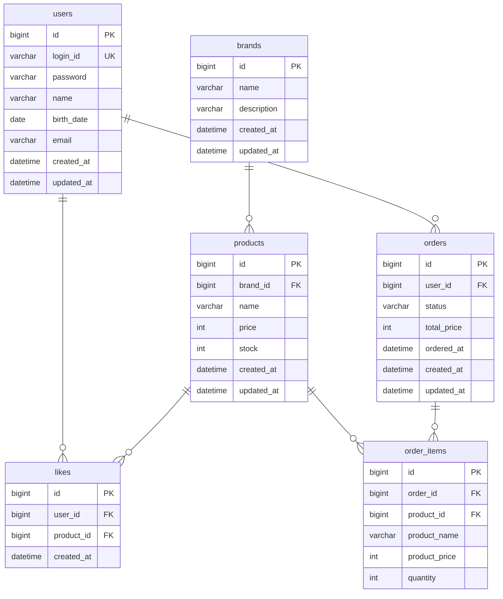

# ERD

## 전체 ERD

---

## 테이블 설계 설명

### brands
브랜드 정보. 삭제 시 연관 products도 삭제되어야 하므로 products에 `brand_id` FK를 두고 cascade delete 또는 애플리케이션 레벨에서 처리.

### products
- `stock`: 재고 수량. 주문 시 차감.
- `brand_id`: 브랜드 FK. 상품 수정 시 변경 불가.
- 어드민에게는 `stock` 노출, 고객에게는 재고 유무 정도만 노출 가능.

### likes
- `(user_id, product_id)` 복합 UK 제약으로 중복 좋아요 방지.
- 좋아요 수는 `likes` 테이블 count 쿼리로 계산하거나, `products.like_count` 캐시 컬럼으로 관리 가능. 현재는 별도 컬럼 없이 집계.

### orders
- `status`: 주문 상태 (`PENDING`, `COMPLETED`, `CANCELLED` 등)
- `total_price`: 주문 시점 총 금액. 이후 가격 변동과 무관하게 보존.
- `ordered_at`: 주문 요청 시각.

### order_items
- `product_name`, `product_price`: 주문 당시 상품 정보 스냅샷.
  - 이후 상품 정보가 변경되어도 주문 내역은 당시 값을 보존.
- `product_id`: 원본 상품 참조 (상품이 삭제되어도 주문 내역은 유지되어야 하므로 FK 제약 주의).

---

## 설계 고민

**좋아요 수를 어떻게 관리할 것인가**
- A: `likes` 테이블 COUNT 집계 → 항상 정확하지만 상품 목록 정렬 시 성능 이슈
- B: `products.like_count` 캐시 컬럼 유지 → 빠르지만 좋아요 등록/취소 시 동기화 필요

현재는 설계 단계이므로 A로 시작하고, 성능 이슈 발생 시 B를 고려.

**order_items.product_id FK 제약**
상품이 삭제되더라도 주문 내역은 남아야 한다. `product_id`는 참조용으로만 두고 FK 제약을 걸지 않거나, soft delete로 상품을 처리하는 방식 중 선택 필요.
