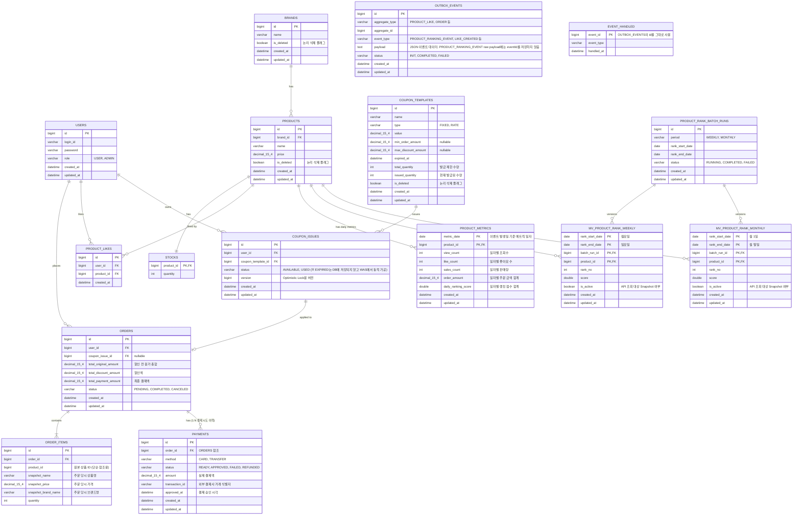

```mermaid
erDiagram
    USERS {
        bigint id PK
        varchar login_id
        varchar password
        varchar role "USER, ADMIN"
        datetime created_at
        datetime updated_at
    }

    BRANDS {
        bigint id PK
        varchar name
        boolean is_deleted "논리 삭제 플래그"
        datetime created_at
        datetime updated_at
    }

    PRODUCTS {
        bigint id PK
        bigint brand_id FK
        varchar name
        decimal_15_4 price
        boolean is_deleted "논리 삭제 플래그"
        datetime created_at
        datetime updated_at
    }

    STOCKS {
        bigint product_id PK, FK
        int quantity
    }

    PRODUCT_LIKES {
        bigint id PK
        bigint user_id FK
        bigint product_id FK
        datetime created_at
        %% Unique Index: (user_id, product_id)
    }

    COUPON_TEMPLATES {
        bigint id PK
        varchar name
        varchar type "FIXED, RATE"
        decimal_15_4 value
        decimal_15_4 min_order_amount "nullable"
        decimal_15_4 max_discount_amount "nullable"
        datetime expired_at
        int total_quantity "발급 제한 수량"
        int issued_quantity "현재 발급된 수량"
        boolean is_deleted "논리 삭제 플래그"
        datetime created_at
        datetime updated_at
    }

    COUPON_ISSUES {
        bigint id PK
        bigint user_id FK
        bigint coupon_template_id FK
        varchar status "AVAILABLE, USED (※ EXPIRED는 DB에 저장되지 않고 WAS에서 동적 가공)"
        bigint version "Optimistic Lock용 버전"
        datetime created_at
        datetime updated_at
        %% Unique Index: (user_id, coupon_template_id)
    }

    ORDERS {
        bigint id PK
        bigint user_id FK
        bigint coupon_issue_id FK "nullable"
        decimal_15_4 total_original_amount "할인 전 원가 총합"
        decimal_15_4 total_discount_amount "할인액"
        decimal_15_4 total_payment_amount "최종 결제액"
        varchar status "PENDING, COMPLETED, CANCELED"
        datetime created_at
        datetime updated_at
    }

    PAYMENTS {
        bigint id PK
        bigint order_id FK "ORDERS 참조"
        varchar method "CARD, TRANSFER"
        varchar status "READY, APPROVED, FAILED, REFUNDED"
        decimal_15_4 amount "실제 결제액"
        varchar transaction_id "외부 결제사 거래 식별자"
        datetime approved_at "결제 승인 시각"
        datetime created_at
        datetime updated_at
    }

    ORDER_ITEMS {
        bigint id PK
        bigint order_id FK
        bigint product_id "원본 상품 ID (단순 참조용)"
        varchar snapshot_name "주문 당시 상품명"
        decimal_15_4 snapshot_price "주문 당시 가격"
        varchar snapshot_brand_name "주문 당시 브랜드명"
        int quantity
    }

    OUTBOX_EVENTS {
        bigint id PK
        varchar aggregate_type "PRODUCT_LIKE, ORDER 등"
        bigint aggregate_id
        varchar event_type "PRODUCT_RANKING_EVENT, LIKE_CREATED 등"
        text payload "JSON 이벤트 데이터. PRODUCT_RANKING_EVENT raw payload에는 eventId를 저장하지 않음"
        varchar status "INIT, COMPLETED, FAILED"
        datetime created_at
        datetime updated_at
    }

    PRODUCT_METRICS {
        date metric_date PK "이벤트 발생일 기준 메트릭 일자"
        bigint product_id PK, FK
        int view_count "일자별 조회수"
        int like_count "일자별 좋아요 수"
        int sales_count "일자별 판매량"
        decimal_15_4 order_amount "일자별 주문 금액 합계"
        double daily_ranking_score "일자별 랭킹 점수 합계"
        datetime created_at
        datetime updated_at
    }

    PRODUCT_RANK_BATCH_RUNS {
        bigint id PK
        varchar period "WEEKLY, MONTHLY"
        date rank_start_date
        date rank_end_date
        varchar status "RUNNING, COMPLETED, FAILED"
        datetime created_at
        datetime updated_at
        %% Index: (period, rank_start_date, rank_end_date, status)
    }

    MV_PRODUCT_RANK_WEEKLY {
        date rank_start_date PK "월요일"
        date rank_end_date PK "일요일"
        bigint batch_run_id PK, FK
        bigint product_id PK, FK
        int rank_no
        double score
        boolean is_active "API 조회 대상 Snapshot 여부"
        datetime created_at
        datetime updated_at
        %% Unique Index: (rank_start_date, rank_end_date, batch_run_id, rank_no)
        %% Index: (rank_start_date, rank_end_date, is_active, rank_no)
        %% Active Snapshot 조회는 is_active=true 조건으로 수행
    }

    MV_PRODUCT_RANK_MONTHLY {
        date rank_start_date PK "월 1일"
        date rank_end_date PK "월 말일"
        bigint batch_run_id PK, FK
        bigint product_id PK, FK
        int rank_no
        double score
        boolean is_active "API 조회 대상 Snapshot 여부"
        datetime created_at
        datetime updated_at
        %% Unique Index: (rank_start_date, rank_end_date, batch_run_id, rank_no)
        %% Index: (rank_start_date, rank_end_date, is_active, rank_no)
        %% Active Snapshot 조회는 is_active=true 조건으로 수행
    }

    EVENT_HANDLED {
        bigint event_id PK "OUTBOX_EVENTS의 id를 그대로 사용"
        varchar event_type
        datetime handled_at
    }

    %% Relationships
    BRANDS ||--o{ PRODUCTS : "has"
    PRODUCTS ||--|| STOCKS : "has"
    USERS ||--o{ ORDERS : "places"
    ORDERS ||--|{ ORDER_ITEMS : "contains"
    USERS ||--o{ PRODUCT_LIKES : "likes"
    PRODUCTS ||--o{ PRODUCT_LIKES : "liked by"
    USERS ||--o{ COUPON_ISSUES : "owns"
    COUPON_TEMPLATES ||--o{ COUPON_ISSUES : "issues"
    COUPON_ISSUES ||--o| ORDERS : "applied to"
    ORDERS ||--o{ PAYMENTS : "has (1:N 결제 시도 이력)"
    PRODUCTS ||--o{ PRODUCT_METRICS : "has daily metrics"
    PRODUCTS ||--o{ MV_PRODUCT_RANK_WEEKLY : "ranked weekly"
    PRODUCTS ||--o{ MV_PRODUCT_RANK_MONTHLY : "ranked monthly"
    PRODUCT_RANK_BATCH_RUNS ||--o{ MV_PRODUCT_RANK_WEEKLY : "versions"
    PRODUCT_RANK_BATCH_RUNS ||--o{ MV_PRODUCT_RANK_MONTHLY : "versions"
```
