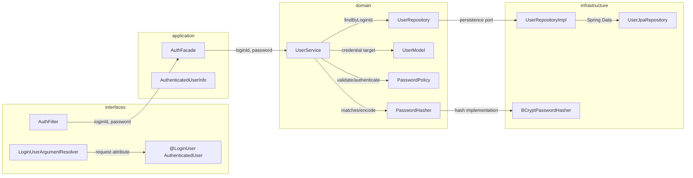
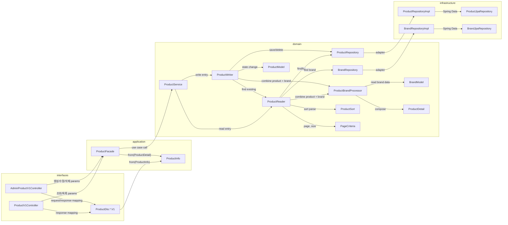
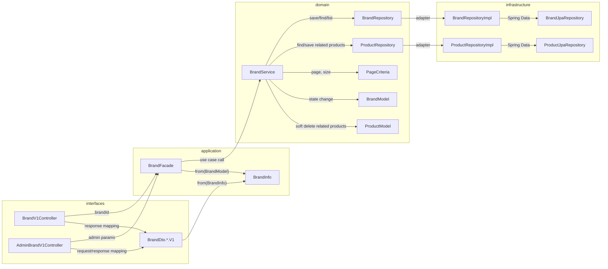
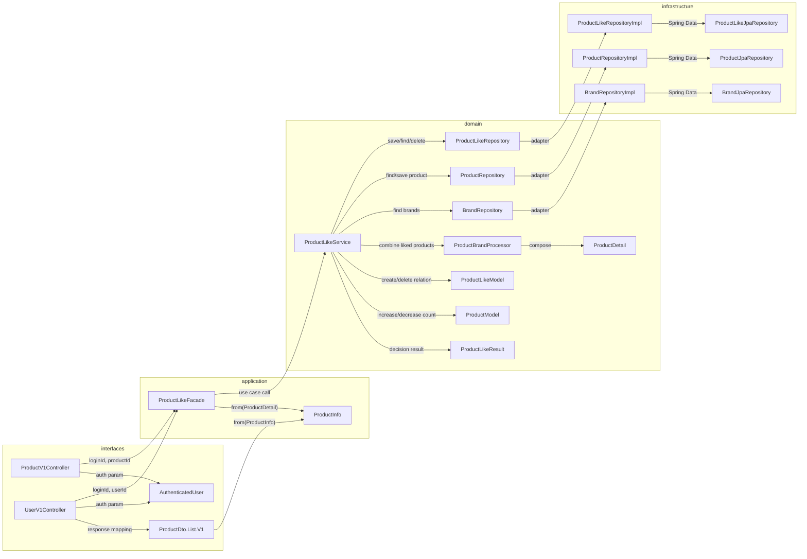
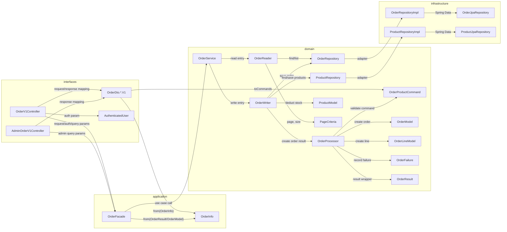
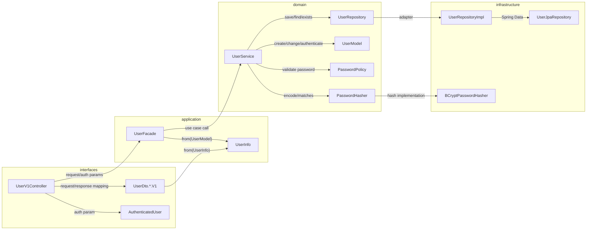

# 01. API Dependency Structure

## 목적

이 문서는 현재 `commerce-api`의 API별 의존 관계를 정리한다.
화살표는 반환값 흐름이 아니라 **참조/import 또는 호출 의존 방향**만 의미한다.
따라서 응답 DTO나 결과 객체가 되돌아오는 방향은 화살표로 표현하지 않는다.

## 작성 기준

- 의존 방향은 단방향으로만 표현한다.
- 양방향 화살표가 생기면 순환 참조 또는 다이어그램 표현 오류로 본다.
- 기본 레이어 방향은 `interfaces -> application -> domain -> infrastructure`이다.
- `interfaces -> domain` 직접 참조는 허용한다. 예: Controller가 Domain Command를 만들거나 Domain Service 진입점을 직접 호출하는 경우.
- API의 진입점은 `*Controller`, Domain의 진입점은 단일 도메인 `*Service`이다.
- `*Service`는 Domain 진입점이고, Repository 접근은 조회 전용 `*Reader`와 생성/수정/삭제 전용 `*Writer`로 분리한다.
- `*Policy` 또는 `*Processor`는 Repository 없이 순수 규칙 처리를 담당한다.
- `ProductBrandProcessor`처럼 2개 이상의 도메인 객체를 조합하는 서비스는 책임이 섞인 도메인명을 함께 드러내고, Repository 없이 순수 조합 로직만 담당한다.

> 주의: 이 문서는 “의도한 레이어 의존 방향”을 표현한다. 현재 구현의 infrastructure adapter는 domain의 Repository interface와 Model을 구현/사용하기 때문에, strict import 기준으로 보면 `infrastructure -> domain` 참조가 남아 있다. 이를 완전히 제거하려면 persistence entity/mapper 분리가 별도 리팩터링으로 필요하다.

---

## 공통 인증 경계

---

## Product API

### API별 의존 흐름

| API | 의존 흐름 |
| --- | --- |
| `GET /api/v1/products/{productId}` | `ProductV1Controller -> ProductFacade -> ProductService -> ProductReader -> ProductRepository/BrandRepository/ProductBrandProcessor` |
| `GET /api/v1/products` | `ProductV1Controller -> ProductFacade -> ProductService -> ProductReader -> ProductRepository/BrandRepository/ProductBrandProcessor` |
| `POST /api-admin/v1/products` | `AdminProductV1Controller -> ProductFacade -> ProductService -> ProductWriter -> ProductRepository/ProductReader/ProductBrandProcessor` |
| `PUT /api-admin/v1/products/{productId}` | `AdminProductV1Controller -> ProductFacade -> ProductService -> ProductWriter -> ProductReader/ProductRepository/ProductModel` |
| `DELETE /api-admin/v1/products/{productId}` | `AdminProductV1Controller -> ProductFacade -> ProductService -> ProductWriter -> ProductReader/ProductRepository/ProductModel` |

---

## Brand API

### API별 의존 흐름

| API | 의존 흐름 |
| --- | --- |
| `GET /api/v1/brands/{brandId}` | `BrandV1Controller -> BrandFacade -> BrandService -> BrandRepository` |
| `GET /api-admin/v1/brands` | `AdminBrandV1Controller -> BrandFacade -> BrandService -> BrandRepository` |
| `POST /api-admin/v1/brands` | `AdminBrandV1Controller -> BrandFacade -> BrandService -> BrandRepository` |
| `PUT /api-admin/v1/brands/{brandId}` | `AdminBrandV1Controller -> BrandFacade -> BrandService -> BrandRepository/BrandModel` |
| `DELETE /api-admin/v1/brands/{brandId}` | `AdminBrandV1Controller -> BrandFacade -> BrandService -> BrandRepository/ProductRepository/BrandModel/ProductModel` |

---

## Like API

### API별 의존 흐름

| API | 의존 흐름 |
| --- | --- |
| `POST /api/v1/products/{productId}/likes` | `ProductV1Controller -> ProductLikeFacade -> ProductLikeService -> ProductRepository/ProductLikeRepository/ProductModel/ProductLikeModel` |
| `DELETE /api/v1/products/{productId}/likes` | `ProductV1Controller -> ProductLikeFacade -> ProductLikeService -> ProductLikeRepository/ProductRepository/ProductModel` |
| `GET /api/v1/users/{userId}/likes` | `UserV1Controller -> ProductLikeFacade -> ProductLikeService -> ProductLikeRepository/ProductRepository/BrandRepository/ProductBrandProcessor` |

---

## Order API

### API별 의존 흐름

| API | 의존 흐름 |
| --- | --- |
| `POST /api/v1/orders` | `OrderV1Controller -> OrderFacade -> OrderService -> OrderWriter -> ProductRepository/OrderRepository/OrderProcessor/ProductModel/OrderModel` |
| `GET /api/v1/orders` | `OrderV1Controller -> OrderFacade -> OrderService -> OrderReader -> OrderRepository/PageCriteria` |
| `GET /api/v1/orders/{orderId}` | `OrderV1Controller -> OrderFacade -> OrderService -> OrderReader -> OrderRepository` |
| `GET /api-admin/v1/orders` | `AdminOrderV1Controller -> OrderFacade -> OrderService -> OrderReader -> OrderRepository/PageCriteria` |
| `GET /api-admin/v1/orders/{orderId}` | `AdminOrderV1Controller -> OrderFacade -> OrderService -> OrderReader -> OrderRepository` |

---

## User API

### API별 의존 흐름

| API | 의존 흐름 |
| --- | --- |
| `POST /api/v1/users` | `UserV1Controller -> UserFacade -> UserService -> UserRepository/PasswordPolicy/PasswordHasher/UserModel` |
| `GET /api/v1/users/me` | `UserV1Controller -> UserFacade -> UserService -> UserRepository` |
| `PUT/PATCH /api/v1/users/password` | `UserV1Controller -> UserFacade -> UserService -> UserRepository/PasswordPolicy/PasswordHasher/UserModel` |

---

## 현재 구조에서 드러나는 판단

- 다이어그램 화살표는 모두 단방향 의존만 표현한다.
- `Facade`는 Repository를 직접 들지 않는다. Transaction은 `application` 레이어에서 열고, Repository 조회/저장은 `domain` 레이어의 단일 도메인 `*Service`가 담당한다.
- `ProductBrandProcessor`는 Product와 Brand 도메인 객체를 조합하는 순수 Processor로 유지하며 Repository를 의존하지 않는다.
- 응답 변환은 DTO의 `from(...)` 팩토리와 `Info` 객체 사이의 같은 방향 의존으로만 표현한다.
