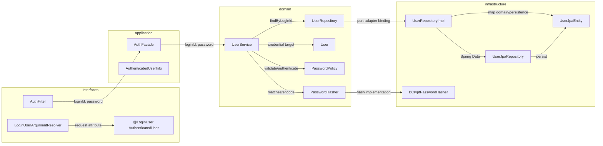
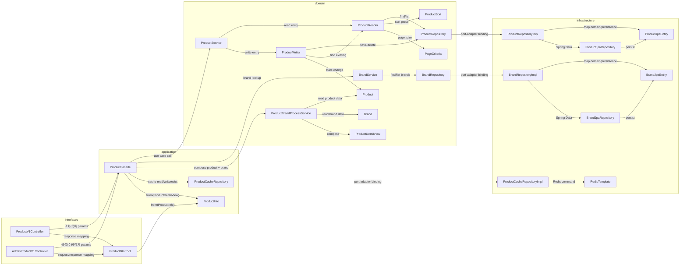
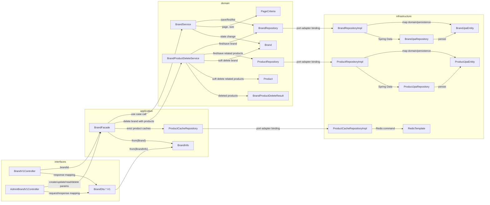
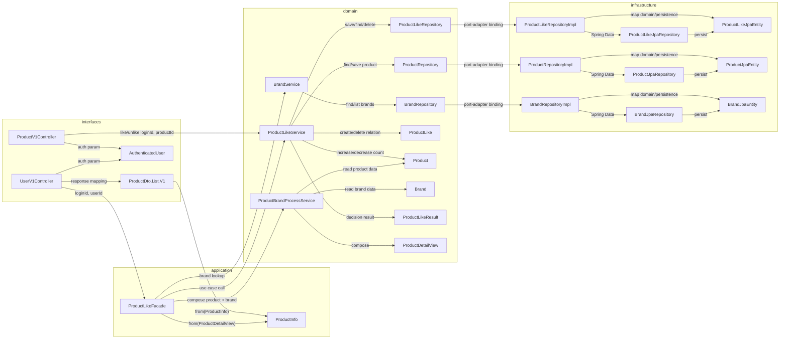
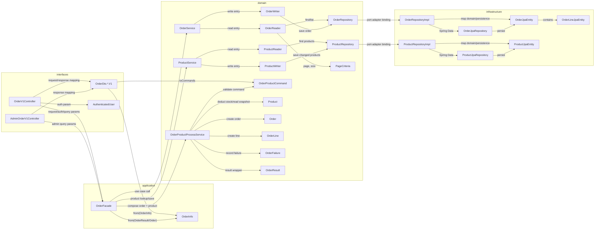
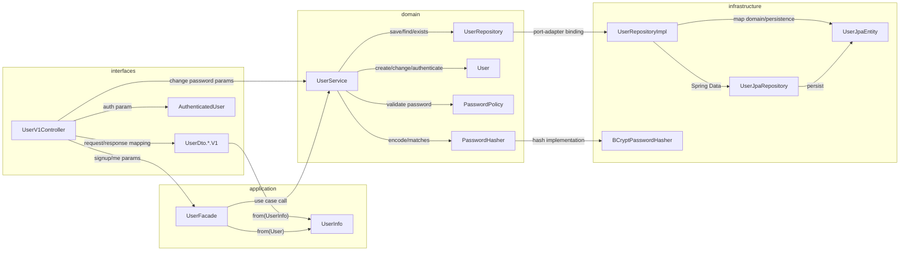

# 01. API Dependency Structure

## 목적

이 문서는 현재 `commerce-api`의 API별 의존 관계를 정리한다.
화살표는 반환값 흐름이 아니라 **API 유스케이스 호출 흐름, 소스 import 의존, 또는 adapter binding 방향**을 의미한다.
따라서 응답 DTO나 결과 객체가 되돌아오는 방향은 화살표로 표현하지 않는다.

## 작성 기준

- 의존 방향은 단방향으로만 표현한다.
- 양방향 화살표가 생기면 순환 참조 또는 다이어그램 표현 오류로 본다.
- 현재 구조는 순수 4-tier layered architecture가 아니라 DDD + Ports & Adapters 구조로 본다.
- API 유스케이스 호출 흐름은 `interfaces -> application -> domain -> repository port -> infrastructure adapter`로 표현한다.
- 소스 import 의존 방향은 `interfaces -> application -> domain`, `infrastructure -> domain`이다.
- 캐시, 메시징, 외부 API처럼 application 유스케이스가 소유한 outbound port는 `application`에 둘 수 있고, 이 경우 infrastructure adapter는 해당 application port를 import해 구현할 수 있다.
- `domain`은 `infrastructure` 구현체, Spring Data JPA, `*JpaEntity`를 import하지 않는다.
- `infrastructure`는 domain Repository port를 구현하고 domain 객체와 `*JpaEntity`를 매핑하기 위해 `domain`을 import할 수 있다.
- 다이어그램의 `*Repository --> *RepositoryImpl` 화살표는 domain이 infrastructure 구현체를 import한다는 뜻이 아니라, **port가 adapter로 연결되는 binding**을 표현한다. 실제 소스 import 방향은 `*RepositoryImpl -> *Repository`이다.
- `interfaces -> domain` 직접 참조는 허용한다. 예: Controller가 Domain Command를 만들거나 Domain Service 진입점을 직접 호출하는 경우.
- 응답 DTO/Info 변환, 여러 도메인 조합, 캐시 무효화, 이벤트 발행, 알림, 감사 로그가 없는 `void` command API는 Controller가 Domain `*Service`를 직접 호출할 수 있다.
- 상태 변경 이후 application 레벨 부수효과가 필요한 command API는 Controller에서 Domain Service를 직접 호출하지 않고 Facade를 경유한다.
- API의 진입점은 `*Controller`, Domain의 진입점은 단일 도메인 `*Service`이다.
- `*Service`는 Domain 진입점이고, Repository 접근은 조회 전용 `*Reader`와 생성/수정/삭제 전용 `*Writer`로 분리한다.
- `*Policy`, `*Processor`, `*ProcessService`는 Repository 없이 순수 규칙 처리를 담당한다.
- `ProductBrandProcessService`처럼 2개 이상의 도메인 객체를 조합하는 서비스는 책임이 섞인 도메인명을 함께 드러내고, Repository 없이 순수 조합 로직만 담당한다.
- `BrandProductDeleteService`처럼 여러 도메인의 저장 상태 변경을 하나의 command로 묶는 경우에는 조합 책임이 드러나는 이름으로 별도 Domain Service를 둔다.

> 주의: 현재 구현은 domain 객체와 JPA 영속화 객체를 분리하고, infrastructure adapter에서 domain Repository port와 `*JpaEntity` 간 매핑을 담당한다. 따라서 infrastructure의 domain import는 adapter 구현을 위한 허용 의존이며, domain의 infrastructure import는 허용하지 않는다.
> 캐시 adapter처럼 application port를 구현하는 infrastructure는 application port를 import할 수 있다. 이 경우에도 domain은 application/infrastructure를 import하지 않는다.

---

## 공통 인증 경계

---

## Product API

### API별 의존 흐름

| API | 의존 흐름 |
| --- | --- |
| `GET /api/v1/products/{productId}` | `ProductV1Controller -> ProductFacade -> ProductCacheRepository -> ProductService/BrandService/ProductBrandProcessService` |
| `GET /api/v1/products` | `ProductV1Controller -> ProductFacade -> ProductCacheRepository -> ProductService/BrandService/ProductBrandProcessService` |
| `POST /api-admin/v1/products` | `AdminProductV1Controller -> ProductFacade -> BrandService/ProductService/ProductBrandProcessService/ProductCacheRepository` |
| `PUT /api-admin/v1/products/{productId}` | `AdminProductV1Controller -> ProductFacade -> ProductService -> ProductWriter -> ProductReader/ProductRepository/Product -> ProductCacheRepository` |
| `DELETE /api-admin/v1/products/{productId}` | `AdminProductV1Controller -> ProductFacade -> ProductService -> ProductWriter -> ProductReader/ProductRepository/Product -> ProductCacheRepository` |

---

## Brand API

### API별 의존 흐름

| API | 의존 흐름 |
| --- | --- |
| `GET /api/v1/brands/{brandId}` | `BrandV1Controller -> BrandFacade -> BrandService -> BrandRepository` |
| `GET /api-admin/v1/brands` | `AdminBrandV1Controller -> BrandFacade -> BrandService -> BrandRepository` |
| `POST /api-admin/v1/brands` | `AdminBrandV1Controller -> BrandFacade -> BrandService -> BrandRepository` |
| `PUT /api-admin/v1/brands/{brandId}` | `AdminBrandV1Controller -> BrandFacade -> BrandService -> BrandRepository/Brand` |
| `DELETE /api-admin/v1/brands/{brandId}` | `AdminBrandV1Controller -> BrandFacade -> BrandProductDeleteService -> BrandRepository/ProductRepository/Brand/Product -> ProductCacheRepository` |

---

## Like API

### API별 의존 흐름

| API | 의존 흐름 |
| --- | --- |
| `POST /api/v1/products/{productId}/likes` | `ProductV1Controller -> ProductLikeService -> ProductRepository/ProductLikeRepository/Product/ProductLike` |
| `DELETE /api/v1/products/{productId}/likes` | `ProductV1Controller -> ProductLikeService -> ProductLikeRepository/ProductRepository/Product` |
| `GET /api/v1/users/{userId}/likes` | `UserV1Controller -> ProductLikeFacade -> ProductLikeService/BrandService/ProductBrandProcessService` |

---

## Order API

### API별 의존 흐름

| API | 의존 흐름 |
| --- | --- |
| `POST /api/v1/orders` | `OrderV1Controller -> OrderFacade -> ProductService/OrderProductProcessService/OrderService -> ProductReader/ProductWriter/OrderWriter -> ProductRepository/OrderRepository/Product/Order` |
| `GET /api/v1/orders` | `OrderV1Controller -> OrderFacade -> OrderService -> OrderReader -> OrderRepository/PageCriteria` |
| `GET /api/v1/orders/{orderId}` | `OrderV1Controller -> OrderFacade -> OrderService -> OrderReader -> OrderRepository` |
| `GET /api-admin/v1/orders` | `AdminOrderV1Controller -> OrderFacade -> OrderService -> OrderReader -> OrderRepository/PageCriteria` |
| `GET /api-admin/v1/orders/{orderId}` | `AdminOrderV1Controller -> OrderFacade -> OrderService -> OrderReader -> OrderRepository` |

### 구조 점검 메모

- `OrderReader`는 `OrderRepository`만 참조하므로 Order 단일 도메인 조회 책임으로 볼 수 있다.
- `OrderWriter`는 `OrderRepository`를 통한 주문 저장만 담당한다.
- `ProductService`는 상품 조회와 변경된 상품 저장을 담당하고, `OrderFacade`가 그 결과를 `OrderProductProcessService`로 넘긴다.
- `OrderProductProcessService`는 Repository를 들지 않는 순수 조합 Domain Service이며, `Product` 재고 차감과 `OrderLine` 생성을 함께 수행한다.
- 주문 생성 유스케이스의 cross-domain 조율은 `OrderFacade`가 담당하고, cross-domain 규칙 처리는 `OrderProductProcessService`에 둔다.

---

## User API

### API별 의존 흐름

| API | 의존 흐름 |
| --- | --- |
| `POST /api/v1/users` | `UserV1Controller -> UserFacade -> UserService -> UserRepository/PasswordPolicy/PasswordHasher/User` |
| `GET /api/v1/users/me` | `UserV1Controller -> UserFacade -> UserService -> UserRepository` |
| `PUT/PATCH /api/v1/users/password` | `UserV1Controller -> UserService -> UserRepository/PasswordPolicy/PasswordHasher/User` |

---

## 현재 구조에서 드러나는 판단

- 다이어그램 화살표는 모두 단방향 의존만 표현한다.
- 이 문서의 `domain repository port -> infrastructure adapter` 화살표는 런타임 binding 표현이다. 소스 코드 import 방향은 `infrastructure adapter -> domain repository port/domain object`이다.
- 현재 아키텍처에서 금지하는 것은 infrastructure의 domain import가 아니라 domain의 infrastructure import다.
- `Facade`는 Repository를 직접 들지 않는다. 응답 변환, 도메인 조합, 캐시 무효화 같은 application 레벨 부수효과가 필요한 API는 `application` 레이어에서 조율하고, 이런 부수효과가 없는 단순 `void` command만 Controller가 Domain `*Service` 진입점을 직접 호출할 수 있다.
- Transaction은 Facade를 경유하는 유스케이스에서는 `application` 레이어에서 열고, Controller가 Domain `*Service`를 직접 호출하는 command에서는 해당 Domain Service 진입점에서 연다.
- `ProductCacheRepository`는 application 유스케이스가 소유한 outbound port이며, Redis 기반 구현체는 infrastructure adapter로 둔다.
- `ProductBrandProcessService`는 Product와 Brand 도메인 객체를 조합하는 순수 Domain Service로 유지하며 Repository를 의존하지 않는다.
- `BrandProductDeleteService`는 Brand 삭제와 연결 Product soft delete를 함께 수행하는 조합 command 서비스로, `BrandService`가 Product 저장소를 직접 의존하지 않도록 분리한다.
- 응답 변환은 DTO의 `from(...)` 팩토리와 `Info` 객체 사이의 같은 방향 의존으로만 표현한다.
