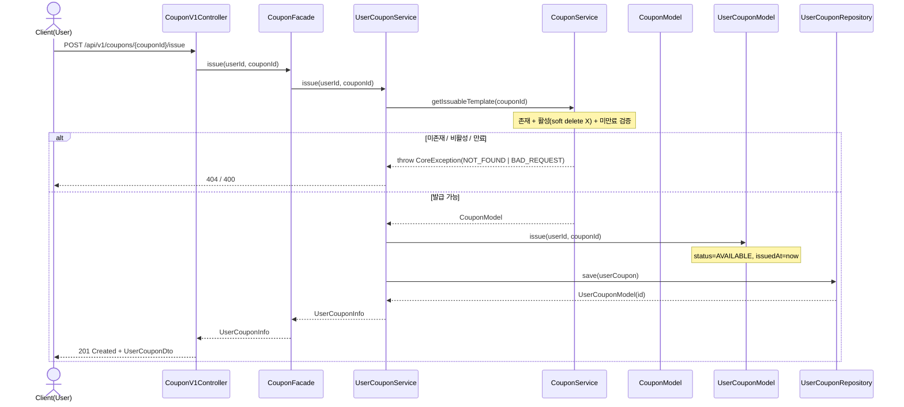
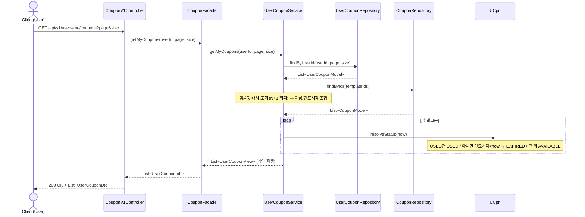
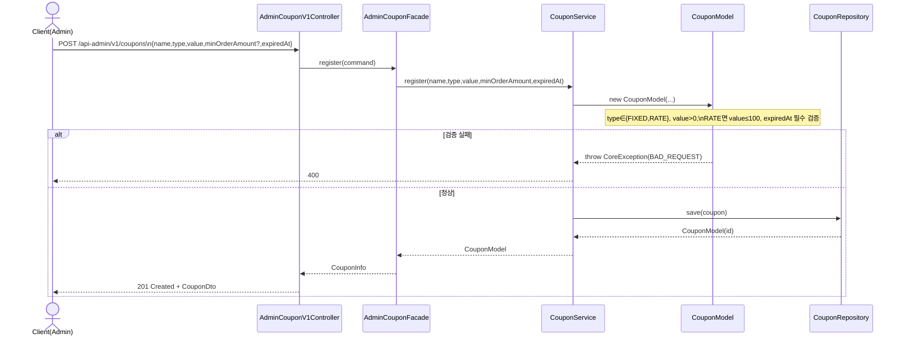
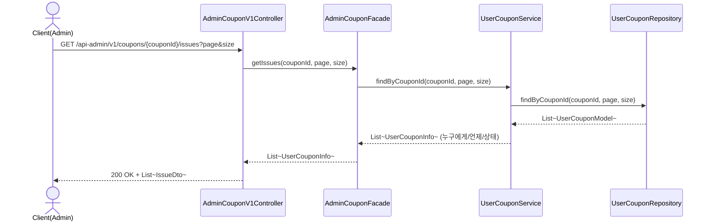
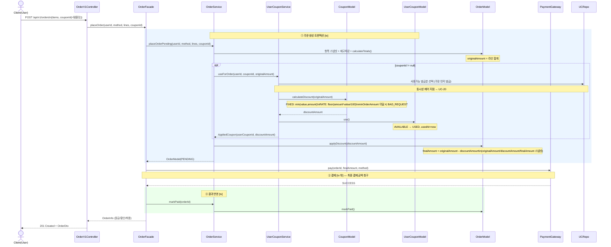
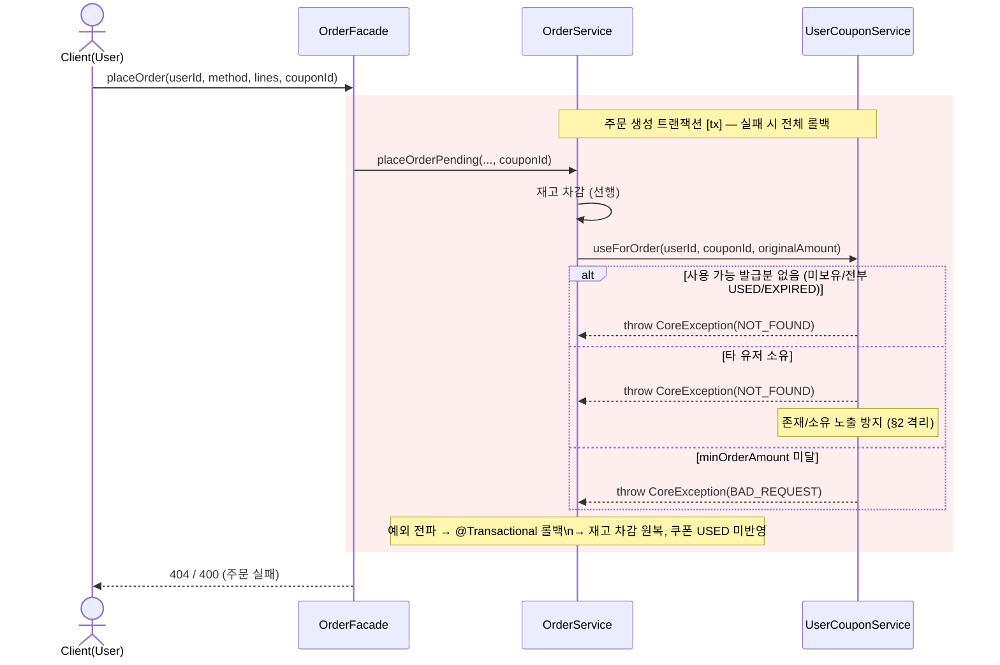
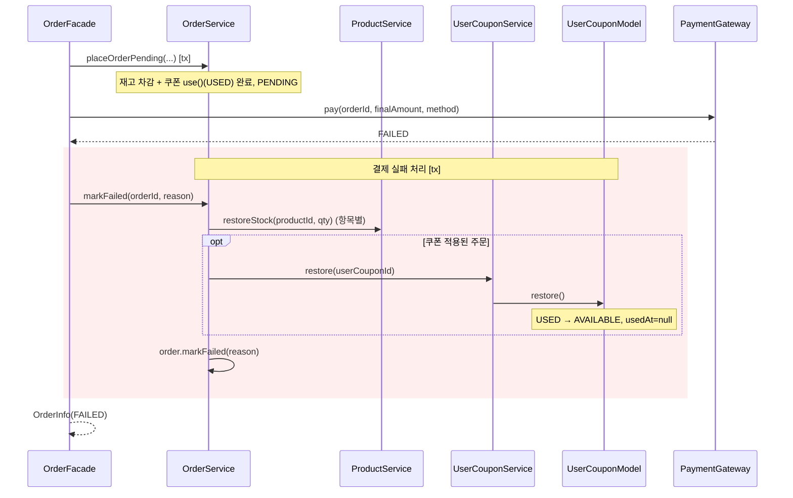
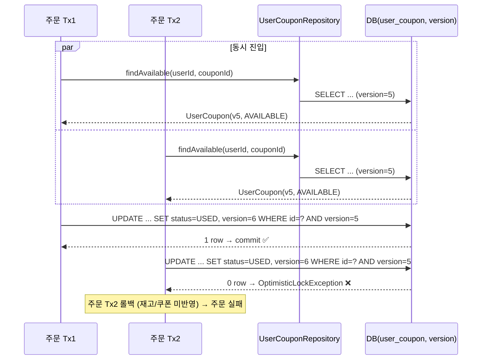
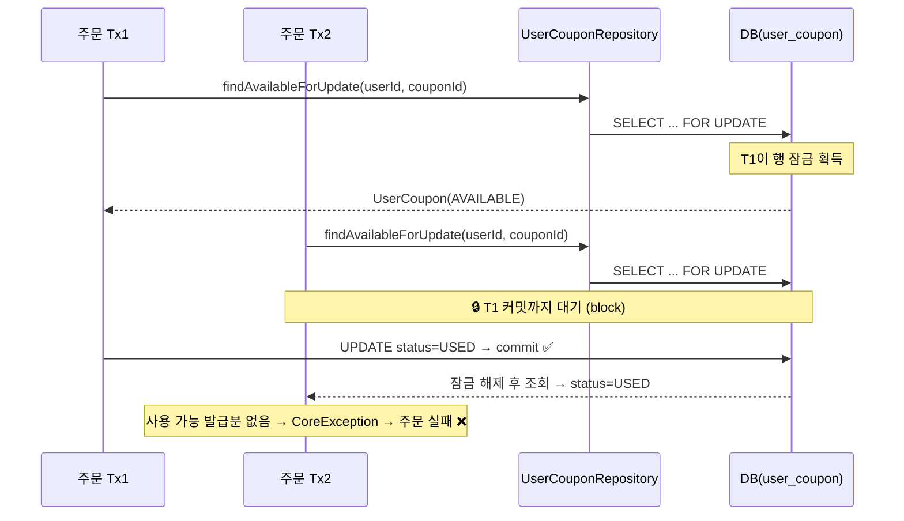

# 02. 시퀀스 다이어그램 — 쿠폰 (Coupons)

[`01-requirements.md`](./01-requirements.md) §6의 UC-13~20 흐름을 레이어별 참여자 기준으로 시각화한다. 표기 규칙은 [`../week2/02-sequence-diagrams.md`](../week2/02-sequence-diagrams.md) §0을 그대로 따른다(레이어/화살표/생략/공통 에러).

## 0. 이 문서의 참여자 (week2 §0.1 레이어에 쿠폰 도메인 추가)

| 약칭 | 클래스 | 레이어 | 책임 |
| --- | --- | --- | --- |
| `CCtrl` | `CouponV1Controller` | Interface (대고객) | 발급·내 쿠폰 조회 |
| `ACtrl` | `AdminCouponV1Controller` | Interface (Admin) | 템플릿 CRUD·발급 내역 |
| `CFac` | `CouponFacade` | Application | 대고객 유스케이스 조립 |
| `ACFac` | `AdminCouponFacade` | Application | Admin 유스케이스 조립 |
| `CSvc` | `CouponService` | Domain Service | 템플릿(Coupon) 생명주기·발급 가능 검증 |
| `UCSvc` | `UserCouponService` | Domain Service | 발급분(UserCoupon) 발급·선택·사용·원복 |
| `Cpn` | `CouponModel` | Domain Aggregate | 템플릿. 할인 계산(`calculateDiscount`) |
| `UCpn` | `UserCouponModel` | Domain Aggregate | 발급분. 상태 전이(`use`/`restore`) |
| `CRepo` | `CouponRepository` | Domain Repository | 템플릿 영속 |
| `UCRepo` | `UserCouponRepository` | Domain Repository | 발급분 영속 (락 조회 포함) |

> 주문 통합(UC-17~20)에서는 week2의 `OrderFacade`/`OrderService`/`OrderModel`/`PaymentGateway`가 함께 등장한다. 쿠폰 사용은 **주문 생성 트랜잭션 안**에서 `OrderService`가 `UserCouponService`를 호출하는 도메인 서비스 간 협력으로 그린다(week2 OrderService→ProductService 패턴과 동일).

---

## UC-13. 쿠폰 발급

**에러 분기**
- 존재하지 않는 템플릿 → `NOT_FOUND` (§7.2)
- 만료 시각 경과 / soft delete된 템플릿 → `BAD_REQUEST` (§9 Q2)
- 중복 발급은 막지 않음 — 같은 사용자가 같은 템플릿을 또 발급받으면 새 행 생성 (§9 Q4)

---

## UC-14. 내 쿠폰 목록 조회

> 상태(AVAILABLE/USED/EXPIRED)는 저장값이 아니라 조회 시점에 파생한다(§7.5). 만료 판정에 템플릿의 `expiredAt`이 필요하므로 발급분 + 템플릿을 배치 조합한다.

---

## UC-15. 쿠폰 템플릿 등록 (Admin)

> 목록(`GET /coupons`)·상세(`GET /coupons/{id}`)·수정(`PUT`)·삭제(`DELETE`, soft delete)는 week2 Brand 관리와 동형이라 다이어그램 생략. 수정은 `CouponModel.update(...)`(동일 검증 재사용), 삭제는 `delete()`(deletedAt=now).

---

## UC-16. 특정 쿠폰 발급 내역 조회 (Admin)

---

## UC-17. 쿠폰을 적용한 주문 (성공)

핵심 흐름. 쿠폰 사용은 **재고 차감과 같은 트랜잭션**에서 일어나고, 결제(PG)는 트랜잭션 밖에서 최종 결제 금액으로 진행한다(week2 §7.6 패턴 그대로).

---

## UC-18. 쿠폰을 적용한 주문 (실패 — 잘못된 쿠폰)

검증 실패는 ① 트랜잭션 안에서 발생하므로 **재고 차감을 포함한 전체가 롤백**된다(원자성).

> 결제(PG)는 호출되지 않는다. 검증이 트랜잭션 안 선행 단계라 PG 이전에 종결된다.

---

## UC-19. 쿠폰을 적용한 주문 (결제 실패 — 원복)

검증·사용 처리·재고 차감까지 끝났으나 PG가 실패한 경우. 재고와 함께 **쿠폰도 원복**한다.

> TIMEOUT(결제 지연)이면 week2와 동일하게 주문은 PENDING 유지, 쿠폰도 USED인 채로 둔다(추후 재확인). 원복은 FAILED 확정 시에만.

---

## UC-20. 동일 쿠폰 동시 사용 — 동시성 제어 (volume-4 핵심)

두 주문이 같은 발급 쿠폰을 거의 동시에 `use()`하려는 경합. **정확히 한 건만 성공**해야 한다. 두 가지 제어 전략을 구현·비교한다(트레이드오프는 [`03-class-diagram.md`](./03-class-diagram.md) §5 / `analyze-query` 스킬 분석으로 정리).

### 20-A. 낙관적 락 (@Version)

### 20-B. 비관적 락 (SELECT ... FOR UPDATE)

**두 전략의 공통 보장**: 한 발급분은 정확히 한 주문에만 USED 된다. 차이(충돌 시점·대기 vs 재시도·처리량)는 03 §5에서 비교한다.
