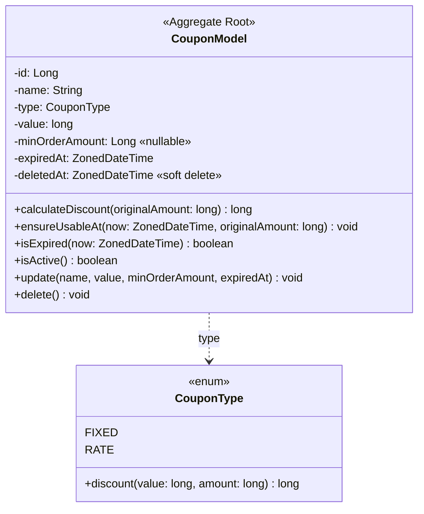
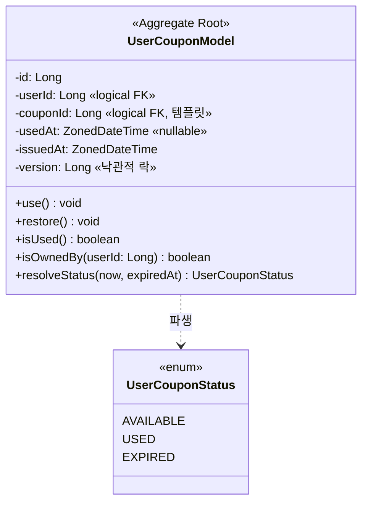
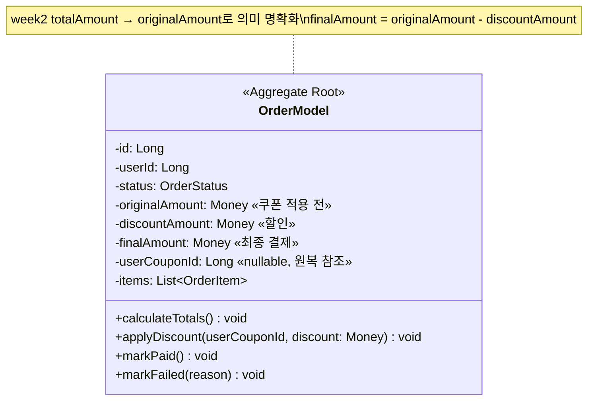
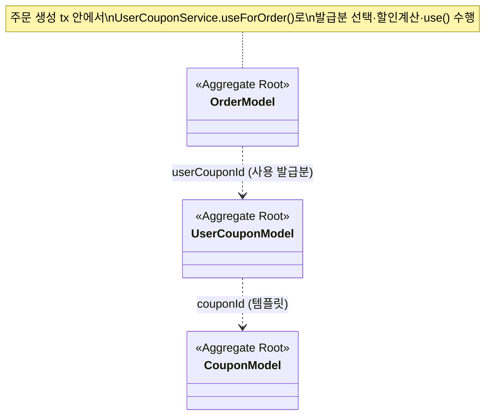

# 03. 클래스 다이어그램 — 쿠폰 (Coupons)

[`01-requirements.md`](./01-requirements.md) §3 도메인 어휘를 클래스 단위로 시각화한다. 표기 규칙(스테레오타입·관계·생략)은 [`../week2/03-class-diagram.md`](../week2/03-class-diagram.md) §0을 그대로 따른다.

쿠폰은 week2의 6개 Aggregate에 **2개를 추가**하고, 기존 **Order Aggregate를 일부 확장**한다.

---

## 1. Aggregate 식별 (week2 + 쿠폰)

| Aggregate | Root | 자식 | VO | 책임 경계 |
| --- | --- | --- | --- | --- |
| **Coupon** *(신규)* | `CouponModel` | — | — | 쿠폰 템플릿. 할인 방식·값·조건 보유, **할인 계산** |
| **UserCoupon** *(신규)* | `UserCouponModel` | — | — | 발급분. 소유·사용 상태 전이, **재사용 방지** |
| Order *(확장)* | `OrderModel` | `OrderItem` | `Money` | + 쿠폰 적용 결과 스냅샷(원금/할인/최종) |
| User / Brand / Product / Like | (week2) | | | 변경 없음 |

- **왜 둘로 나누나** — 템플릿(Coupon)은 운영자가 한 번 정의해 다수에게 공유되는 불변 규칙이고, 발급분(UserCoupon)은 사용자별로 생겨나 각자 사용/만료되는 가변 인스턴스다. 생명주기·소유자·일관성 경계가 다르므로 별도 Aggregate로 분리한다.
- **Aggregate 간 참조는 ID(Long)로만**. `UserCouponModel`은 `couponId`로 템플릿을 가리키되 `CouponModel` 객체를 직접 품지 않는다. 할인 계산처럼 둘이 만나야 하는 협력은 `UserCouponService`(도메인 서비스)가 조정한다(week2 OrderService 패턴).

---

## 2. Coupon (템플릿) Aggregate



**도메인 규칙**
- 생성/수정 검증: `type ∈ {FIXED, RATE}`, `value > 0`, `RATE`면 `value ≤ 100`, `expiredAt` 필수. 위반 시 `CoreException(BAD_REQUEST)`.
- `calculateDiscount(amount)` — 할인 금액 산출(01 §7.1):
  - `FIXED` → `min(value, amount)`
  - `RATE` → `floor(amount * value / 100)`
  - 결과는 `0 ≤ discount ≤ amount` 보장(최종 금액 음수 불가).
- `ensureUsableAt(now, amount)` — 만료(`isExpired`) 또는 `minOrderAmount` 미달이면 예외. 적용 직전 검증의 단일 진입점.
- soft delete: `delete()`(멱등, deletedAt=now) / `isActive()`(deletedAt==null). Brand/Product와 동일 패턴.

> **CouponType이 계산을 갖는 이유** — 할인 방식별 분기를 enum 메서드로 캡슐화해 `CouponModel`에서 `if(type==FIXED)...` 분기를 제거한다. 새 타입 추가 시 enum 한 곳만 확장.

---

## 3. UserCoupon (발급분) Aggregate



**도메인 규칙**
- **상태는 저장하지 않고 파생**(01 §7.5). 저장값은 `usedAt`(사용 시각, null=미사용)뿐. `resolveStatus(now, expiredAt)`:
  - `usedAt != null` → `USED`
  - else `expiredAt < now` → `EXPIRED`
  - else → `AVAILABLE`
- `use()` — `usedAt`이 이미 있으면 `CONFLICT`(재사용 금지), 아니면 `usedAt = now`. **재사용 방지의 도메인 불변식**.
- `restore()` — `usedAt = null`(결제 실패 원복, 01 §7.6). 멱등.
- `isOwnedBy(userId)` — 소유자 검증. 불일치 시 호출측이 `NOT_FOUND`로 응대(§2 격리).
- `version` — 낙관적 락 컬럼(§5-A). 비관적 락(§5-B)에서는 사용하지 않지만 컬럼은 공존 가능.

> **만료를 enum/필드로 저장하지 않는 이유** — 만료는 시간 경과로 "저절로" 일어나는 사건이라 별도 갱신 주체가 없다. 저장하면 배치로 EXPIRED 전이를 돌려야 하고 그 사이 불일치가 생긴다. 조회 시 `now`와 `expiredAt`만 비교하면 항상 정확하다.

---

## 4. Order Aggregate 확장



**변경점**
- 금액 3종을 모두 스냅샷(01 §7.7): `originalAmount`(라인 합계) / `discountAmount`(미적용 시 0) / `finalAmount`(PG 청구액).
- `userCouponId`(nullable) 보존 — 결제 실패 시 어떤 발급분을 `restore()`할지 참조(UC-19). 템플릿 ID가 아니라 **실제 사용된 발급분 ID**.
- `applyDiscount(userCouponId, discount)` — `calculateTotals()`로 `originalAmount` 확정 후 호출. `finalAmount = originalAmount - discount` 계산 + 스냅샷.
- 쿠폰 미적용 주문: `discountAmount = 0`, `finalAmount = originalAmount`, `userCouponId = null`.

---

## 5. 동시성 제어 — 두 전략 비교 (volume-4 핵심)

01 §7.4 "한 발급분은 정확히 한 번만 사용"을 동시 요청에서도 보장하는 두 방식. 둘 다 구현해 `analyze-query` 스킬로 트레이드오프를 분석한다.

### 5.1 낙관적 락 (Optimistic, @Version)

```
UserCouponEntity.@Version Long version
→ UPDATE ... SET status, version=v+1 WHERE id=? AND version=v
→ 0 rows면 ObjectOptimisticLockingFailureException
```

| 항목 | 내용 |
| --- | --- |
| 충돌 감지 | **커밋 시점** (UPDATE의 WHERE version 불일치) |
| 대기 | 없음(락 미보유). 충돌 시 예외→실패/재시도 |
| 적합 | 경합이 드문 경우. 쿠폰은 보통 1인 1장 사용이라 경합 빈도 낮음 |
| 비용 | 충돌 시 트랜잭션 통째 롤백·재수행. 경합 잦으면 낭비 |
| 주의 | 재고 차감 후 쿠폰 단계에서 터지면 전체 롤백(원자성으로 안전) |

### 5.2 비관적 락 (Pessimistic, FOR UPDATE)

```
@Lock(PESSIMISTIC_WRITE)
findAvailableForUpdate(userId, couponId) → SELECT ... FOR UPDATE
```

| 항목 | 내용 |
| --- | --- |
| 충돌 방지 | **조회 시점** 행 잠금. 경합 트랜잭션은 대기 |
| 대기 | 선행 Tx 커밋까지 block. 데드락·락 대기 타임아웃 가능 |
| 적합 | 경합이 잦고 실패-재시도 비용이 큰 경우 |
| 비용 | 락 보유 구간만큼 처리량 저하. PG 호출은 락 밖이라 보유 구간은 짧게 유지 |
| 주의 | 락 순서 일관성(재고→쿠폰 등) 유지로 데드락 회피 |

### 5.3 본 프로젝트 선택

- **기본은 낙관적 락**(쿠폰 사용 경합 빈도가 낮고, 실패 시 "주문 실패"가 자연스러운 응답). 발급분 단위 `@Version`.
- **비관적 락 버전도 함께 구현**해 동일 시나리오(UC-20) 통합 테스트로 동작을 비교하고, 트레이드오프를 문서화(포트폴리오용).
- 최후방 안전선: 한 발급분은 행 하나(`user_coupon.id`)라 UPDATE의 단일 행 보장이 근본 방어. 락은 "사용 가능 판정 후 사용 처리" 사이의 경합을 막는 역할.

---

## 6. 통합 다이어그램 (쿠폰 ↔ 주문)



- 모든 교차-Aggregate 참조는 단방향 ID. 객체 그래프가 트랜잭션 경계를 넘지 않는다.
- 협력 조정자: `UserCouponService`(발급분 ↔ 템플릿 할인계산), `OrderService`(주문 tx 안에서 `UserCouponService` 호출). Facade는 PG를 낀 비-tx 오케스트레이션만.
