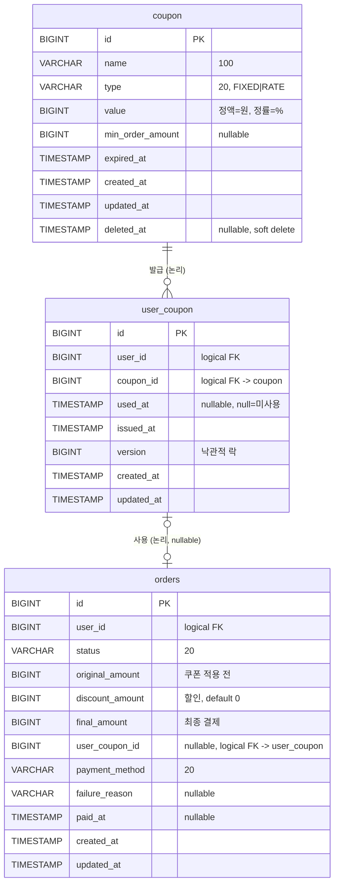

# 04. ERD — 쿠폰 (Coupons)

[`03-class-diagram.md`](./03-class-diagram.md)의 신규 Aggregate(Coupon·UserCoupon)를 물리 테이블로 매핑하고, Order 테이블 확장을 정의한다. 표기 규칙(식별자·시간·상태값·soft delete·FK 정책·네이밍)은 [`../week2/04-erd.md`](../week2/04-erd.md) §0을 그대로 따른다.

## 0. 추가 표기 메모

- 신규 테이블 식별자·감사 컬럼·시간 정밀도는 week2와 동일(`BIGINT id PK`, `TIMESTAMP(6)` UTC, `BaseEntity` 상속).
- 상태값은 VARCHAR(20) + 애플리케이션 enum 매핑(week2 §0.1). 단, **발급분 상태(AVAILABLE/USED/EXPIRED)는 저장하지 않는다** — `used_at`과 템플릿 `expired_at`으로 조회 시점 파생(01 §7.5, 03 §3).

### 0.1 FK 정책 (Aggregate 경계 반영)

| 관계 | DB FK 여부 | 근거 |
| --- | --- | --- |
| `coupon.id ← user_coupon.coupon_id` | **DB FK X (논리 참조)** | Aggregate 간 ID 참조. 템플릿 soft delete가 발급분을 끊지 않아야 함 |
| `users.id ← user_coupon.user_id` | DB FK X | Aggregate 간 ID 참조 (week2 동형) |
| `user_coupon.id ← orders.user_coupon_id` | DB FK X | 스냅샷 약한 참조 — 발급분 변화가 주문 내역을 끊지 않아야 함 |

### 0.2 네이밍

| 03 Aggregate | 테이블명 | 비고 |
| --- | --- | --- |
| Coupon | `coupon` | 템플릿. 단수(코드 컨벤션) |
| UserCoupon | `user_coupon` | 발급분. snake_case |

---

## 1. 전체 ERD (쿠폰 영역)

---

## 2. 테이블 상세

### 2.1 `coupon` (쿠폰 템플릿)

| 컬럼 | 타입 | 제약 | 설명 |
| --- | --- | --- | --- |
| `id` | BIGINT | PK, AUTO_INCREMENT | |
| `name` | VARCHAR(100) | NOT NULL | 쿠폰 이름 |
| `type` | VARCHAR(20) | NOT NULL | `FIXED` \| `RATE` (enum 매핑) |
| `value` | BIGINT | NOT NULL | 정액=할인 금액(원), 정률=할인 비율(%). `> 0`, RATE면 `≤ 100` (앱 검증) |
| `min_order_amount` | BIGINT | NULL | 최소 주문 금액 조건. NULL=조건 없음 |
| `expired_at` | TIMESTAMP(6) | NOT NULL | 만료 시각(UTC). 경과 시 발급/사용 불가 |
| `created_at` / `updated_at` | TIMESTAMP(6) | BaseEntity | |
| `deleted_at` | TIMESTAMP(6) | NULL | soft delete. NULL=활성 |

- **CHECK 제약 미사용** — `value`/`type` 정합은 애플리케이션(`CouponModel` 생성 검증)이 책임(week2 상태머신과 동일 정책).
- 인덱스: 목록 조회(`GET /api-admin/v1/coupons`)는 `deleted_at, id DESC` 정렬 패턴. `INDEX (deleted_at, id)` 또는 PK 역순으로 충분(데이터량 적음).

### 2.2 `user_coupon` (발급분)

| 컬럼 | 타입 | 제약 | 설명 |
| --- | --- | --- | --- |
| `id` | BIGINT | PK, AUTO_INCREMENT | 발급분 식별자(주문의 `user_coupon_id`가 가리킴) |
| `user_id` | BIGINT | NOT NULL | 소유 사용자 (논리 FK) |
| `coupon_id` | BIGINT | NOT NULL | 원본 템플릿 (논리 FK) |
| `used_at` | TIMESTAMP(6) | NULL | 사용 시각. **NULL=미사용**, 값 있으면 USED |
| `issued_at` | TIMESTAMP(6) | NOT NULL | 발급 시각. 발급분 선택(가장 먼저 발급) 정렬 기준 |
| `version` | BIGINT | NOT NULL, default 0 | 낙관적 락(@Version). 비관적 락 버전에서는 미사용 |
| `created_at` / `updated_at` | TIMESTAMP(6) | BaseEntity | |

- **`deleted_at` 없음** — 발급분은 soft delete 대상이 아니다. 상태는 `used_at`(+템플릿 `expired_at`)으로 파생.
- **UNIQUE 제약 없음** — 동일 (user_id, coupon_id) 중복 발급 허용(01 §9 Q4). 따라서 발급분 행이 곧 "한 장"이며, `id` 단위로 사용을 통제.

**인덱스**

| 인덱스 | 용도 |
| --- | --- |
| `INDEX (user_id, coupon_id, used_at)` | 주문 시 사용 가능 발급분 선택: `WHERE user_id=? AND coupon_id=? AND used_at IS NULL ORDER BY issued_at`. 미사용분 탐색 효율 |
| `INDEX (user_id, id)` | 내 쿠폰 목록(`GET /users/me/coupons`) — 사용자별 + id 정렬 |
| `INDEX (coupon_id, id)` | Admin 발급 내역(`GET /coupons/{id}/issues`) — 템플릿별 페이지 |

> 사용 가능 발급분 선택 정렬은 `issued_at ASC`(가장 먼저 발급, 03 §3 선택 규칙). `issued_at`이 동률이면 `id ASC` tiebreaker.

### 2.3 `orders` 확장 (week2 변경)

week2 `orders`에서 금액 컬럼을 확장한다.

| 변경 | 내용 |
| --- | --- |
| `total_amount` → `original_amount` | 의미 명확화: 쿠폰 적용 전 라인 합계. (마이그레이션 §3) |
| `+ discount_amount` | BIGINT NOT NULL default 0. 할인 금액 |
| `+ final_amount` | BIGINT NOT NULL. 최종 결제 금액 = original − discount |
| `+ user_coupon_id` | BIGINT NULL. 사용한 발급분(원복 참조, UC-19). 논리 FK |

- `Money` VO ↔ `BIGINT` 컬럼 매핑은 week2 Order 패턴 그대로(매퍼가 변환).
- 쿠폰 미적용 주문: `discount_amount=0`, `final_amount=original_amount`, `user_coupon_id=NULL`.

---

## 3. 마이그레이션 메모

1. `coupon` / `user_coupon` 신규 생성.
2. `orders.total_amount` → `original_amount` 컬럼 의미 전환. 기존 데이터는 `discount_amount=0`, `final_amount=original_amount`로 백필.
   - DDL 부담을 줄이려면 `total_amount` 컬럼명을 유지하고 코드에서 `originalAmount`로 매핑하는 선택도 가능(엔티티 컬럼명 vs 도메인명 분리, week2 영속 분리 패턴). → 구현 단계에서 컬럼 rename 여부 확정.
3. `ddl-auto`: 기존대로 `none`(운영) / `create`(local·test). 테스트는 Testcontainers가 매번 생성하므로 영향 없음.
4. enum 값(`FIXED`/`RATE`)은 VARCHAR 저장 — 길이 확장 여지 위해 VARCHAR(20).

---

## 4. 정합성·동시성 (04 관점)

- **사용 가능 발급분 선택 + USED 전이**의 원자성은 03 §5 락 전략으로 보장. DB 레벨에서는 `user_coupon.id` 단일 행 UPDATE가 근본 단위.
- **낙관적 락**: `version` 컬럼으로 `UPDATE ... WHERE id=? AND version=?` 단일 행 갱신. 0행이면 충돌.
- **비관적 락**: `SELECT ... FOR UPDATE`로 선택 시점 행 잠금. `used_at IS NULL` 조건과 함께 사용.
- 템플릿(`coupon`)은 발급·사용 시 읽기만 하므로 경합 없음. 수정·삭제는 운영자 단독 행위로 빈도 낮음.
