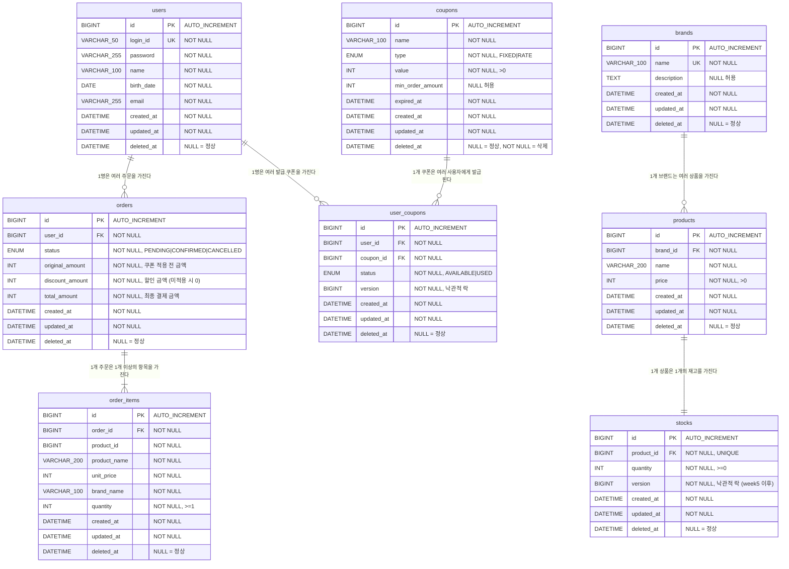

# 01. ERD (Week 4 — Coupon 도메인 추가)

> Week 2 ERD 기반에서 쿠폰 도메인과 주문 금액 스냅샷 컬럼을 추가합니다.

---

## 1. ERD 다이어그램

---

## 2. 신규 / 변경 테이블 상세

### 2-1. `coupons` — 쿠폰 템플릿 (신규)

| 컬럼명 | 타입 | NULL | 제약 | 설명 |
|--------|------|------|------|------|
| `id` | BIGINT | NOT NULL | PK | 쿠폰 템플릿 식별자 |
| `name` | VARCHAR(100) | NOT NULL | — | 쿠폰명 |
| `type` | ENUM | NOT NULL | FIXED \| RATE | 정액 / 정률 |
| `value` | INT | NOT NULL | CHECK (> 0) | FIXED: 할인 금액(원), RATE: 할인율(%) |
| `min_order_amount` | INT | NULL | — | 최소 주문 금액 조건 |
| `expired_at` | DATETIME | NOT NULL | — | 쿠폰 만료 일시 |
| `deleted_at` | DATETIME | NULL | — | 소프트 딜리트 |

### 2-2. `user_coupons` — 발급된 쿠폰 (신규)

| 컬럼명 | 타입 | NULL | 제약 | 설명 |
|--------|------|------|------|------|
| `id` | BIGINT | NOT NULL | PK | 발급 쿠폰 식별자 |
| `user_id` | BIGINT | NOT NULL | FK → users(id) | 소유 사용자 |
| `coupon_id` | BIGINT | NOT NULL | FK → coupons(id) | 원본 쿠폰 템플릿 |
| `status` | ENUM | NOT NULL | AVAILABLE \| USED | 사용 상태 (EXPIRED는 만료일 기반 동적 계산) |
| `version` | BIGINT | NOT NULL | — | 낙관적 락용 버전 필드 |

**제약**
- `UNIQUE (user_id, coupon_id)` — 1인 1회 발급 보장
- EXPIRED 상태는 DB에 저장하지 않으며, `coupons.expired_at` 기준으로 응답 시 동적 계산

### 2-3. `orders` — 주문 (변경)

| 컬럼명 | 변경 내용 | 설명 |
|--------|----------|------|
| `original_amount` | **신규** | 쿠폰 적용 전 원래 주문 금액 |
| `discount_amount` | **신규** | 할인 금액 (쿠폰 미적용 시 0) |
| `total_amount` | 의미 변경 | 최종 결제 금액 = original_amount − discount_amount |

---

## 3. 설계 결정

| 결정 | 내용 | 근거 |
|------|------|------|
| **EXPIRED 동적 계산** | `user_coupons.status`는 AVAILABLE/USED만 저장 | 배치 없이도 만료 여부를 실시간 반영. `expired_at` 변경 시 즉시 적용 가능 |
| **낙관적 락** | `user_coupons.version` 필드 | 쿠폰은 소유자 1인이 여러 기기에서 동시 사용하는 낮은 충돌 확률 → 비관적 락 없이 충분 |
| **1인 1회 발급** | `UNIQUE (user_id, coupon_id)` | 중복 발급을 DB 레벨에서 차단 |
| **주문 금액 3분할** | `original_amount`, `discount_amount`, `total_amount` | 주문은 계약이며, 할인 내역도 스냅샷으로 보존 |
