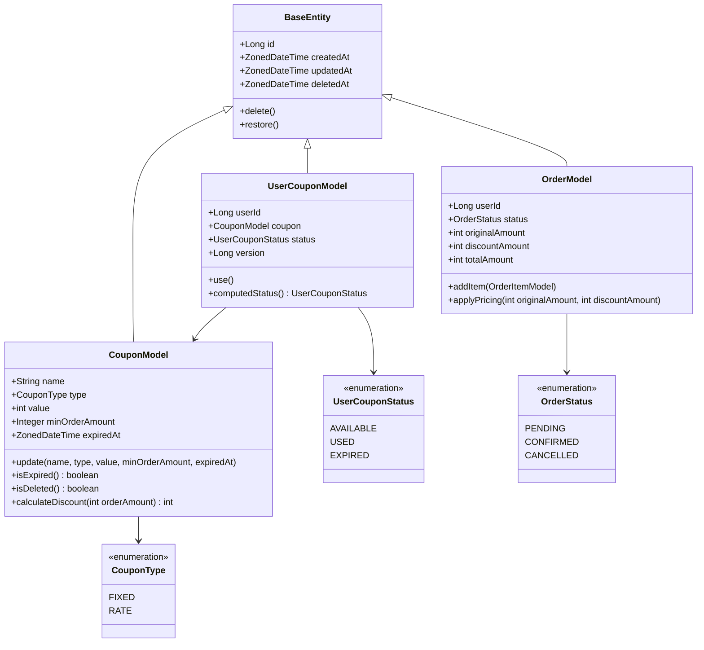
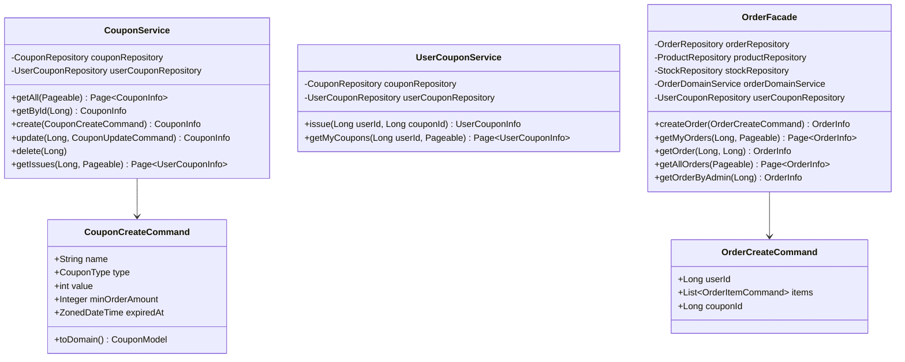
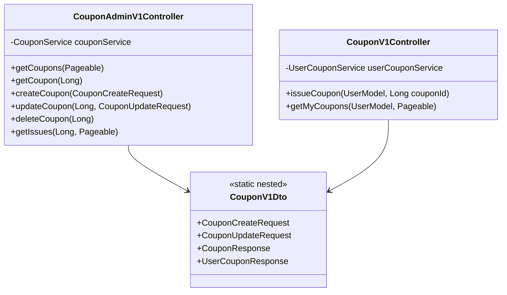

# 02. 클래스 다이어그램 (Week 4 — Coupon 도메인)

> 쿠폰 도메인 신규 클래스와 주문 도메인 변경 사항을 중심으로 작성합니다.

---

## 1. 도메인 레이어



---

## 2. 애플리케이션 레이어



---

## 3. 인터페이스 레이어



---

## 4. 레이어 간 의존 관계

```
interfaces/api/coupon
    ↓ (uses)
application/coupon (CouponService, UserCouponService)
    ↓ (uses)
domain/coupon (CouponModel, UserCouponModel, CouponRepository, UserCouponRepository)
    ↑ (implements)
infrastructure/coupon (CouponRepositoryImpl, UserCouponRepositoryImpl)

interfaces/api/order (OrderV1Controller)
    ↓
application/order (OrderFacade)
    ↓ (uses domain/coupon.UserCouponRepository for coupon apply)
domain/coupon + domain/order + domain/product + domain/stock
```

> `OrderFacade`는 `UserCouponRepository`를 직접 주입해 쿠폰 사용 처리를 수행합니다.  
> 쿠폰 도메인 서비스가 없는 이유: 쿠폰 사용은 `UserCouponModel.use()` 1줄로 캡슐화되어 있어 별도 Domain Service가 필요 없습니다.
