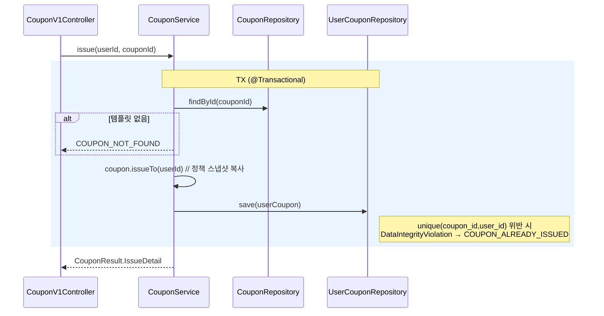
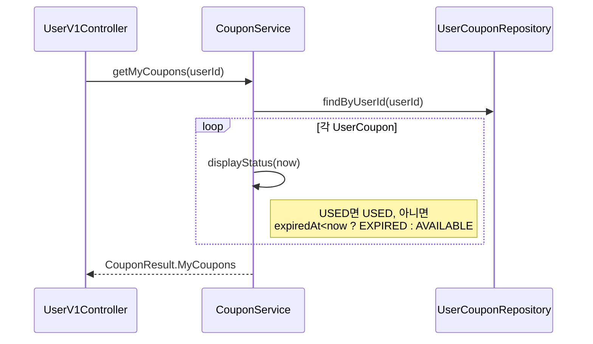
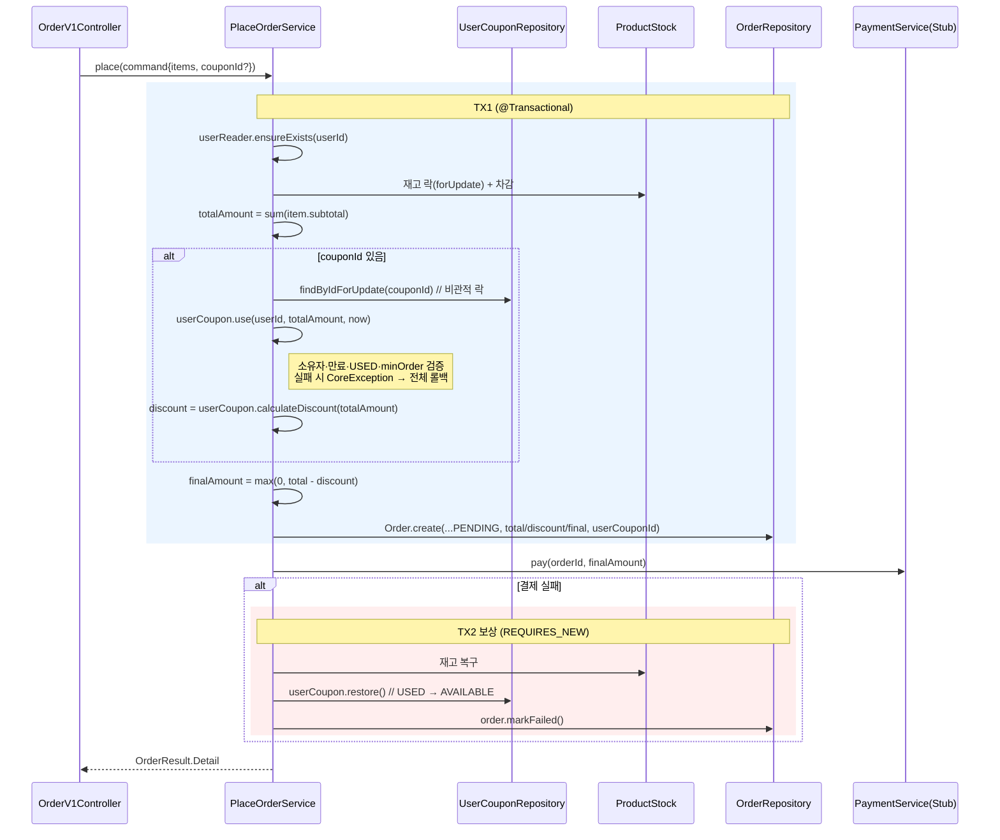

# Sequence Diagrams — Coupon

책임 분리·호출 순서·트랜잭션 경계를 검증한다. 특히 쿠폰 USED 전이와 보상의 경계, 이중 사용을 막는 락 지점이 핵심이다.

## 1. 쿠폰 발급 (유저당 1회)

발급 1회 제한이 동시 요청에서도 깨지지 않는지 검증한다.

**설계 의도**: 앱 레벨 `existsBy` 체크만으로는 동시 발급 경합에 취약하다. 유니크 제약을 1차 방어선으로 두고 위반을 CONFLICT로 변환한다(사전 체크는 사용자 친화적 메시지용 보조).

## 2. 내 쿠폰 목록 조회 (파생 상태)

EXPIRED를 저장 없이 계산하며 N+1을 피하는지 검증한다.

**설계 의도**: 만료는 `UserCoupon`의 스냅샷 `expiredAt`으로 조회 시 계산한다. 정책을 전부 스냅샷한 덕에 템플릿 조회가 없어 N+1 자체가 발생하지 않는다.

## 3. 주문 + 쿠폰 적용 (이번 주 핵심)

USED 전이와 보상의 트랜잭션 경계, 이중 사용 방지 락을 검증한다.

**설계 의도**:
1. `findByIdForUpdate`(비관적 락)가 이중 사용 방지의 핵심이다. 동시 두 주문이 같은 쿠폰을 노려도 락으로 직렬화되고, 두 번째는 이미 USED라 `use()`에서 실패한다.
2. 쿠폰 USED 전이를 TX1 안에 둬서 주문 PENDING과 원자적으로 묶는다(요구사항: "주문 성공 시 즉시 USED").
3. 만료 판정은 `UserCoupon`의 스냅샷 `expiredAt`으로 한다. 자체 필드라 템플릿 조회가 없고, 도메인은 Repository를 모른다.
4. 보상은 별도 트랜잭션(REQUIRES_NEW)으로 처리한다. 재고·쿠폰·주문 상태를 한 트랜잭션으로 묶어 부분 실패를 막으며, 기존 `PaymentService` 주석의 계획과 일치한다.

## 설계 리스크

1. 보상 트랜잭션 검증 난이도: 결제가 Stub이라 실패 경로 E2E가 어렵다. 테스트 한정으로 실패 주입형 Stub을 둔다.
2. `use()` 책임 비대화: 검증 5종이 한 메서드에 모인다. 커지면 `CouponUsagePolicy` 정적 규칙으로 분리한다.
3. 만료 소급 조정 불가: `expiredAt`을 스냅샷한 대가다. 프로모션 일괄 연장이 필요해지면 `coupon_id` 기준 일괄 UPDATE 관리자 기능으로 대응한다(범위 제외).
