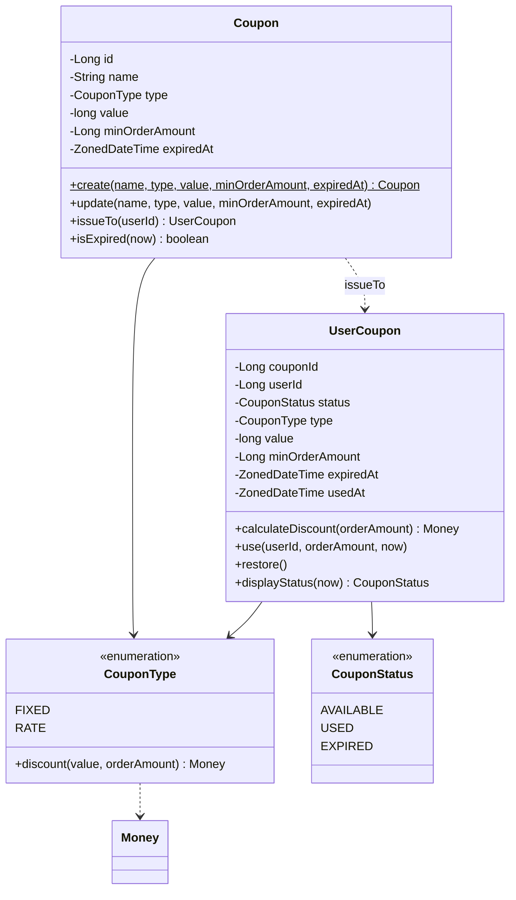
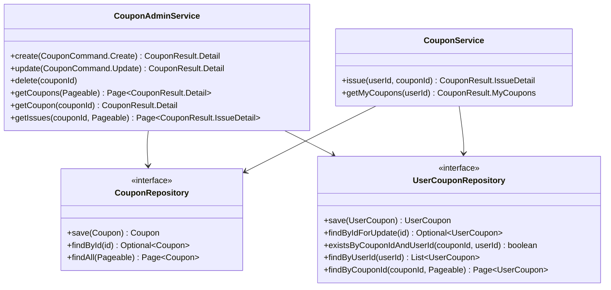

# Class Diagram — Coupon

도메인 책임과 의존 방향을 검증한다. 비즈니스 규칙(할인 계산·사용 가능 판정·USED 전이)이 엔티티에 캡슐화되고, application은 조율만 하는지 확인한다.

## 도메인 계층

## 애플리케이션 계층

## 설계 의도

1. **`UserCoupon.use(userId, orderAmount, now)`가 핵심 메서드다** — 소유자·만료·USED·minOrderAmount 검증과 USED 전이를 한 메서드 불변식으로 묶는다. 주문 서비스가 규칙을 흩뿌리지 않게 한다. 만료(`expiredAt`)도 스냅샷 필드라 템플릿 조회 없이 자체 판정한다(도메인은 Repository를 모름).
2. **할인 계산은 `CouponType` enum에 다형적으로** — `discount(value, orderAmount)`가 FIXED/RATE 분기·floor·클램핑을 흡수한다. `UserCoupon.calculateDiscount`는 enum에 위임.
3. **`displayStatus(now)`는 조회 전용 파생 상태** — 저장 상태(`status`: AVAILABLE/USED)와 분리되며, 만료는 자체 `expiredAt`으로 EXPIRED를 계산한다.
4. **의존 방향** — `interfaces → application → domain ← infrastructure`. Repository port는 domain, JPA 어댑터는 infrastructure. 주문 통합은 `PlaceOrderService`가 `UserCouponRepository`/`CouponRepository`를 조율한다(Facade는 단일 유스케이스라 불필요).
