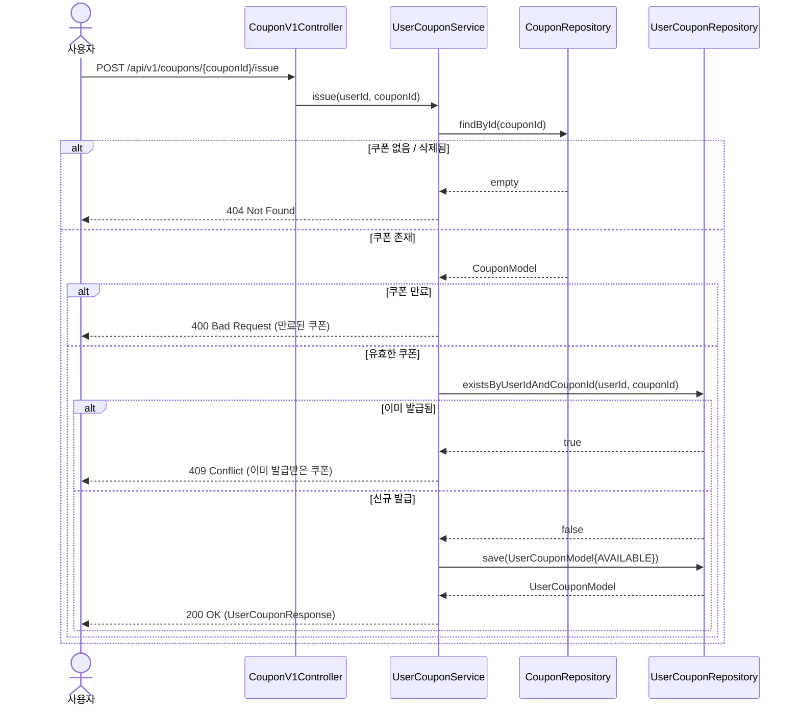
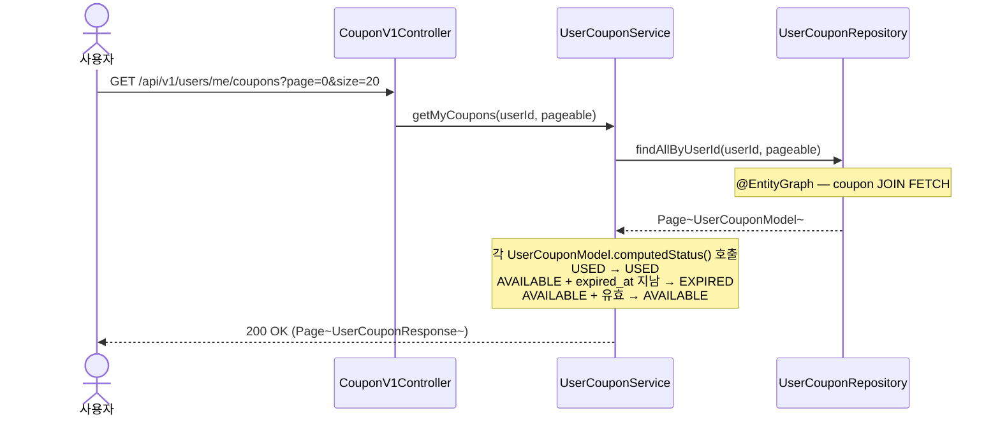
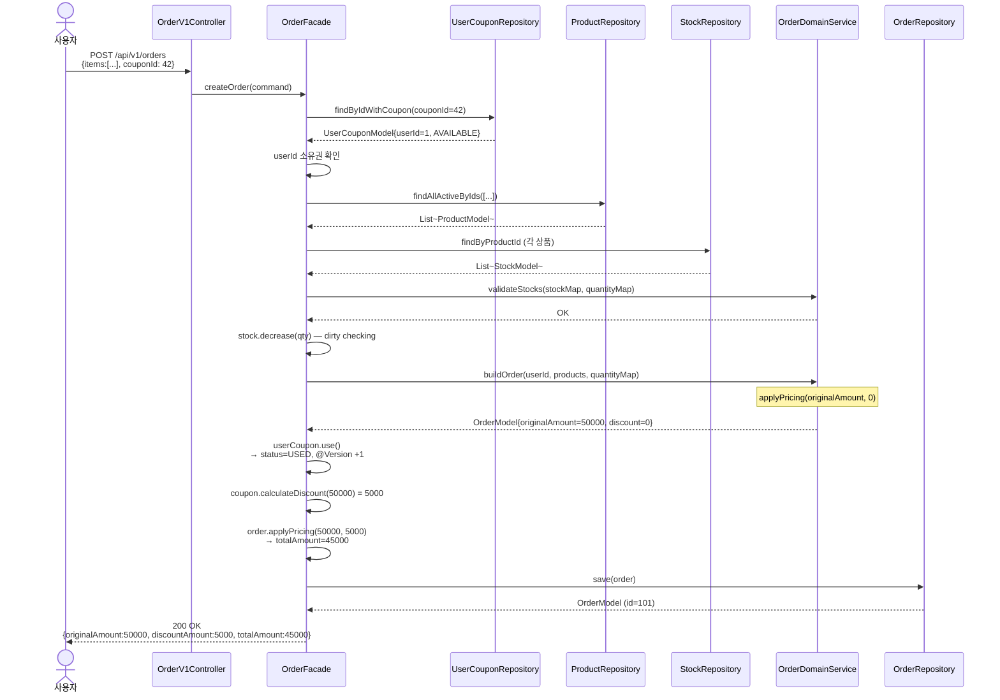
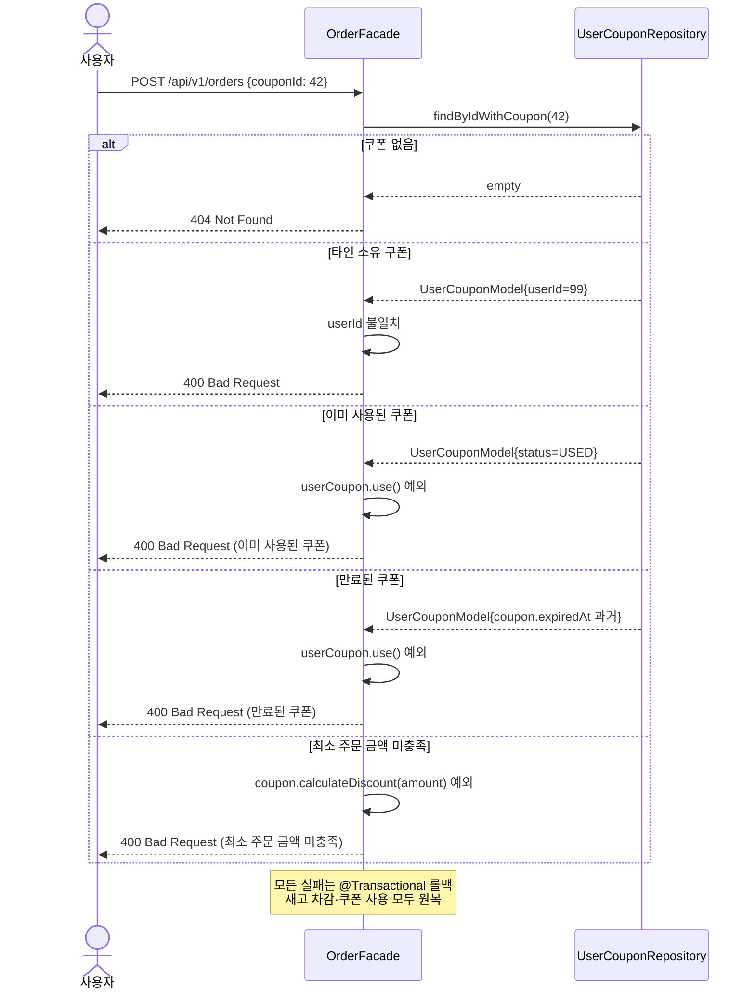
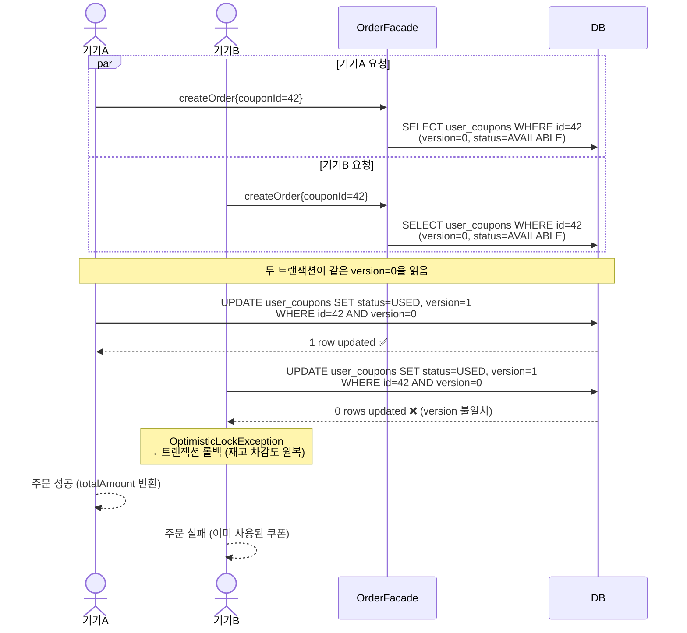

# 03. 시퀀스 다이어그램 (Week 4 — Coupon)

---

## 목차

1. [쿠폰 발급](#1-쿠폰-발급)
2. [내 쿠폰 목록 조회](#2-내-쿠폰-목록-조회)
3. [쿠폰 적용 주문 — 정상 흐름](#3-쿠폰-적용-주문--정상-흐름)
4. [쿠폰 적용 주문 — 실패 흐름](#4-쿠폰-적용-주문--실패-흐름)
5. [쿠폰 동시 사용 — 낙관적 락 충돌](#5-쿠폰-동시-사용--낙관적-락-충돌)

---

## 1. 쿠폰 발급

사용자가 쿠폰 템플릿 ID를 지정해 발급을 요청합니다. 동일 쿠폰은 1인 1회만 발급됩니다.

---

## 2. 내 쿠폰 목록 조회

발급된 쿠폰 목록을 페이지 단위로 반환합니다. EXPIRED 상태는 `expired_at` 기준으로 동적 계산합니다.

---

## 3. 쿠폰 적용 주문 — 정상 흐름

쿠폰 ID를 포함해 주문하면 쿠폰 유효성 검증 → 재고 차감 → 쿠폰 사용 처리 → 금액 확정 순으로 진행됩니다.

---

## 4. 쿠폰 적용 주문 — 실패 흐름

쿠폰 관련 실패 케이스별 분기입니다.

---

## 5. 쿠폰 동시 사용 — 낙관적 락 충돌

같은 사용자가 두 기기에서 동시에 동일 쿠폰으로 주문하는 시나리오입니다.

