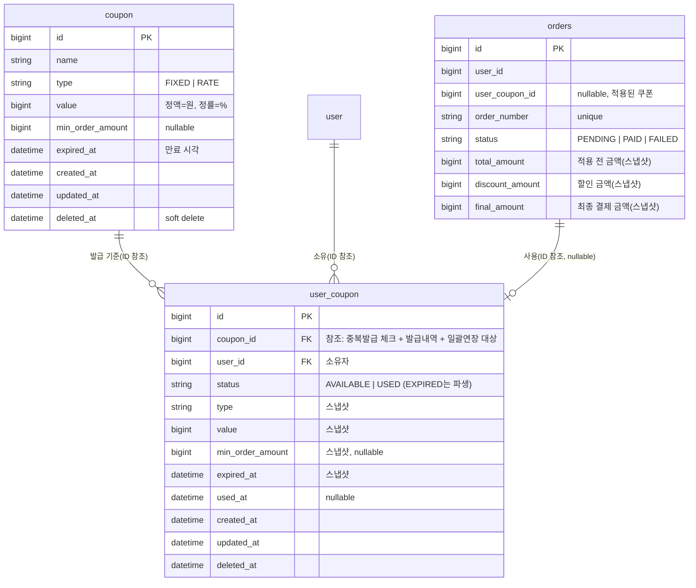

# ERD — Coupon

영속성 구조와 관계의 주인을 검증한다. 두 Aggregate의 분리, "정책 전부 스냅샷 + `couponId` 참조" 의도, 발급 1회 제한의 DB 강제를 확인한다.

## 설계 의도

1. `user_coupon (coupon_id, user_id)` 유니크 제약으로 "유저당 1회 발급"을 DB 레벨에서 보장한다. 동시 발급 경합도 차단되며, 위반은 `DataIntegrityViolationException → COUPON_ALREADY_ISSUED(CONFLICT)`로 변환한다.
2. `expired_at`은 양쪽에 존재하되 의미가 다르다. `coupon.expired_at`은 템플릿의 현재 정책, `user_coupon.expired_at`은 발급 시점에 복사한 스냅샷이다. 발급 후 템플릿 만료를 수정해도 발급분은 영향받지 않는다. 발급분 만료는 `user_coupon.expired_at`만으로 판정한다(템플릿 조회 불필요).
3. `coupon`은 soft delete(공통 정책)다. 발급분이 정책을 스냅샷으로 들고 있어, 템플릿 삭제와 무관하게 발급분은 동작한다.
4. `orders` 금액 3종은 요구사항의 "적용 전 / 할인 / 최종 금액 스냅샷"을 만족한다. 결제는 `final_amount`로 진행한다. 기존 `orders`에 `user_coupon_id`, `discount_amount`, `final_amount` 컬럼을 추가한다(기존 `total_amount`는 적용 전 금액 의미 유지).

## 마이그레이션 영향 (기존 대비)

- 신규 테이블: `coupon`, `user_coupon`
- `orders` 컬럼 추가: `user_coupon_id`(nullable), `discount_amount`, `final_amount`
- `local`/`test`는 `ddl-auto: create`라 자동 반영. 그 외 프로파일은 별도 DDL 필요.
