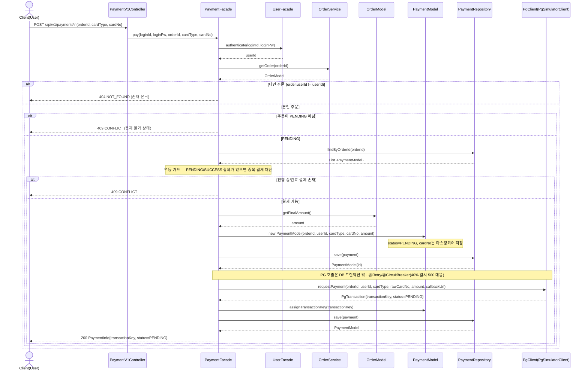
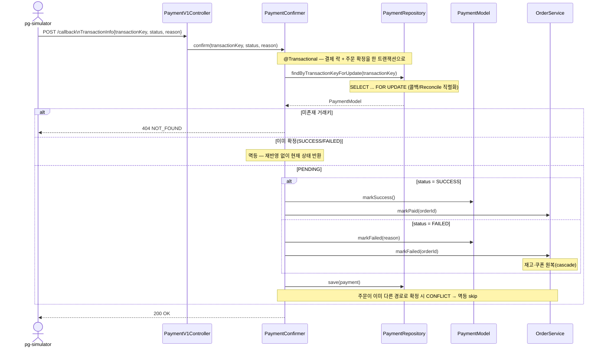
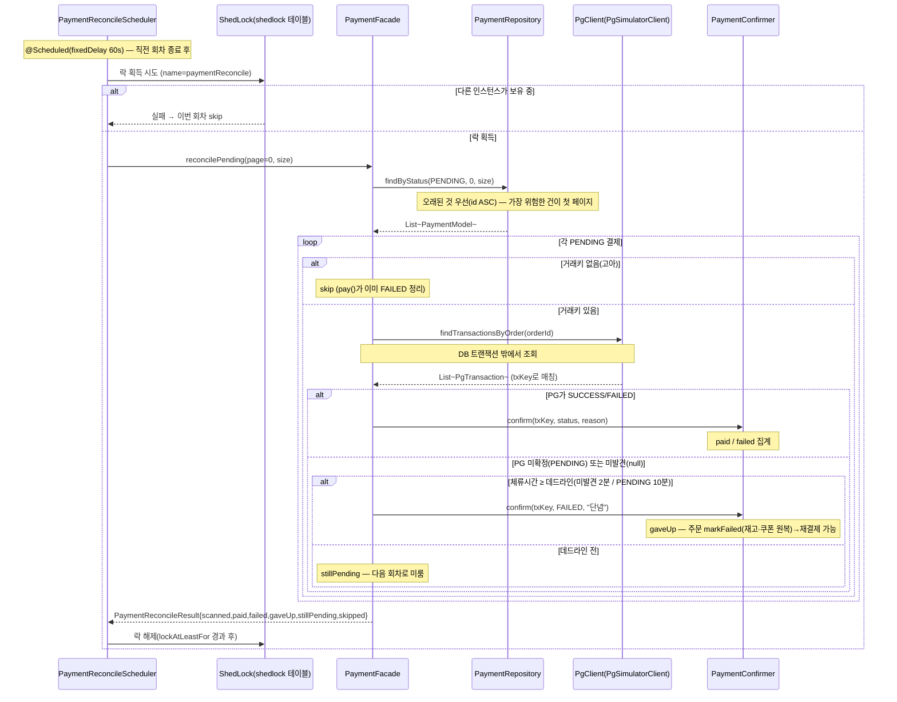

# 02. 시퀀스 다이어그램 — 결제 (Payments)

volume-6 결제 기능의 흐름을 레이어별 참여자 기준으로 시각화한다. 표기 규칙(레이어/화살표/생략/공통 에러)은 [`../week2/02-sequence-diagrams.md`](../week2/02-sequence-diagrams.md) §0을 그대로 따른다.

> 본 문서는 구현된 결제 흐름 3종을 담는다 — **결제 시작(pay)** · **콜백 수신(callback, §3.4)** · **Reconcile 대사 배치(§3.5)**. 콜백·Reconcile은 모두 동일한 확정 단위 `PaymentConfirmer.confirm`(비관락+멱등)을 거쳐 "정확히 한 번"만 상태 전이가 일어난다.

## 0. 이 문서의 참여자 (week2 §0.1 레이어에 결제 도메인 추가)

| 약칭 | 클래스 | 레이어 | 책임 |
| --- | --- | --- | --- |
| `PCtrl` | `PaymentV1Controller` | Interface (대고객) | 결제 시작 엔드포인트 (§3.6 예정) |
| `PFac` | `PaymentFacade` | Application | 결제 시작 유스케이스 조립 |
| `UFac` | `UserFacade` | Application | 인증(loginId/Pw → userId) |
| `OSvc` | `OrderService` | Domain Service | 주문 조회·상태 검증 |
| `Ord` | `OrderModel` | Domain Aggregate | 주문(소유자·상태·최종금액) |
| `Pay` | `PaymentModel` | Domain Aggregate | 결제 시도. 카드번호 마스킹·거래키 부여 |
| `PRepo` | `PaymentRepository` | Domain Repository | 결제 영속 (멱등 가드 조회 포함) |
| `PG` | `PgClient` → `PgSimulatorClient` | External | 외부 PG(pg-simulator) 어댑터 (재시도/서킷) |

> **인증 위치 주의** — week2 `OrderV1Controller`는 컨트롤러에서 인증 후 `userId`를 Facade에 넘기지만, 결제는 플랜 §3.3에 따라 **`PaymentFacade.pay`가 `loginId/loginPw`를 받아 내부에서 인증**한다. 본 다이어그램은 구현 그대로(Facade 내부 인증)를 그린다.

---

## UC-P1. 결제 시작 — `POST /api/v1/payments`

주문 생성(placeOrder)과 분리된 별도 진입점. 결제 레코드를 PENDING으로 만들고 PG에 요청해 거래키를 확보한다. **주문 상태는 여기서 건드리지 않으며**, 최종 승인/거절은 PG 콜백 또는 Reconcile이 확정한다.

### 메모
- **카드번호 이중 처리** — `PaymentModel`에는 마스킹본이 저장되고, `PG`에는 원본(`rawCardNo`)이 전달된다(pg-simulator의 카드번호 정규식 검증 통과 목적).
- **트랜잭션 경계** — `PaymentFacade.pay`는 `@Transactional`이 아니며, 각 `save`는 개별 트랜잭션으로 처리된다. PG HTTP 호출이 DB 커넥션/락을 잡지 않도록 트랜잭션 밖에서 일어난다.
- **응답은 PENDING** — pg-simulator는 즉시 PENDING 거래만 발급하고 실제 결과는 1~5초 뒤 비동기로 콜백한다. 따라서 이 흐름의 응답은 항상 PENDING이며, 클라이언트는 콜백 처리 이후의 상태를 별도로 조회한다.

---

## UC-P2. 결제 콜백 수신 — `POST /api/v1/payments/callback`

pg-simulator가 1~5초 뒤 비동기로 보내는 `TransactionInfo`를 수신해 결제·주문을 최종 확정한다. 확정은 콜백·Reconcile이 공유하는 `PaymentConfirmer.confirm`(비관락 `findByTransactionKeyForUpdate` → 멱등 체크 → 상태 전이 → 주문 cascade)으로 일원화돼 있다.

### 메모
- **주문 식별은 콜백 payload를 불신**하고, 우리 결제 레코드의 `orderId`를 신뢰한다(위변조 방지).
- 콜백은 인증 헤더 없이 수신하며 래퍼 없는 `TransactionInfo` 원본을 받는다.

---

## UC-P3. Reconcile 대사 배치 — 스케줄러 + 단념(give-up)

콜백이 유실돼 PENDING으로 남은 결제를 PG 진실원천과 대조해 끝내 확정하는 **안전망 배치**다. 주기 실행(`PaymentReconcileScheduler`)과 운영 수동(`AdminPaymentV1Controller`) 두 트리거가 같은 `PaymentFacade.reconcilePending`을 호출한다. 멀티 인스턴스에서는 **ShedLock**으로 회차당 한 인스턴스만 실행한다.

### 메모
- **무한 PENDING 종료(give-up)** — PG가 끝내 미확정/미발견이어도 체류 데드라인을 넘기면 FAILED로 단념해 종료한다. 이전엔 종료 조건이 없어 60초마다 영원히 재조회했다. 데드라인은 `payment.reconcile.give-up.{not-found-after, pending-after}`로 설정.
- **starvation 방지** — 스캔을 `id ASC`(오래된 것 우선)로 바꿔, PENDING이 페이지 크기를 넘어도 가장 오래(=가장 위험)된 건이 첫 페이지에서 우선 처리된다.
- **확정 경로 단일화** — 정상 확정·give-up 모두 `PaymentConfirmer.confirm`을 거치므로, 늦은 콜백과 경합해도 비관락+멱등으로 한 번만 반영된다(경합 건은 `skipped`).
- **트랜잭션 경계** — `reconcilePending` 자체는 `@Transactional`이 아니며 PG 조회는 DB tx 밖, 각 확정만 `confirm`의 독립 트랜잭션. 한 건 실패가 배치 전체를 막지 않는다.
