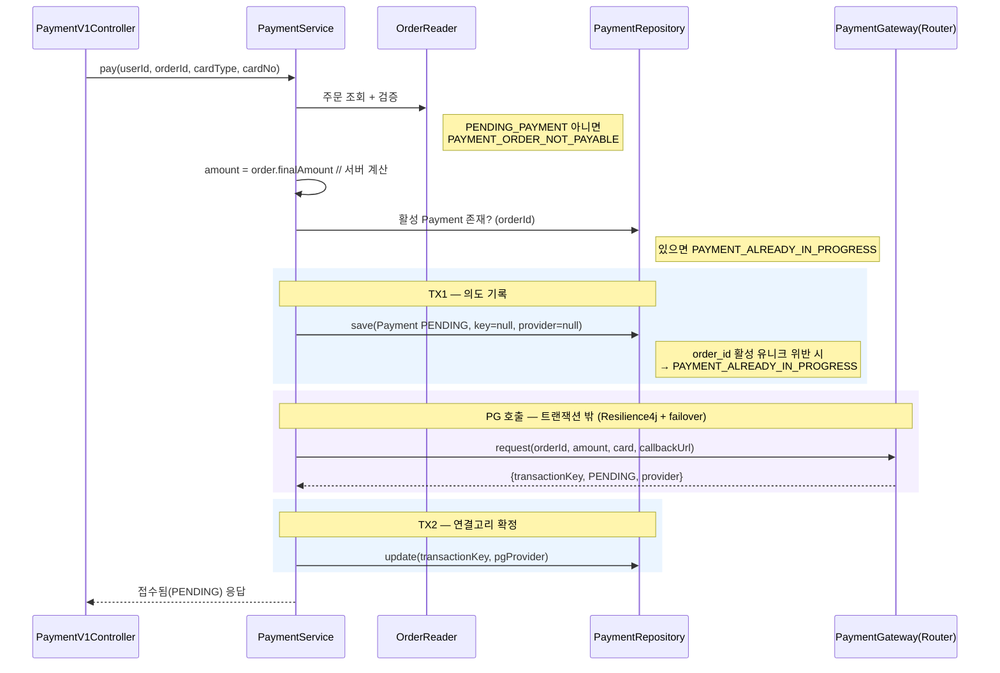
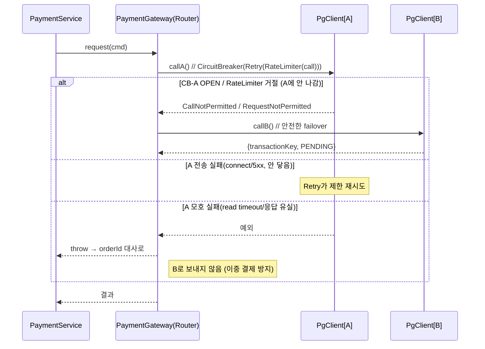
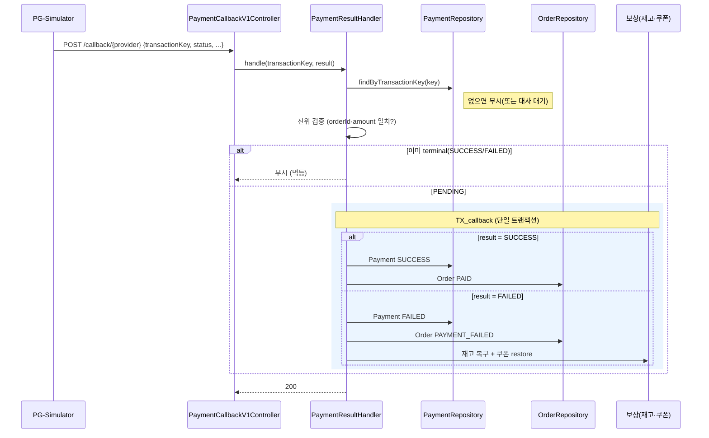
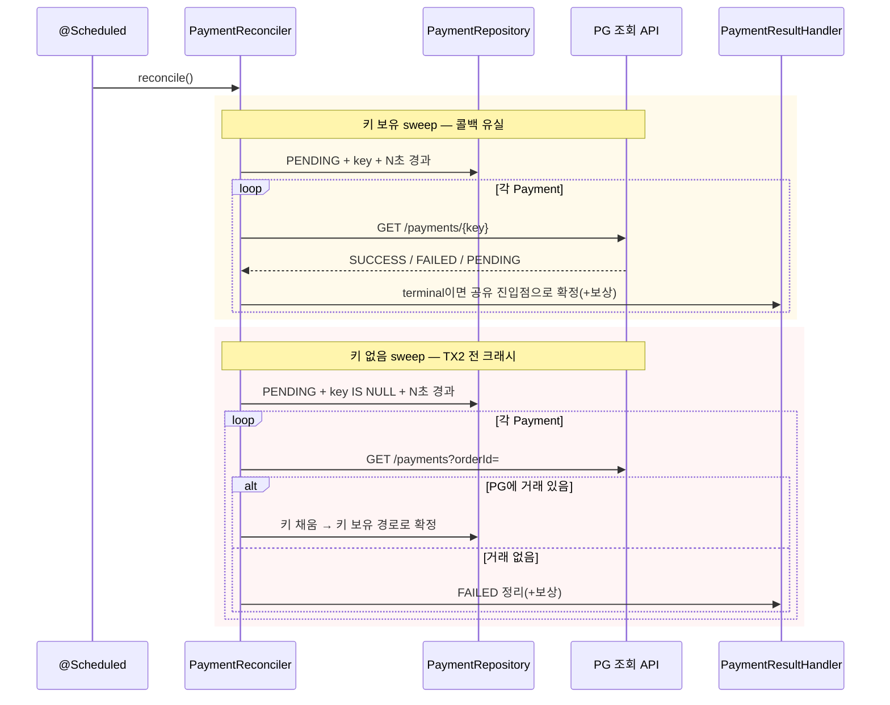

# Sequence Diagrams — Payment

호출 순서가 아니라 **트랜잭션 경계와 상태 전이**를 검증한다. 특히 PG 호출이 어떤 트랜잭션에도 들어가지 않는 점, 콜백·대사의 멱등 전이, failover의 안전 트리거가 핵심이다.

## 1. 결제 요청 (TX1 → PG 호출 → TX2)

PG 호출이 트랜잭션 밖에 있는지, 先 PENDING 생성으로 고아 거래를 막는지 검증한다.

**설계 의도**:
1. PG 호출은 TX1·TX2 **사이의 트랜잭션 밖**이다. 재고/Payment 락을 PG 지연(100~500ms + retry) 동안 잡지 않는다.
2. **TX1에서 PENDING을 먼저 커밋**해 "결제 시도" 의도를 남긴다. PG 호출 전 크래시는 PG가 모르므로(돈 안 움직임) 안전, TX2 전 크래시는 키 없음 sweep(orderId)으로 복구.
3. 멱등은 `order_id` 활성 유니크가 1차 방어선이다. 사전 `exists` 체크는 사용자 메시지용 보조.
4. `amount`는 주문에서 서버가 계산한다. 클라이언트가 보낸 금액은 신뢰하지 않는다.

## 2. PG 호출 내부 — Resilience4j & failover

데코레이터 순서와 failover의 안전 트리거를 검증한다.

**설계 의도**:
1. 순서 **`CircuitBreaker(Retry(RateLimiter(call)))`** — CB가 바깥이라 OPEN 시 retry를 건너뛰고, "`CallNotPermitted` = A에 안 닿음" 불변식이 성립한다. 이 불변식 위에서만 failover가 안전하다.
2. failover는 **"안 나간 게 확실한 예외"에만**. 보내진 뒤 모호한 실패는 대사로 — A가 이미 처리했을 수 있어 B로 보내면 이중 결제.
3. Retry는 전송 계층 실패에만, 모호 실패·400은 제외.

## 3. 콜백 수신 (결과 확정 + 보상)

비동기 결과의 멱등 전이와 FAILED 보상의 단일 트랜잭션을 검증한다.

**설계 의도**:
1. **transactionKey 단독 조회**. "키 저장 전 콜백 도착" 레이스는 콜백 지연(1~5초) ≫ TX2(ms)라 사실상 발생하지 않고, 발생해도 키 보유 sweep이 회수하므로 핸들러를 단순하게 둔다.
2. **`PENDING`일 때만 전이**(멱등 가드). 콜백과 대사가 같은 Payment를 동시에 건드려도 1회만 반영한다(+ 낙관적 락).
3. **FAILED는 단일 트랜잭션** — 상태 전이 + 보상을 한 TX로 묶는다. 부분 실패 시 통째 롤백 → Payment PENDING 유지 → 대사가 재처리(콜백 무보증이라 재전송 없음).
4. 콜백엔 서명/인증이 없으므로 `orderId·amount` 일치를 검증한 뒤에만 전이한다.

## 4. 정합성 보정 (대사) — @Scheduled

콜백 유실(키 보유)과 TX2 전 크래시(키 없음)를 두 sweep으로 회수하는지 검증한다.

**설계 의도**:
1. **재결제가 아니라 조회 기반 보정**. PG는 orderId 멱등이 아니라 재요청은 이중 결제다. 기존 거래의 진짜 상태를 읽어 내부 상태를 맞춘다.
2. **FAILED 처리는 콜백과 공유 진입점**(`PaymentResultHandler`)을 호출한다. 콜백이 단일 TX 롤백으로 못 끝낸 보상을 대사가 동일 로직으로 마저 수행한다. 보상 로직이 두 군데로 갈라지지 않게 한다.
3. 규모상 `@Scheduled`로 충분하다. 대량·재시작 보장이 필요해지면 `commerce-batch`(Spring Batch)로 승격한다.

## 설계 리스크

1. **failover 안전 분기 검증 난이도**: "보낸 뒤 모호 실패"를 재현하기 어렵다. PG 클라이언트에 예외 주입형 테스트 더블로 `CallNotPermitted` vs 모호 실패 분기를 검증한다.
2. **콜백 진위 검증 범위**: 서명이 없어 `orderId·amount` 일치로만 막는다. 실제 PG라면 서명 검증을 추가해야 한다(범위 외).
3. **대사 주기 vs UX**: 콜백 유실분은 대사 주기만큼 확정이 지연된다. 사용자에겐 "결제 처리 중" 상태를 노출하고, 최종 결과는 주문 상세/알림으로 전달한다(동기 응답으로 내려주지 않는다).
