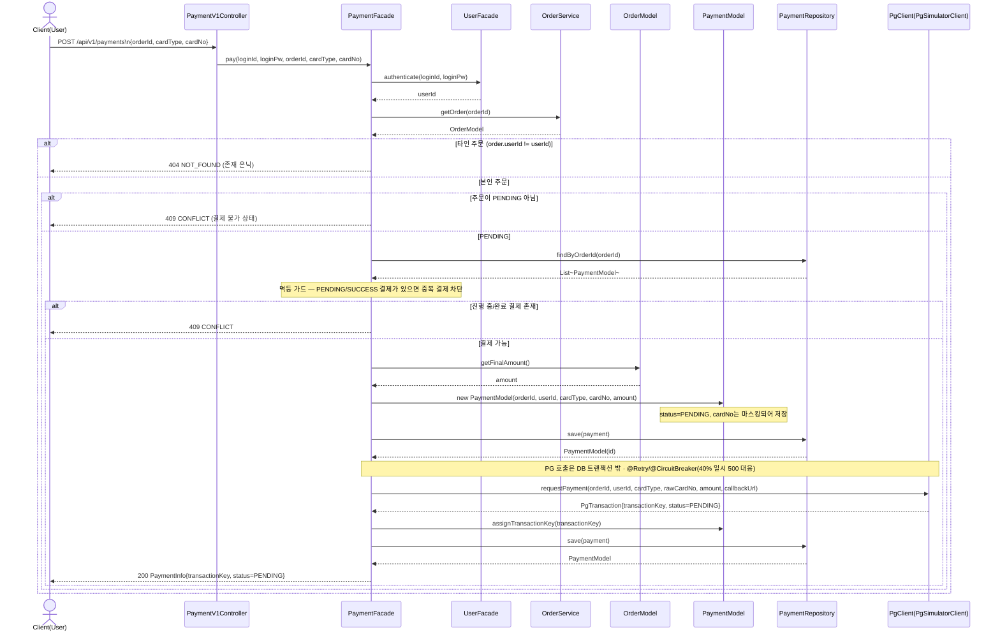

# 02. 시퀀스 다이어그램 — 결제 (Payments)

volume-6 결제 기능의 흐름을 레이어별 참여자 기준으로 시각화한다. 표기 규칙(레이어/화살표/생략/공통 에러)은 [`../week2/02-sequence-diagrams.md`](../week2/02-sequence-diagrams.md) §0을 그대로 따른다.

> 본 문서는 **현재 확정·구현된 흐름**인 "결제 시작(pay)"만 담는다. **결제 콜백 수신**과 **Reconcile**(고아 PENDING 정리·최종 확정) 시퀀스는 §3.4/§3.5 설계가 확정된 뒤 추가한다.

## 0. 이 문서의 참여자 (week2 §0.1 레이어에 결제 도메인 추가)

| 약칭 | 클래스 | 레이어 | 책임 |
| --- | --- | --- | --- |
| `PCtrl` | `PaymentV1Controller` | Interface (대고객) | 결제 시작 엔드포인트 (§3.6 예정) |
| `PFac` | `PaymentFacade` | Application | 결제 시작 유스케이스 조립 |
| `UFac` | `UserFacade` | Application | 인증(loginId/Pw → userId) |
| `OSvc` | `OrderService` | Domain Service | 주문 조회·상태 검증 |
| `Ord` | `OrderModel` | Domain Aggregate | 주문(소유자·상태·최종금액) |
| `Pay` | `PaymentModel` | Domain Aggregate | 결제 시도. 카드번호 마스킹·거래키 부여 |
| `PRepo` | `PaymentRepository` | Domain Repository | 결제 영속 (멱등 가드 조회 포함) |
| `PG` | `PgClient` → `PgSimulatorClient` | External | 외부 PG(pg-simulator) 어댑터 (재시도/서킷) |

> **인증 위치 주의** — week2 `OrderV1Controller`는 컨트롤러에서 인증 후 `userId`를 Facade에 넘기지만, 결제는 플랜 §3.3에 따라 **`PaymentFacade.pay`가 `loginId/loginPw`를 받아 내부에서 인증**한다. 본 다이어그램은 구현 그대로(Facade 내부 인증)를 그린다.

---

## UC-P1. 결제 시작 — `POST /api/v1/payments`

주문 생성(placeOrder)과 분리된 별도 진입점. 결제 레코드를 PENDING으로 만들고 PG에 요청해 거래키를 확보한다. **주문 상태는 여기서 건드리지 않으며**, 최종 승인/거절은 PG 콜백 또는 Reconcile이 확정한다.

### 메모
- **카드번호 이중 처리** — `PaymentModel`에는 마스킹본이 저장되고, `PG`에는 원본(`rawCardNo`)이 전달된다(pg-simulator의 카드번호 정규식 검증 통과 목적).
- **트랜잭션 경계** — `PaymentFacade.pay`는 `@Transactional`이 아니며, 각 `save`는 개별 트랜잭션으로 처리된다. PG HTTP 호출이 DB 커넥션/락을 잡지 않도록 트랜잭션 밖에서 일어난다.
- **응답은 PENDING** — pg-simulator는 즉시 PENDING 거래만 발급하고 실제 결과는 1~5초 뒤 비동기로 콜백한다. 따라서 이 흐름의 응답은 항상 PENDING이며, 클라이언트는 콜백 처리 이후의 상태를 별도로 조회한다.

### 후속 (미작성 — §3.4/§3.5 설계 후 추가)
- **UC-P2. 결제 콜백 수신** (`POST /api/v1/payments/callback`) — PG의 `TransactionInfo` 수신 → `findByTransactionKeyForUpdate`로 잠그고 `markSuccess`/`markFailed` → 주문 `markPaid`/`markFailed`(재고·쿠폰 원복) 연계.
- **UC-P3. Reconcile** — PENDING 결제를 `findTransactionsByOrder`로 PG 진실원천과 대조해 최종 확정. 콜백 유실·요청 실패로 남은 **고아 PENDING** 정리(재결제 가능화) 포함.
