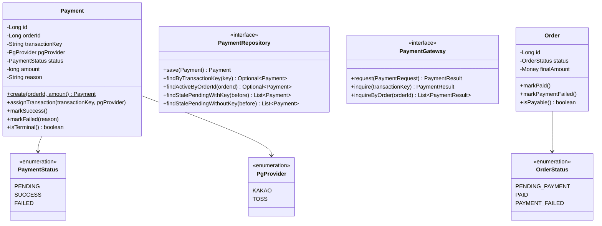
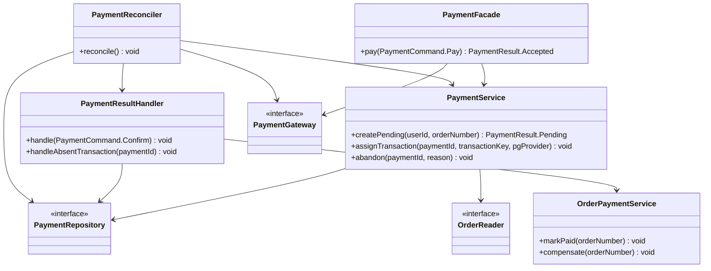
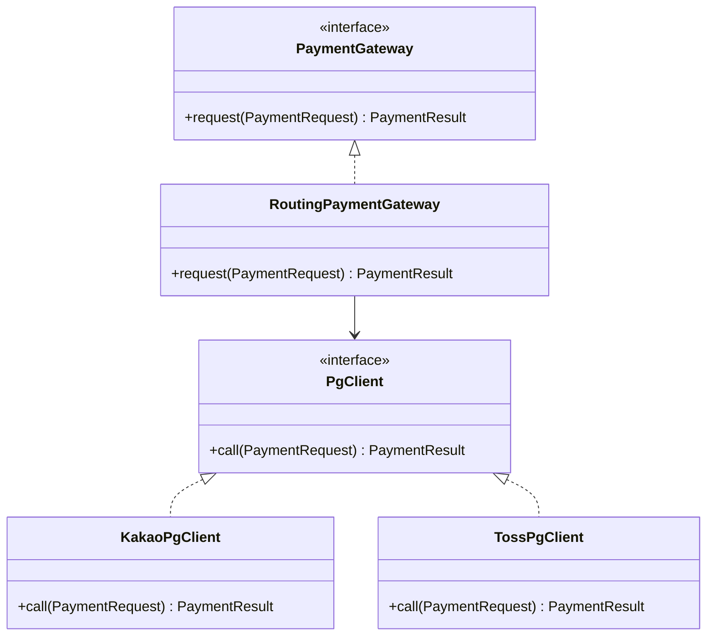
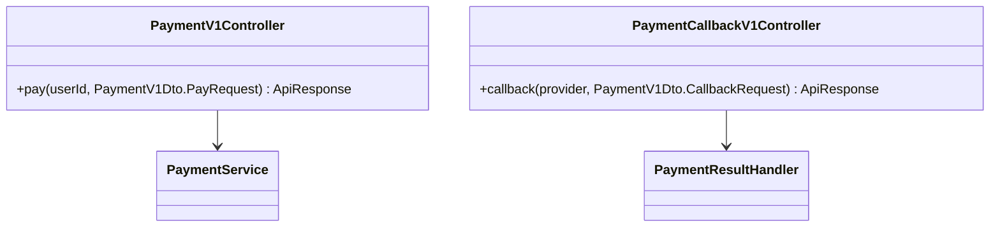

# Class Diagram — Payment

도메인 책임과 의존 방향을 검증한다. 결제 상태 전이·멱등 가드는 `Payment` 엔티티에, PG 호출·재시도·failover는 인프라(gateway)에, 트랜잭션 조율은 application에 있는지 확인한다. 의존 방향은 `interfaces → application → domain ← infrastructure`.

## 도메인 계층

**설계 의도**:
- `Payment`는 **멱등 전이의 불변식**을 캡슐화한다. `markSuccess()`/`markFailed()`는 `PENDING`에서만 허용하고(아니면 무시/예외), 콜백·정합성 보정이 같은 객체를 동시에 건드려도 1회만 전이된다.
- `Order`도 **전이를 자기 메서드로 캡슐화**한다. `markPaid()`/`markPaymentFailed()`는 `PENDING_PAYMENT`에서만 동작하고 이미 terminal이면 무시한다 — `PaymentResultHandler`가 `order.setStatus(...)`로 규칙을 밖으로 빼지 않게 한다(Payment의 `markSuccess/markFailed`와 대칭). 콜백·정합성 보정이 같은 주문을 동시에 확정해도 멱등이다. (현재 week4 `Order`는 가드 없는 `markFailed()`만 있어, week6 구현 시 이 형태로 정렬한다.)
- `transactionKey`·`pgProvider`는 nullable. 생성 시점(TX1)엔 비어 있고 `assignTransaction()`(TX2)에서 채운다 — 先 PENDING 생성 패턴.
- `PaymentGateway`는 **port**다. 멀티 PG·재시도·failover는 이 인터페이스 뒤 인프라에 숨긴다. 도메인은 PG가 몇 개인지, Resilience4j가 있는지 모른다.

## 애플리케이션 계층

**설계 의도**:
1. **`PaymentFacade.pay`** — TX1(PENDING 생성) → PG 호출(트랜잭션 밖) → TX2(키 확정)의 3구간을 조율한다. 트랜잭션 경계를 가르는 책임이라 `@Transactional`을 메서드 전체에 걸지 않고, 각 구간을 `PaymentService`의 트랜잭션 메서드(`createPending`/`assignTransaction`)에 위임한다.
2. **`PaymentResultHandler`가 콜백·정합성 보정의 공유 진입점**이다. `handle(Confirm)`은 transactionKey로 결제를 찾아 SUCCESS/FAILED를 확정하고, `handleAbsentTransaction`은 주문 기준 보정에서 PG에 거래가 없을 때(G1) FAILED로 정리한다. 두 경로 모두 보상은 `OrderPaymentService.compensate` 한 곳을 타서 분기가 갈라지지 않는다. 상태 전이는 `order.markPaid()`/`order.markPaymentFailed()` 도메인 메서드에 위임한다 — Handler는 로드·조율만 하고 전이 규칙(가드)은 `Order` 안에 둔다.
3. **`PaymentReconciler`**는 `@Scheduled`로 두 정합성 보정(키 기준·주문 기준)을 돌리고, 확정은 `PaymentResultHandler`에 위임한다(자체 보상 로직을 갖지 않는다). 주문 기준 보정에서 거래를 찾으면 `PaymentService.assignTransaction`으로 키를 채우고, 회수 실패가 길어지면 `abandon`으로 포기한다.
4. `OrderPaymentService`는 결제 결과에 따른 주문 전이(`markPaid`/`compensate`)를 담당하고, 보상은 `docs/week4`의 재고·쿠폰 복구를 재사용한다(결제 실패 보상의 실체).

## 인프라 계층 (PG 호출 · Resilience4j · failover)

**설계 의도**:
1. **3계층 책임 분리**: `RoutingPaymentGateway`(분배·failover, 직접 구현) → `PgClient`(PG별 HTTP 어댑터: `KakaoPgClient`/`TossPgClient`) → Resilience4j(PG별 인스턴스, 라이브러리). RateLimiter/CB는 PG마다 분리돼 PG-A 장애가 PG-B에 전이되지 않는다. `cardType`(SAMSUNG/KB/HYUNDAI 등 카드 브랜드)은 `PaymentRequest`의 필드일 뿐, PG 선택(`pgProvider`)과는 별개 축이다.
2. **데코레이터 순서 `CircuitBreaker(Retry(RateLimiter(call)))`** — 어노테이션 기본 순서는 Retry가 바깥이므로, 수동 조합(`Decorators.with...`)이나 aspect-order로 **CB를 바깥**에 둔다. 학습·정합성 양면에서 이 순서가 핵심.
3. failover는 라우터의 책임이고, RateLimiter는 "포화" 신호원일 뿐 분배 주체가 아니다. 가중치 분배(라우팅)는 범위 외(+α).

## 인터페이스 계층

**설계 의도**: 결제 요청과 콜백 수신을 컨트롤러로 분리한다. 콜백은 PG가 호출하는 서버 간 엔드포인트로, URL의 `{provider}`로 PG를 구분한다. 요청/응답 DTO는 application의 Command/Result와 분리한다(프로젝트 규약).
