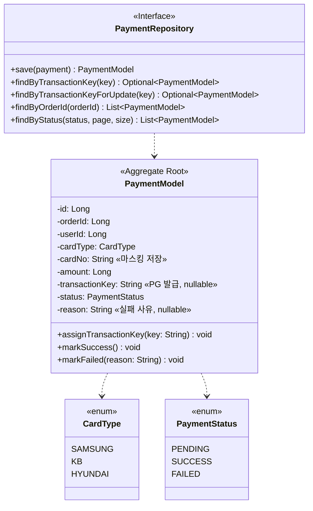
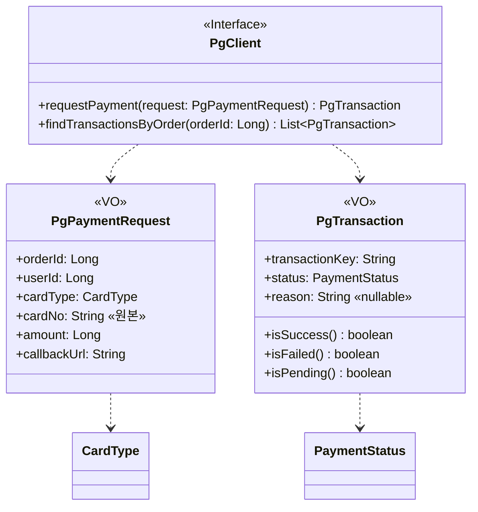
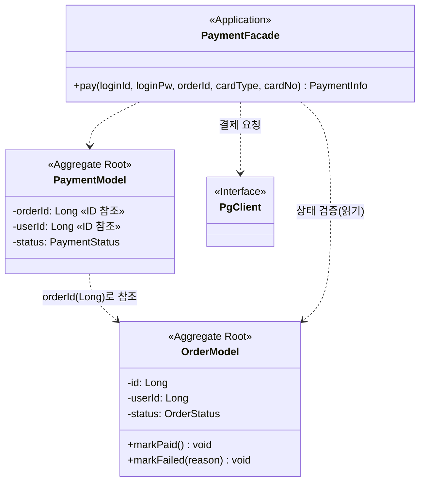

# 03. 클래스 다이어그램 — 결제 (Payments)

volume-6 결제 기능의 도메인 어휘를 클래스 단위로 시각화한다. 표기 규칙(스테레오타입·관계·생략)은 [`../week2/03-class-diagram.md`](../week2/03-class-diagram.md) §0을 그대로 따른다.

> 요구사항·분석은 별도 `01-requirements.md` 대신 구현 계획(플랜 `binary-scribbling-teapot.md`)과 Notion 작업 허브에 정리돼 있다. 본 문서는 **현재 확정·구현된 부분**(결제 도메인, PG 연동 포트, 결제 시작 흐름)만 담으며, 콜백 수신·Reconcile 관련 클래스/관계는 §3.4/§3.5 설계 확정 후 갱신한다.

결제는 week2의 기존 Aggregate에 **Payment 1개를 추가**하고, **외부 PG 연동 포트(PgClient)를 신설**한다.

---

## 1. Aggregate 식별 (결제)

| Aggregate | Root | 자식 | VO | 책임 경계 |
| --- | --- | --- | --- | --- |
| **Payment** *(신규)* | `PaymentModel` | — | — | 한 주문에 대한 외부 결제 시도 1건. 상태 머신(PENDING→SUCCESS/FAILED)·멱등 확정·카드번호 마스킹 |
| **(External)** *(신규)* | `PgClient` | — | `PgPaymentRequest`, `PgTransaction` | 외부 PG(pg-simulator) 추상화. 요청/조회를 도메인 언어로 노출 |
| Order *(기존)* | `OrderModel` | `OrderItem` | `Money` | 결제와 **분리** — placeOrder는 PENDING 주문만 생성(§3.7 예정), 확정은 결제 콜백/Reconcile이 주문 상태 머신을 구동 |

- **왜 Payment를 별도 Aggregate로** — 주문(Order)은 "무엇을 얼마에 사는가"의 일관성 경계이고, 결제(Payment)는 "그 주문값을 외부 PG로 어떻게 회수하는가"의 별도 생명주기다. 한 주문에 결제 시도가 여러 번(실패 후 재시도) 생길 수 있으므로 1:N으로 분리한다.
- **Aggregate 간 참조는 ID(Long)로만** — `PaymentModel`은 `orderId`/`userId`로 주문·사용자를 가리키되 객체를 직접 품지 않는다.
- **외부 PG는 포트-어댑터로 격리** — 도메인은 `PgClient` 인터페이스에만 의존하고, pg-simulator HTTP 계약(DTO·ApiResponse 래퍼·orderId 포맷·헤더)은 어댑터(`PgSimulatorClient`)에 가둔다. 멀티 PG는 새 어댑터 추가로 확장(현재 범위 밖).

---

## 2. Payment Aggregate

- **상태 머신** — 생성 시 `PENDING`. `markSuccess`/`markFailed`는 `requirePending()` 가드를 거쳐 `PENDING`에서만 전이 가능, 그 외 상태에서 호출하면 `CONFLICT`. 콜백·Reconcile이 같은 결제를 중복 확정해도 정확히 한 번만 반영된다(멱등).
- **카드번호 마스킹** — 생성자가 원본을 받아 `1234-****-****-1451` 형태로 마스킹해 저장한다. **원본은 영속하지 않으며** PG 호출에만 쓰인다(§3 시퀀스 참조).
- **`findByTransactionKeyForUpdate`** — 비관적 락(`SELECT ... FOR UPDATE`)으로 행을 잠그고 조회. 콜백/Reconcile 동시 확정을 직렬화한다.

---

## 3. 외부 PG 연동 포트 (PgClient)

- **`requestPayment`** — DB 트랜잭션 밖에서 호출. 어댑터가 40% 일시 500에 `@Retry`, 연속 실패에 `@CircuitBreaker`를 적용한다.
- **`findTransactionsByOrder`** — Reconcile 진실원천. 콜백 유실로 우리 쪽이 PENDING으로 남았을 때 PG의 최종 상태를 직접 조회한다(§3.5에서 사용 예정).
- **`PgPaymentRequest.cardNo`는 원본** — pg-simulator가 `\d{4}-\d{4}-\d{4}-\d{4}` 정규식을 검증하므로 마스킹본은 거부된다. 영속용(마스킹)과 PG 전송용(원본)을 분리한다.

> **구현 어댑터** `PgSimulatorClient`(infrastructure)가 `PgClient`를 구현하며, `PgSimulatorFeignClient`(Feign)로 pg-simulator(:8082) 계약을 미러한다. orderId는 `%06d`로 6자 이상 문자열 변환, 응답은 `ApiResponse<T>` 래퍼에서 언랩.

---

## 4. 통합 관계도 (Order ↔ Payment ↔ PG)

- 결제 시작(`pay`)에서는 `PaymentFacade`가 주문을 **읽기만** 한다(소유·PENDING 검증). 주문 상태 전이(`markPaid`/`markFailed`)는 결제 **콜백/Reconcile** 단계에서 일어나며, 해당 흐름의 클래스/관계는 §3.4/§3.5 설계 확정 후 이 문서에 추가한다.
