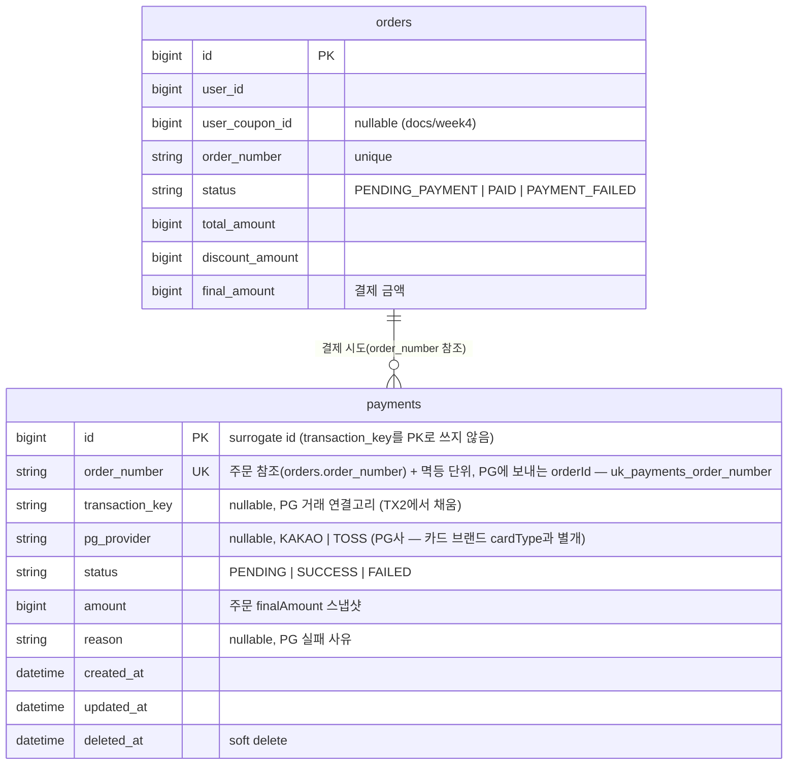

# ERD — Payment

영속성 구조와 멱등·연결고리를 검증한다. 내부 `Payment`와 외부 PG 거래를 잇는 `transaction_key`, 주문당 1결제를 강제하는 제약, 주문 상태 확장을 확인한다.

## 설계 의도

1. **`id`는 surrogate, `transaction_key`는 PK가 아니다.** transactionKey를 식별자로 쓰면 키를 받기 전(TX1)에 로우를 만들 수 없어 先 PENDING 생성이 불가능하다. 자체 id를 두고 `transaction_key`를 nullable 컬럼으로 둬, 의도(PENDING)를 먼저 기록하고 키는 PG 호출 성공 후(TX2) 채운다.

2. **멱등 단위는 `order_id`(Long)가 아니라 `order_number`(String)다.** PG는 `orderId`를 6자 이상 문자열로 검증하는데, 우리 주문의 surrogate id(Long)는 짧아서(`1`, `2`…) 그대로 못 보낸다. 반면 `order_number`(`yyyyMMdd-NNNNNN`)는 표시용으로 만든 유니크 문자열이라 그대로 PG의 `orderId`로 보내고, 보정·멱등의 키로도 쓴다. 그래서 `Payment`는 `order_id`가 아닌 `order_number`로 주문을 참조한다.

3. **주문당 결제는 1건이다.** `payments(order_number)`에 유니크 제약(`uk_payments_order_number`)을 둔다. 결제가 SUCCESS/FAILED로 끝나면 주문도 `PAID`/`PAYMENT_FAILED`가 되어 더는 결제할 수 없으니(05-state-diagram 참고), 한 주문번호에는 결제가 하나만 생긴다. 앱에서 거는 활성 결제 검사(`findActiveByOrderNumber`)는 조회와 저장 사이에 다른 요청이 끼어들 수 있어, 동시 요청이 몰릴 때 이 유니크 제약이 마지막 방어선이 된다. 제약에 걸려 저장이 막힌 요청은 `PAYMENT_ALREADY_IN_PROGRESS`(409)로 돌려준다.

4. **`transaction_key`가 두 상태 기계의 연결고리다.** 콜백은 `transaction_key`로 Payment를 찾고, 콜백 유실 시 키 기준 보정이 `GET /payments/{key}`로 대조한다. 키가 아직 없는 Payment(TX2 전 크래시)는 `order_number`를 PG의 `orderId`로 넘겨 `GET /payments?orderId=`로 대조한다 → 그래서 `order_number`는 항상 채워져야 한다.

5. **`pg_provider`는 어느 PG사로 결제했는지 추적**한다(`KAKAO`/`TOSS` 등, 멀티 PG·failover 대비). 콜백 구분과 정합성 보정 시 "어느 PG에 물어볼지" 결정의 근거. failover로 PG가 바뀌면 이 값이 최종 PG를 가리킨다. 사용자가 고른 **카드 브랜드(`cardType`: SAMSUNG/KB/HYUNDAI)는 PG 선택과 별개 축**이라 혼동하지 않는다 — 카드 브랜드는 PG로 전달되는 결제 수단일 뿐이다.

6. **`amount`는 주문 `final_amount` 스냅샷**이다. 결제 시점 금액을 고정해 콜백 진위 검증(`amount` 일치)과 사후 대조에 사용한다.

7. **주문 상태 확장**: 기존 `orders.status`(`PENDING | PAID | FAILED`, docs/week4)를 결제 흐름에 맞춰 **`PENDING_PAYMENT | PAID | PAYMENT_FAILED`**로 정렬한다. 결제 전 재고 선점 상태가 `PENDING_PAYMENT`, 실패 보상 후가 `PAYMENT_FAILED`다.

## 마이그레이션 영향 (기존 대비)

- 신규 테이블: `payments`
- `orders.status` enum 값 정렬: `PENDING → PENDING_PAYMENT`, `FAILED → PAYMENT_FAILED`(의미 동일, 명시화). 기존 데이터가 있으면 값 매핑 필요.
- 기존 `StubPaymentGateway` 및 `PlaceOrderFacade` 내부 결제 호출 제거 — 결제는 별도 API로 분리.
- `local`/`test`는 `ddl-auto: create`라 자동 반영. 그 외 프로파일은 별도 DDL + enum 값 마이그레이션 필요.
