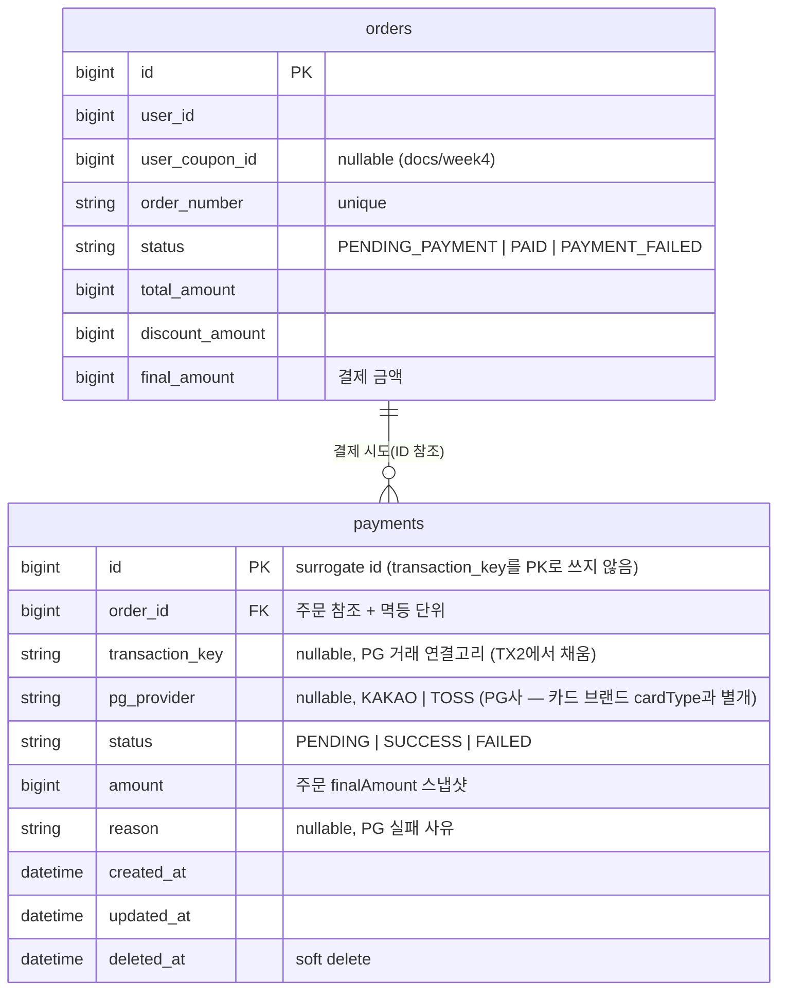

# ERD — Payment

영속성 구조와 멱등·연결고리를 검증한다. 내부 `Payment`와 외부 PG 거래를 잇는 `transaction_key`, 주문당 1결제를 강제하는 제약, 주문 상태 확장을 확인한다.

## 설계 의도

1. **`id`는 surrogate, `transaction_key`는 PK가 아니다.** transactionKey를 식별자로 쓰면 키를 받기 전(TX1)에 로우를 만들 수 없어 先 PENDING 생성이 불가능하다. 자체 id를 두고 `transaction_key`를 nullable 컬럼으로 둬, 의도(PENDING)를 먼저 기록하고 키는 PG 호출 성공 후(TX2) 채운다.

2. **주문당 결제 1건은 DB로 강제한다.** `payments(order_id)`에 **활성 상태(PENDING/SUCCESS) 한정 유니크**를 둔다(예: 부분 유니크 인덱스, 또는 활성 결제 전용 컬럼/테이블 분리). FAILED는 재결제를 허용해야 하므로 유니크 대상에서 제외한다. 앱 레벨 `exists` 체크는 동시 요청 경합에 취약하므로 이 제약이 1차 방어선이다.

3. **`transaction_key`가 두 상태 기계의 연결고리다.** 콜백은 `transaction_key`로 Payment를 찾고, 콜백 유실 시 키 보유 sweep이 `GET /payments/{key}`로 대조한다. 키가 아직 없는 Payment(TX2 전 크래시)는 `order_id`로 `GET /payments?orderId=` 대조한다 → 그래서 `order_id`는 항상 채워져야 한다.

4. **`pg_provider`는 어느 PG사로 결제했는지 추적**한다(`KAKAO`/`TOSS` 등, 멀티 PG·failover 대비). 콜백 구분과 대사 시 "어느 PG에 물어볼지" 결정의 근거. failover로 PG가 바뀌면 이 값이 최종 PG를 가리킨다. 사용자가 고른 **카드 브랜드(`cardType`: SAMSUNG/KB/HYUNDAI)는 PG 선택과 별개 축**이라 혼동하지 않는다 — 카드 브랜드는 PG로 전달되는 결제 수단일 뿐이다.

5. **`amount`는 주문 `final_amount` 스냅샷**이다. 결제 시점 금액을 고정해 콜백 진위 검증(`amount` 일치)과 사후 대조에 사용한다.

6. **주문 상태 확장**: 기존 `orders.status`(`PENDING | PAID | FAILED`, docs/week4)를 결제 흐름에 맞춰 **`PENDING_PAYMENT | PAID | PAYMENT_FAILED`**로 정렬한다. 결제 전 재고 선점 상태가 `PENDING_PAYMENT`, 실패 보상 후가 `PAYMENT_FAILED`다.

## 마이그레이션 영향 (기존 대비)

- 신규 테이블: `payments`
- `orders.status` enum 값 정렬: `PENDING → PENDING_PAYMENT`, `FAILED → PAYMENT_FAILED`(의미 동일, 명시화). 기존 데이터가 있으면 값 매핑 필요.
- 기존 `StubPaymentGateway` 및 `PlaceOrderFacade` 내부 결제 호출 제거 — 결제는 별도 API로 분리.
- `local`/`test`는 `ddl-auto: create`라 자동 반영. 그 외 프로파일은 별도 DDL + enum 값 마이그레이션 필요.
