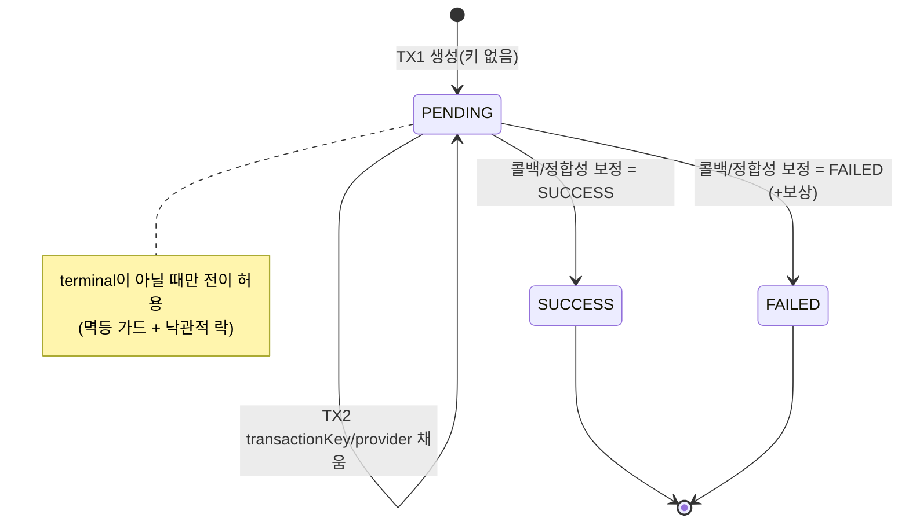
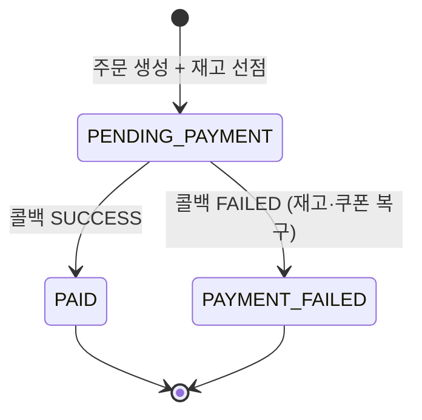
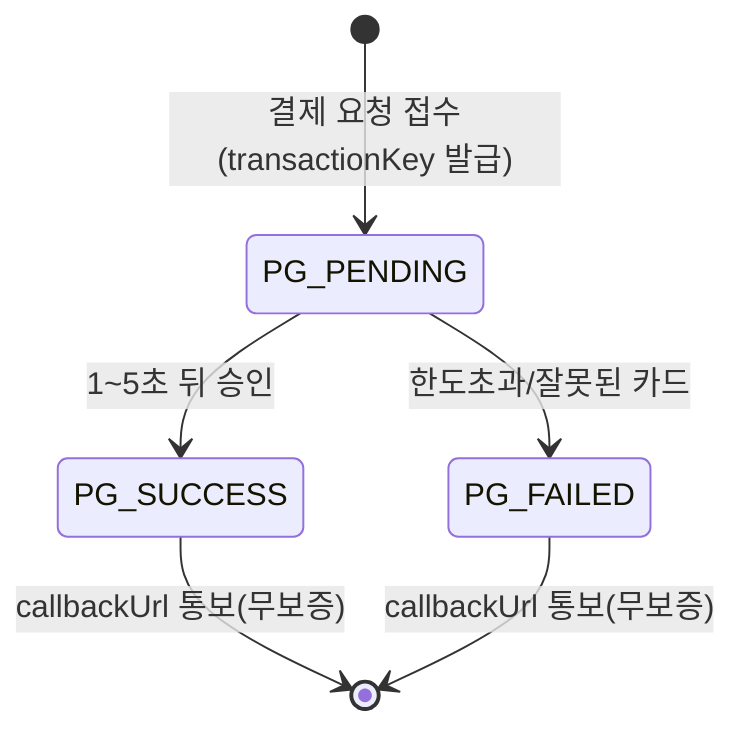
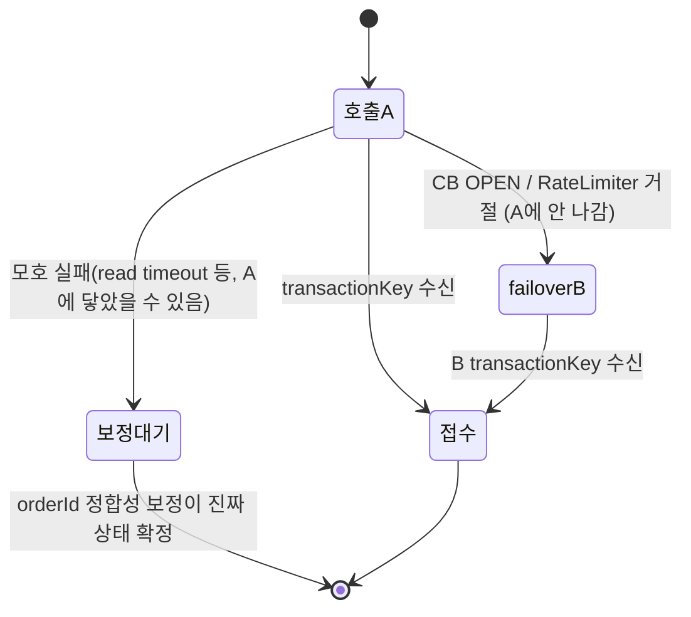

# State Diagram — Payment

호출 흐름이 아니라 **상태 전이**로 구조를 본다. 내부(`Payment`/`Order`)와 외부(PG 거래) 상태를 분리해 정리하고, 둘이 어긋날 수 있는 지점을 명시한다.

## 1. 내부 Payment 상태

- 전이는 `PENDING → SUCCESS` 또는 `PENDING → FAILED` **단방향 1회**. terminal 재진입은 무시한다.
- `TX2`는 상태를 바꾸지 않는다(PENDING 유지). `transaction_key`·`pg_provider`만 채운다.

## 2. 내부 Order 상태 (결제 연계)

## 3. 외부 PG 거래 상태

- PG는 내부와 **독립적으로** 전이한다. 결과 통보(콜백)는 1회·무보증이다.

## 4. 두 상태가 어긋나는 지점 (정합성 갭)

| # | 내부 상태 | 외부 PG 상태 | 원인 | 회수 경로 |
| --- | --- | --- | --- | --- |
| G1 | Payment PENDING (키 없음) | 거래 없음 | TX1 후 PG 호출 전 크래시 | 주문 기준 보정(orderId) → 재처리/FAILED |
| G2 | Payment PENDING (키 없음) | PG_SUCCESS/FAILED | PG 성공 ~ TX2 전 크래시 | 주문 기준 보정(orderId) → 키 채움 → 확정 |
| G3 | Payment PENDING (키 보유) | PG terminal | 콜백 유실(무보증) | 키 기준 보정(transactionKey) → 확정 |
| G4 | Payment FAILED, 보상 미완 | PG_FAILED | 콜백 단일 TX 부분 실패 → 롤백 | PENDING 유지 → 정합성 보정 재처리(공유 진입점) |
| G5 | Payment SUCCESS/FAILED (확정됨) | PG terminal | 콜백+정합성 보정 동시 도착 | 멱등 가드(PENDING일 때만) → 1회만 반영 |

**핵심 원칙**:
1. 모든 갭의 회수는 **추측이 아니라 PG 조회**로 한다(재결제 금지 — PG는 orderId 멱등이 아님).
2. 키 유무가 회수 경로를 가른다 — **키 있으면 transactionKey, 없으면 orderId**로 대조.
3. terminal 전이는 멱등이라, 어느 경로(콜백/정합성 보정)로 와도 결과가 같다.

## 5. failover의 상태 안전성

failover로 결제가 PG-A → PG-B로 넘어가도 이중 결제가 없으려면, **PG-A에 거래가 생기지 않은 상태**에서만 넘어가야 한다.

- `failoverB`는 **"A에 안 나간 게 확실한"** 분기에서만 도달한다. `보정대기`(모호)에서는 B로 가지 않는다 — A가 처리했을 수 있어 이중 결제가 되기 때문이다.
- 이 안전성은 데코레이터 순서 `CircuitBreaker(Retry(RateLimiter(call)))`(CB 바깥)일 때 `CallNotPermitted = A에 안 닿음` 불변식으로 보장된다.
