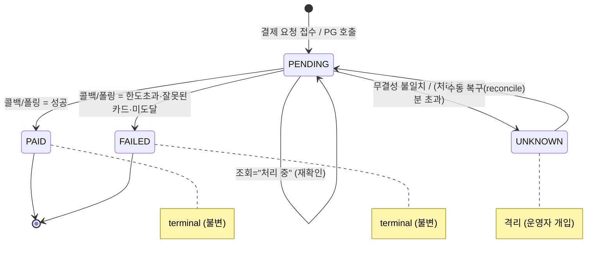

# 결제 도메인 구현 리포트 (Payment Implementation Report)

> 하나의 축으로 읽는다: **외부 PG 는 느려지고·실패하고·중복되고·응답을 잃는다.**
> 그래서 "성공 경로"가 아니라 **모든 어긋남이 결국 `PENDING` 을 거쳐 정합성으로 수렴하는 상태 기계**를 짰다.
> 이 문서의 모든 엔드포인트·스케줄러·의사결정은 그 한 가지 목표에 종속된다.

---

## 1. 추가된 엔드포인트

`PaymentV1Controller` (`/api/v1/payments`)

| 메서드 | 경로 | 인증 | 하는 일 |
|---|---|---|---|
| `pay` | `POST /api/v1/payments` | 로그인 (`X-Loopers-LoginId/Pw`) | 주문 검증 → PG 결제 요청. 동기 응답으로는 결과를 확정할 수 없으므로 **항상 `202 PENDING`("처리 중")** 반환. `amount` 는 클라이언트가 보내지 않고 서버가 `order.finalPrice` 에서 도출(위변조 방지) |
| `get` | `GET /api/v1/payments/{paymentId}` | 로그인 + 소유자 검증 | 결제의 **현재 확정 상태**(`PENDING/PAID/FAILED/UNKNOWN`)·`failureReason` 를 그대로 노출. 결과 통지는 이 조회를 **클라이언트가 폴링**해서 확인한다 |
| `callback` | `POST /api/v1/payments/callback` | **공개**(로그인 헤더 미선언) | PG 가 처리 결과를 통보. 무결성 가드 통과 시 상태 확정. commerce-api 는 전역 인증 인터셉터가 없고 각 핸들러가 로그인 헤더를 직접 받으므로, 로그인 헤더를 선언하지 않은 이 메서드는 자연히 공개된다 |
| `reconcile` | `POST /api/v1/payments/{paymentId}/reconcile` | 관리자(`X-Loopers-Ldap`) | `UNKNOWN`/오래된 `PENDING` 을 운영자가 강제 재조회·확정 |

> **결과 통지는 서버 푸시(WebSocket/SSE/알림)를 두지 않는다.** 상태를 확정하는 단일 출처는 콜백/폴링이 채운 DB 이고, `GET` 은 그 상태를 보여줄 뿐이다.

---

## 2. 내부 스케줄러

`PaymentReconciliationScheduler` — **단 하나**.

| 항목 | 값 | 이유 |
|---|---|---|
| 주기 | `@Scheduled(fixedDelay = 5000)` (5초) | 콜백이 유실돼도 `PENDING` 이 영원히 갇히지 않도록 주기적으로 쓸어담는다 |
| 대상 | `createdAt` 이 **10초(grace)** 이전인 `PENDING` | 방금 PENDING 된 건을 즉시 조회하면 콜백에 일할 기회를 안 준다. PG 처리 지연(1~5초)에서 역산 |
| 처리 단위 | 건별 `paymentFacade.reconcile(payment)` | 한 건 실패가 다음 건을 막지 않도록 try-catch 로 격리. 다음 주기에 재시도된다 |
| 격리 상한 | `createdAt` **10분** 초과 + PG 도 처리 중 | 영원한 `PENDING` 방지 (§5 참고) |

`@EnableScheduling` 은 `CommerceApiApplication` 에 이미 선언돼 있어 추가 설정 없이 동작한다.

---

## 3. 상태 기계



- `PENDING` = **"우리는 아직 모른다"를 정직하게 표현하는 상태**. 모든 장치가 이 상태를 중심으로 연결된다.
- `PAID`/`FAILED` = terminal, 불변. 중복 콜백/조회가 와도 안 바뀐다 = **상태 레벨의 멱등성**.
- `UNKNOWN` = 억지 단정 대신 격리. 운영자만 `reconcile` 로 되살릴 수 있다.

---

## 4. 채널별 엣지케이스 대응

실패가 들어오는 "채널"을 구분하는 것이 출발점이다. 동기 POST 응답과 비동기 콜백은 다른 종류의 실패를 싣는다.

### 4.1 결제 요청(동기 POST 응답) 채널

| 사건 | 도메인 매핑 | 대응 |
|---|---|---|
| 미도달 5xx (40%) | `PaymentGatewayException` | catch → **`PENDING` 유지**. 폴링이 복구. 사용자에겐 "처리 중" |
| Connect Timeout / 연결 실패 | `PaymentGatewayException` | 미도달(돈 안 빠짐) → **자동 재시도 안전** (`@Retry`) |
| Read Timeout (응답만 유실 가능) | `PaymentGatewayTimeoutException` (하위 타입) | **자동 재시도 금지** → `PENDING` 유지 후 폴링이 "주문 없음" 확인 뒤에만 처리 |
| 입력 검증 4xx (우리 측 버그) | `CoreException(BAD_REQUEST)` | 명확히 거부. CB·Retry 모두 무시 |
| CB OPEN (PG 장애 지속) | `CallNotPermittedException` | PG 호출조차 안 함 → **`PENDING` "처리 중"**. 실패로 단정하지 않음 |

> 핵심: **어떤 분기든 사용자에게 "실패"라고 단정하지 않는다.** 처리는 1~5초 뒤 비동기로 확정되므로, 동기 응답으로 확정할 수 있는 건 없다.

### 4.2 결과 확정(비동기 콜백 / 폴링) 채널

| PG 응답 | 의미 | 대응 |
|---|---|---|
| `SUCCESS` / `FAILED` | 결과 확정 | 그 결과로 확정 (`PAID` / `FAILED`). **10분이 지났어도** 확정한다 |
| 처리 중(`PENDING`) | 도달했으나 결과 미정 | 건드리지 않고 다음 주기 재확인. **단, 10분 초과 시 `UNKNOWN` 격리** |
| 주문 없음 (404) | 미도달, 돈 안 빠짐 | **`FAILED` 로 확정** (자동 재요청 X, 사용자 재시도에 위임) |
| `amount`/`cardNo` 불일치 | 금액 위변조·오배달 가능성 | 전이 거부 → **`UNKNOWN` 격리** |

### 4.3 동시성 / 멱등성

| 사건 | 대응 |
|---|---|
| 콜백 ↔ 폴링이 동시에 같은 결제 확정 | **조건부 UPDATE**(`WHERE status='PENDING'`) + affected rows 로 승자 판별 → 주문 후처리 **정확히 1회** |
| 사용자 결제 버튼 따닥 클릭 | 진입 시 `findActive` 로 활성(PENDING/PAID) 결제 있으면 **PG 재호출 없이 멱등 반환** |
| 중복 콜백 | terminal 불변 + 조건부 UPDATE 로 두 번째는 무시 |

---

## 5. 정합성으로 수렴하기 위한 의사결정

모든 결정은 "어긋남을 `PENDING` 으로 떨궈 두고, 정합성 복구 장치가 나중에 맞춘다"는 한 축을 따른다.

### 5.1 트랜잭션을 3조각으로 쪼갠다 — 외부 호출을 트랜잭션 밖으로

```
Tx1 : 주문 검증 후 Payment(PENDING) 저장 → 커밋   ← 닻 확보
 ── 트랜잭션 밖 ── : PG 호출 (CB/Timeout/Retry). DB 커넥션 점유 X
Tx2 : 접수 응답(transactionKey) 저장 (여전히 PENDING)
```

- **결정**: `PaymentFacade.pay()` 를 통째로 `@Transactional` 로 감싸지 않는다(프로젝트 규약에서의 의도적 일탈).
- **이유**: PG HTTP 호출(최대 수 초) 동안 DB 커넥션을 잡고 있으면, PG 가 느려질 때 HikariCP 풀이 고갈되어 **결제와 무관한 요청까지 죽는다**(장애 전파). 외부 호출은 반드시 트랜잭션 밖이어야 한다.
- **닻(anchor)**: Tx1 이 `PENDING` 을 먼저 커밋하므로, 이후 어디서 죽든(PG 호출 직전/중/Tx2 직전) 항상 복구 가능한 `PENDING` 행이 남는다.

### 5.2 Fallback 은 "실패"가 아니라 "안전한 시작점(PENDING)"으로 떨군다

- **결정**: CB OPEN·미도달·타임아웃을 모두 `PENDING` "처리 중"으로 수렴시킨다.
- **이유**: CB OPEN 은 "PG 가 바빠 시도조차 안 한 것"이다. "실패"로 단정하면 잠시 후 CB 가 닫히고 그 주문이 처리될 때 **"실패라더니 결제됐어요?"** 상태 불일치가 난다. 우리가 모르는 것은 모른다고 둔다.

### 5.3 후처리 정확히 1회 — 격리 수준이 아니라 조건부 UPDATE 로 보장

- **결정**: `UPDATE payment SET status='PAID' WHERE id=? AND status='PENDING'` 의 affected rows 로 승패를 가른다. `1` 이면 후처리, `0` 이면 스킵.
- **이유**: 콜백·폴링 두 스레드가 둘 다 `PENDING` 을 읽는 check-then-act 갭은 트랜잭션 격리 수준(RR/RC)으로 막히지 않는다. 검사와 적용을 **단일 UPDATE 로 원자화**해 갭 자체를 없앤다. 낙관적 락보다 단순하고 affected rows 로 승자 판별이 자연스럽다.
- **격리(UNKNOWN)도 같은 방식**: `markUnknown` 도 조건부 UPDATE(`WHERE status='PENDING'`)로 처리한다. managed entity dirty update 는 status 가드가 없어, 동시에 일어난 정상 전이(`PAID`)를 덮어쓸 수 있기 때문이다.

### 5.4 `transactionKey` 하나에 추적을 의존하지 않는다 — 닻은 `orderNumber`

- **결정**: 추적은 **`orderNumber`(우리가 잃지 않는 닻) + `transactionKey`(PG 의 정밀 핸들, nullable)** 둘 다 보유한다.
- **이유**: 이 PG 는 `transactionKey` 를 응답으로 발급하는데(모델 B), **타임아웃 시 그 응답 자체를 못 받는다**(닭-달걀). 그래서 `transactionKey` 가 없으면 `GET /payments?orderId={orderNumber}` 로 되짚는다.

### 5.5 Read Timeout 은 자동 재시도하지 않는다

- **결정**: 미도달(5xx·Connect Timeout)만 `@Retry` 대상으로 두고, Read Timeout(`PaymentGatewayTimeoutException`)은 `ignore-exceptions` 로 제외한다. CircuitBreaker 는 상위 타입으로 둘 다 집계하되, Retry 정책만 분리한다.
- **이유**: Read Timeout 은 "요청은 도달했는데 응답만 유실"을 포함한다. 조회 없이 블라인드로 재시도하면 **이중결제** 위험이 있다. 타임아웃 건은 `PENDING` 으로 남겨, 폴링이 "주문 없음(미도달)"을 확인한 뒤에만 처리한다.

### 5.6 CircuitBreaker 인스턴스를 분리한다

- **결정**: 결제 요청(POST)은 `paymentRequest`, 폴링/조회(GET)는 `paymentQuery` 로 CB 를 나눈다.
- **이유**: 한 CB 에 섞으면 GET 의 대량 정상 호출에 POST 실패율이 **희석되어** CB 가 안 열린다. 보호해야 할 핵심 경로(POST)를 배경 reconciliation(GET)과 분리한다.

### 5.7 reconcile 은 PG 를 먼저 조회한다 (상한은 "처리 중"에만 건다)

- **결정**: 폴링/수동 복구 시 PG 를 먼저 조회한다. PG 가 `SUCCESS`/`FAILED` 를 주면 `createdAt` 이 10분을 넘었어도 그대로 확정하고, `UNKNOWN` 격리는 **PG 도 여전히 처리 중이면서 10분을 초과한** 경우에만 적용한다.
- **이유**: 오래됐다는 이유만으로 격리하면, 이미 **돈이 빠진 `SUCCESS` 건**이 `UNKNOWN` 에 갇혀 "돈 빠졌는데 주문 누락"이 된다. 상한은 무조건 격리가 아니라 "처리 중" 가지에만 걸리는 안전판이다.

### 5.8 미도달(주문 없음)은 FAILED 로 확정하고, 시스템이 자동 재요청하지 않는다

- **결정**: 폴링이 "주문 없음"을 확인하면 `FAILED` 로 떨구고 **사용자 재시도에 맡긴다**.
- **이유**: 미도달은 돈이 안 빠진 게 증명되므로 재시도해도 이중결제는 없다. 그래도 시스템이 임의로 재호출하지 않는다 — 자동 재요청은 통제하기 어려운 부작용을 키운다. 명시적인 사용자 재시도가 더 안전하다.

### 5.9 진위 검증을 생략한 대신, 무결성 가드를 1차 방어선으로 둔다

- **결정**: 콜백 서명/IP 화이트리스트는 구현하지 않는다(과제 수위). 대신 콜백/폴링이 가져온 `amount`·`cardNo` 가 우리가 저장한 값과 다르면 전이를 거부하고 `UNKNOWN` 으로 격리한다.
- **이유**: 진위 검증을 생략한 만큼, **우리가 이미 보유한 값과의 대조가 유일한 무결성 방어선**이 된다. `amount` 불일치는 금액 위변조, `cardNo` 불일치는 오배달(다른 거래의 콜백)을 잡는다.

### 5.10 재결제는 새 row 로 연다

- **결정**: 결제 시도마다 새 `PaymentModel` 행을 만들고, 활성(PENDING/PAID) 결제 1건만 멱등 기준으로 본다. `FAILED` 는 활성 조회에서 제외된다.
- **이유**: 잘못된 카드로 `FAILED` 된 주문이 unique 제약에 걸려 **정당한 재결제가 막히면 안 된다.** `FAILED` 는 terminal 로 남고(불변), 재결제는 새 행으로 진행되므로 "카드 변경 후 재시도" 흐름이 자연스럽게 열린다.

---

## 6. 의사결정을 테스트로 고정한 지점

확정 정책은 단언으로 박아 회귀를 막았다.

| 정책 | 테스트 |
|---|---|
| terminal 불변 / 카드 마스킹 | `PaymentModelTest` |
| 조건부 UPDATE affected=1/0 | `PaymentRepositoryIntegrationTest` |
| 무결성 가드 → UNKNOWN 격리 | `PaymentServiceTest`, `PaymentConfirmIntegrationTest` |
| 후처리 정확히 1회 (실제 2-스레드 race) | `PaymentConfirmIntegrationTest` |
| Tx 분리: PG 예외 시 PENDING 잔류 / 재결제 새 row / 따닥 클릭 멱등 | `PaymentFacadeIntegrationTest` |
| CB OPEN → PENDING "처리 중" | `PaymentCircuitBreakerIntegrationTest` |
| CB 집계: PaymentGatewayException 집계 / CoreException 무시 | `PaymentGatewayCircuitBreakerIntegrationTest` |
| Retry: 5xx 재시도(3회) / Read Timeout·4xx 미재시도 | `PaymentGatewayRetryIntegrationTest` |
| 폴링 5시나리오 + "10분 초과여도 SUCCESS면 PAID" | `PaymentReconciliationIntegrationTest` |
| 예외 분기 변환 / 404→빈 결과 / status 매핑 | `PaymentGatewayImplTest` |
| 202+PENDING+DB영속 / 소유자 검증 / 콜백 공개 / 수동 복구 | `PaymentV1ApiE2ETest`, `PaymentCallbackV1ApiE2ETest`, `PaymentReconcileV1ApiE2ETest` |

---

## 관련 문서
- [[payment-design]] — 설계 원본 (왜)
- [[payment-implementation-plan]] — 구현 계획 (어떻게)
- [[payment-implementation-tasks]] — 작업 분해 (무엇을)
