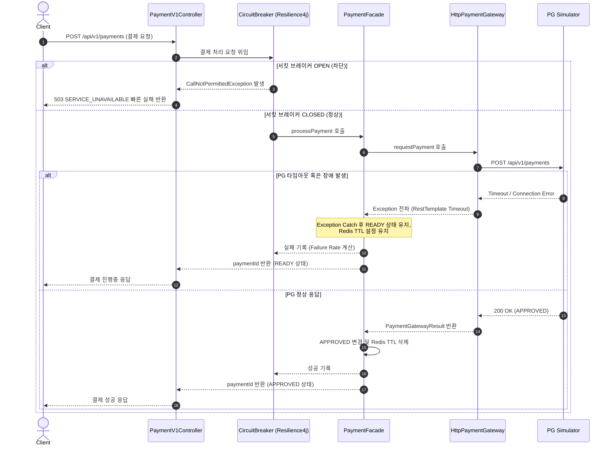

# Week 6 Resilience & 외부 결제 장애 대응 구현 계획 (Plan 2)

본 문서는 외부 결제 시스템(PG) 장애로 인한 내부 자원 고갈을 차단하고 시스템의 복원성(Resilience)을 극대화하기 위해, 서킷 브레이커 도입, 수동 복구 API 제공, 타임아웃 상황 처리 방안을 TDD(Red-Green-Refactor) 및 Tidy First 원칙에 따라 설계한 구현 계획입니다.

---

## 1. 핵심 설계 목표 및 아키텍처

### 1.1 서킷 브레이커 (Circuit Breaker) 도입
*   **목적:** 외부 PG API(`requestPayment`, `queryPaymentStatus`) 호출 시 발생하는 지연(Latency) 및 장애(5xx)가 애플리케이션의 톰캣(Tomcat) 스레드 고갈 및 커넥션 풀 고갈(Cascading Failure)로 이어지는 것을 방지합니다.
*   **동작 방식 (Fail-Fast):**
    *   서킷 브레이커가 `OPEN` 상태인 경우 결제 요청을 차단하고, DB 작업(주문 생성 이후 결제 요청 진입 시점)을 수행하지 않고 즉시 사용자에게 빠른 에러를 반환합니다.
    *   에러 응답: `CoreException(ErrorType.SERVICE_UNAVAILABLE)` -> HTTP 503 Service Unavailable 및 메시지 반환.

---

## 2. 단계별 구현 계획 (Red -> Green -> Refactor)

### Step 1: 서킷 브레이커 의존성 추가 및 Configuration 설정
외부 결제사 연동 구간에 Resilience4j 서킷 브레이커를 빈으로 등록하고 임계치를 설정합니다.

*   **Tidy First (구조적 변경):**
    1.  `build.gradle.kts`에 `spring-cloud-starter-circuitbreaker-resilience4j` 의존성을 추가합니다.
    2.  `ErrorType` enum에 `SERVICE_UNAVAILABLE(HttpStatus.SERVICE_UNAVAILABLE, "PAYMENT-503", "현재 외부 결제 시스템 장애로 결제가 일시 중단되었습니다.")` 에러 타입을 추가합니다.

*   **Test (Red):**
    *   `PaymentGateway` 인터페이스의 구현체인 `HttpPaymentGateway`에 대해 CircuitBreaker 설정을 확인하는 단위 테스트를 작성합니다.
    *   호출 실패를 모킹하여 실패율(Failure Rate)이 50%를 초과할 때 서킷 브레이커가 `CLOSED` -> `OPEN`으로 전환되는지 검증합니다.
    *   서킷 브레이커가 `OPEN`일 때 결제 요청을 수행할 시 `CallNotPermittedException`이 정상적으로 트리거되는지 검증합니다.
    *   `PaymentV1Controller` 혹은 전역 예외 처리기(`GlobalExceptionHandler`)에서 `CallNotPermittedException` 발생 시 `CoreException(ErrorType.SERVICE_UNAVAILABLE)`로 매핑하여 503 에러가 반환되는지 검증하는 API 테스트를 작성합니다.

*   **Implementation (Green):**
    1.  `CircuitBreakerConfig`를 작성하여 `pgCircuitBreaker` 레지스트리를 구성합니다.
        *   `slidingWindowSize(10)`: 최근 10번의 호출을 기준으로 계산
        *   `failureRateThreshold(50.0f)`: 실패율 50% 이상 시 OPEN
        *   `slowCallRateThreshold(50.0f)`: 느린 호출 비율 50% 이상 시 OPEN
        *   `slowCallDurationThreshold(Duration.ofSeconds(5))`: 5초 이상 걸리는 호출을 느린 호출로 판정
        *   `waitDurationInOpenState(Duration.ofSeconds(10))`: OPEN 상태에서 10초 대기 후 HALF_OPEN 전환
        *   `permittedNumberOfCallsInHalfOpenState(3)`: HALF_OPEN 상태에서 3회 검증 호출 허용
    2.  `HttpPaymentGateway` 호출을 `CircuitBreaker`로 래핑하거나, AOP 기반의 `@CircuitBreaker`를 설정합니다.
    3.  `GlobalExceptionHandler`에 `CallNotPermittedException` 핸들러를 추가하여 `CoreException(ErrorType.SERVICE_UNAVAILABLE)`로 변환하여 예외 처리를 일원화합니다.

*   **Refactor (Tidy First):**
    *   외부 API 예외 처리 구조를 가다듬어 내부 비즈니스 예외와 인프라 예외의 경계를 명확하게 구분합니다.

---

---

## 4. 검증 시나리오 및 통과 기준 (Acceptance Criteria)

| 시나리오 | 동작 흐름 | 예상 결과 | 검증 방법 |
| --- | --- | --- | --- |
| **외부 시스템 완전 장애 (서킷 브레이커 작동)** | PG사 지속 장애 -> 서킷 브레이커 OPEN -> 사용자 결제 요청 유입 | 외부 API 호출을 생략하고 즉시 503 SERVICE_UNAVAILABLE 반환 | `PaymentV1ControllerTest` 통합 테스트 |
