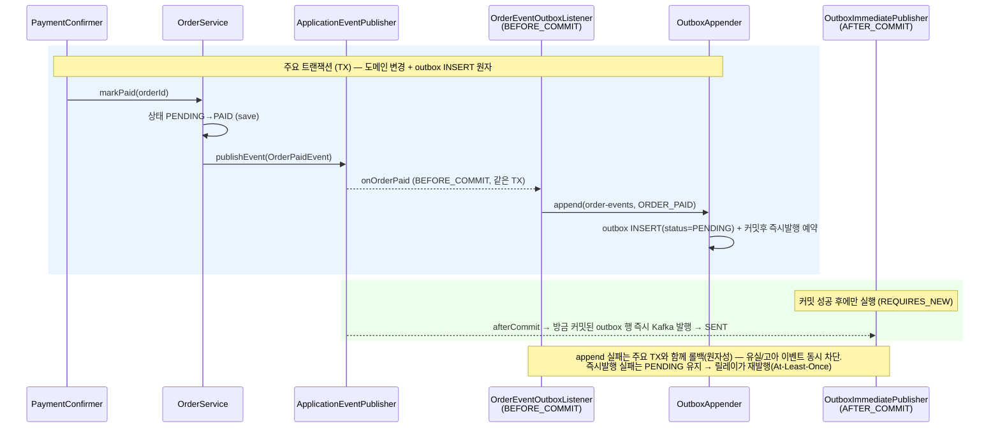
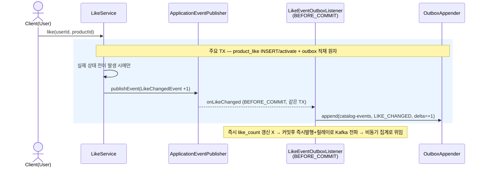
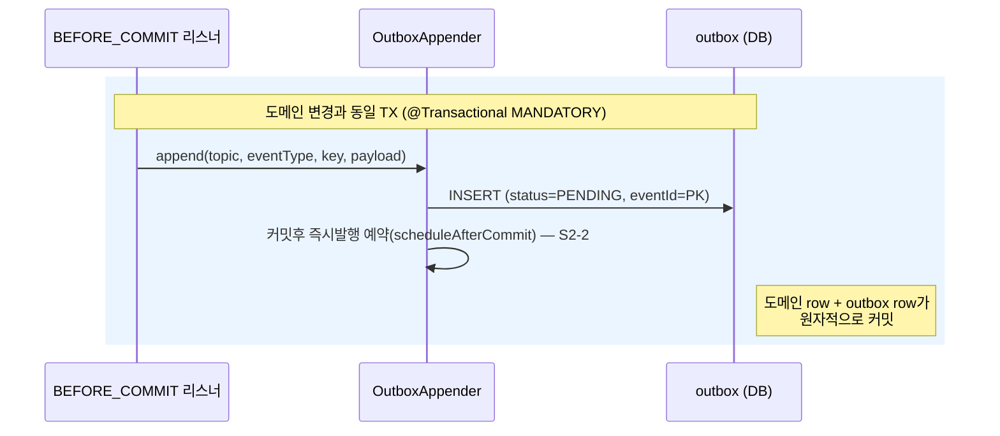
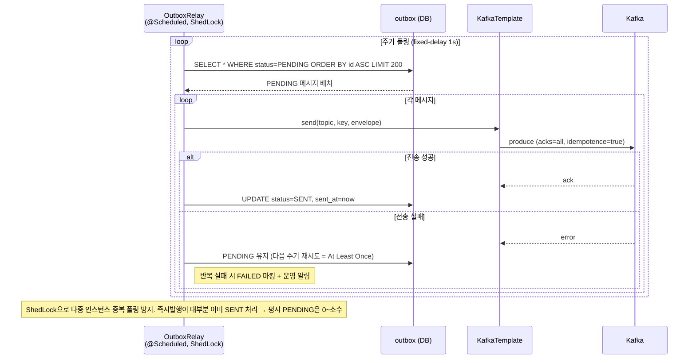
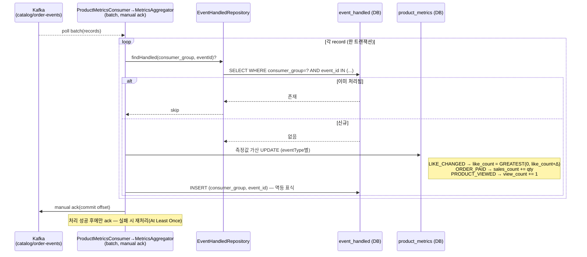
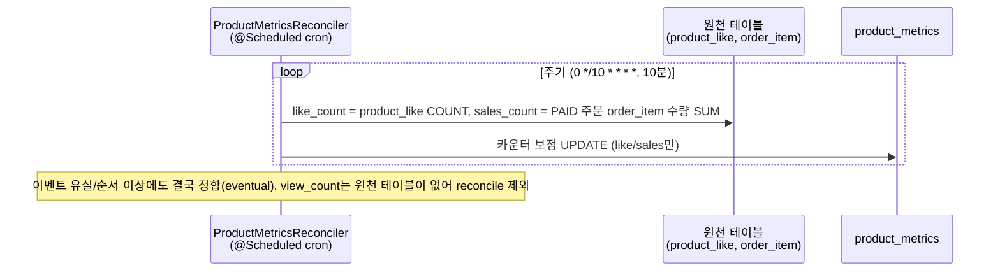
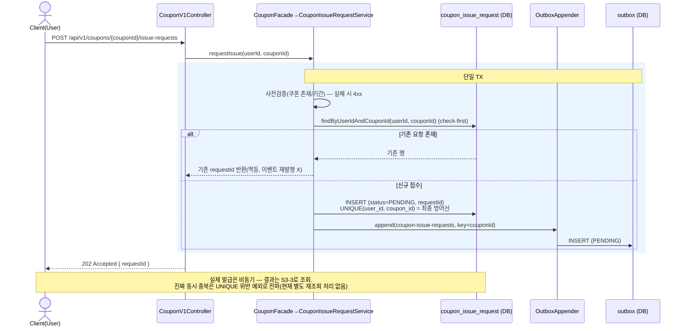
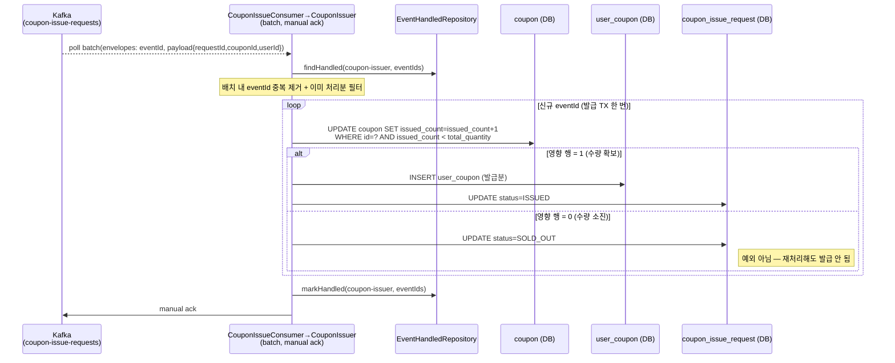
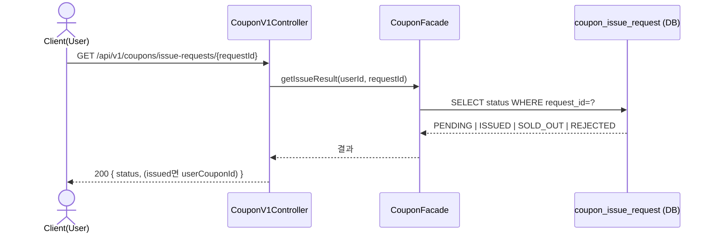
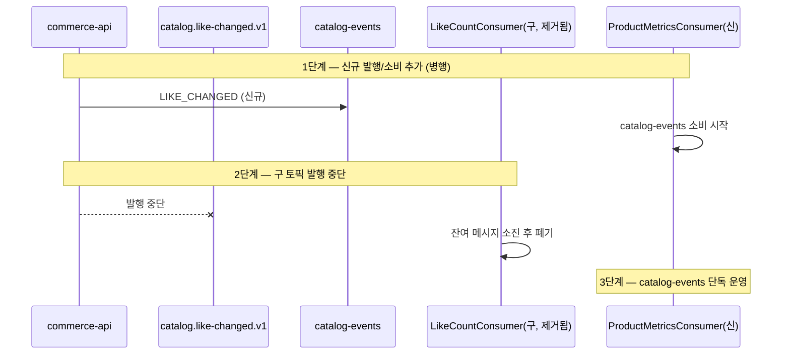

# 02. 시퀀스 다이어그램 — 이벤트 기반 아키텍처 (Event-Driven)

[`01-requirements.md`](./01-requirements.md) §6의 Step1~3 흐름을 레이어별 참여자 기준으로 시각화한다. 표기 규칙은 [`../week2/02-sequence-diagrams.md`](../week2/02-sequence-diagrams.md) §0을 따른다(레이어/화살표/생략/공통 에러). 이 문서의 결정 근거는 [`01-requirements.md`](./01-requirements.md) §9 결정사항 표를 따른다.

## 0. 참여자 (기존 레이어 + week7 신규)

### commerce-api (Producer)

| 약칭 | 클래스/컴포넌트 | 레이어 | 책임 |
| --- | --- | --- | --- |
| `OFac` | `OrderFacade` | Application | 주문 유스케이스 조립 |
| `OSvc` | `OrderService` | Domain Service | 주문 생성·상태 전이 |
| `PFac` | `PaymentFacade` | Application | 결제 시작/콜백/reconcile 조립 |
| `PCfm` | `PaymentConfirmer` | Application | 결제 확정 단위(콜백·reconcile 공유) |
| `LSvc` | `LikeService` | Domain Service | 좋아요 상태 전이 |
| `CFac` | `CouponFacade` | Application | 쿠폰 대고객 유스케이스 |
| `Pub` | `ApplicationEventPublisher` | Spring | 인-프로세스 도메인 이벤트 발행 |
| `Appender` | `OutboxAppender` | Application (@Transactional MANDATORY) | 도메인 트랜잭션 안에서 `outbox` INSERT + 커밋후 즉시발행 예약 |
| `OBox` | `outbox` 테이블 | DB | 발행 대기 메시지(PENDING/SENT/FAILED) |
| `ImmPub` | `OutboxImmediatePublisher` | Application (AFTER_COMMIT, REQUIRES_NEW) | 커밋 직후 즉시 Kafka 발행(저지연 주경로) → SENT 마킹. 실패분은 릴레이가 회수 |
| `Relay` | `OutboxRelay` | Application (@Scheduled+ShedLock) | PENDING 폴링 → Kafka 발행(즉시발행 안전망) → SENT 마킹 |
| `KT` | `KafkaTemplate` | Infra | Kafka 발행(acks=all, idempotence=true) |

### Kafka

| 토픽 | 키 | eventType 예 |
| --- | --- | --- |
| `catalog-events` | productId | LIKE_CHANGED, PRODUCT_VIEWED |
| `order-events` | orderId | ORDER_PAID |
| `coupon-issue-requests` | couponId | COUPON_ISSUE_REQUESTED |

### commerce-streamer (Consumer)

| 약칭 | 클래스/컴포넌트 | 책임 |
| --- | --- | --- |
| `MCon` | `ProductMetricsConsumer` (group=metrics-aggregator) → `MetricsAggregator` | catalog/order 이벤트 소비 → 집계 |
| `CCon` | `CouponIssueConsumer` (group=coupon-issuer) → `CouponIssuer` | 발급 요청 소비 → 발급 처리 |
| `Idem` | `EventHandledRepository` (컨슈머 인라인 조회-후-필터) | `event_handled(consumer_group, event_id)` 멱등 확인/기록 |
| `EH` | `event_handled` 테이블 | 처리 완료 표식(event_id PK) |
| `PM` | `product_metrics` 테이블 | 좋아요/판매량/조회 수 upsert |
| `CpnW` | `coupon` 테이블 | 원자 UPDATE(issued_count) |
| `UCW` | `user_coupon` 테이블 | 발급분 INSERT |
| `CIR` | `coupon_issue_request` 테이블 | 발급 결과(PENDING/ISSUED/SOLD_OUT/REJECTED) |

> **공통 envelope**: 모든 메시지는 `{ eventId, eventType, aggregateType, aggregateId, version, occurredAt, payload }`를 공유한다. `eventId`는 outbox PK(전역 고유) = 소비자 멱등 키. `version`은 envelope에 실려 있으나 가산 카운터라 현재 소비측 최신성 비교엔 쓰지 않는다(값 0, → S2-3).

---

## Step 1. ApplicationEvent 경계 분리

### S1-1. 결제 확정 시 이벤트 분리 (outbox append = BEFORE_COMMIT, Kafka 발행 = AFTER_COMMIT)

주요 로직(결제 확정 → 주문 PAID)과, 타 시스템(streamer 판매량 집계)이 필요로 하는 전파 이벤트를 분리한다. 전파 이벤트는 **도메인 변경과 같은 트랜잭션(BEFORE_COMMIT)에서 outbox에 적재**하고(원자성), 실제 Kafka 발행은 **커밋 후(AFTER_COMMIT)** 즉시발행 경로가 담당한다. (알림 같은 순수 부가 처리는 §9 #8에 따라 이번 범위 미구현 — 코드에 리스너 없음, mock/log 자리만 남김.)

> **판단 기준**: `OrderPaidEvent`는 (c) streamer 판매량 집계라는 **타 시스템 전파**가 필요 → Kafka(outbox) 대상. outbox 적재는 결제 확정과 (a) **원자적이어야** 하므로 BEFORE_COMMIT(같은 TX)이고, 실제 Kafka 발행은 커밋된 사실만 내보내야 하므로 AFTER_COMMIT 즉시발행 + 폴링 릴레이 안전망. 알림 등 전파 불필요·결과 무관 후속은 ApplicationEvent까지만(이번 미구현).

### S1-2. 좋아요 상태 전이 (결과적 일관성, 기존 일반화)

> 상품 조회수(`PRODUCT_VIEWED`)도 동일 패턴이다: `getProductDetail` → `ProductViewedEvent` 발행 → `ProductViewOutboxListener`(BEFORE_COMMIT) → `append(catalog-events, PRODUCT_VIEWED)`.

---

## Step 2. Kafka 이벤트 파이프라인

### S2-1. Outbox 발행 (도메인 변경과 단일 트랜잭션)

핵심 불변식: **도메인 변경 INSERT/UPDATE 와 outbox INSERT 는 같은 트랜잭션**. 둘 다 커밋되거나 둘 다 롤백 → 메시지 유실(at-most-once) 제거.

### S2-2. Outbox 발행 — 하이브리드(커밋후 즉시발행 + 폴링 릴레이 안전망)

발행은 두 경로다. **주경로**는 커밋 직후 `OutboxImmediatePublisher`가 방금 적재된 행을 즉시 발행(저지연). **안전망**은 `OutboxRelay`가 주기적으로 `PENDING`을 폴링해 즉시발행 실패분·앱 다운분을 재발행한다. 둘이 같은 행을 중복 발행해도 브로커 멱등(idempotence)·소비자 멱등(`event_handled`)이 흡수한다. 아래는 안전망 릴레이 흐름.

### S2-3. 집계 Consumer — product_metrics 가산 UPDATE (멱등)

> **왜 version 비교가 없나**: 세 카운터가 전부 **가산(교환법칙 성립)**이라 순서에 무관하게 합산하면 같은 결과가 된다. 따라서 stale 판정용 `version` 비교가 불필요하고, 중복만 `event_handled(consumer_group, event_id)`로 차단하면 정확하다. (envelope의 `version` 필드는 미래의 비가산 집계 대비로 실려 있으나 현재 값 0, 소비측 미사용.)

### S2-4. reconcile 안전망 (이벤트 유실 보정)

---

## Step 3. Kafka 기반 선착순 쿠폰 발급

### S3-1. 발급 요청 (API는 발행만, 202 Accepted)

### S3-2. 발급 처리 Consumer (원자 UPDATE + 멱등)

선착순 불변식 `issued_count <= total_quantity`를 어떤 동시성에서도 위반하지 않는다. key=couponId로 같은 쿠폰 요청이 같은 파티션에 직렬화된다.

> **1인 1매**: `coupon_issue_request`의 `UNIQUE(user_id, coupon_id)`(S3-1)가 요청 단계에서, `event_handled(consumer_group, event_id)`(event_id=outbox PK)가 소비 단계에서 이중 차단. `status=REJECTED`(자격 미달)는 enum에 정의만 되어 있고 **현재 미사용** — 컨슈머는 ISSUED/SOLD_OUT만 확정한다(확장 여지, 자격검증 추가 시 사용).

### S3-3. 발급 결과 조회

---

## 부록. 좋아요 토픽 마이그레이션 (스키마 통일)

기존 `catalog.like-changed.v1` → `catalog-events`(공통 envelope) 전환. 무중단 이전 절차. **(현재 코드 기준 이전 완료 — 구 토픽·`LikeCountConsumer`·`LikeChangedMessage`는 제거됨. 아래는 이력 참고용.)**

> reconcile(S2-4)이 원천에서 카운트를 재보정하므로, 이전 중 짧은 불일치는 결국 수렴한다.
